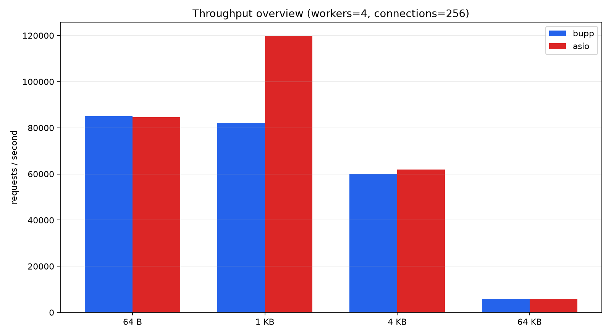
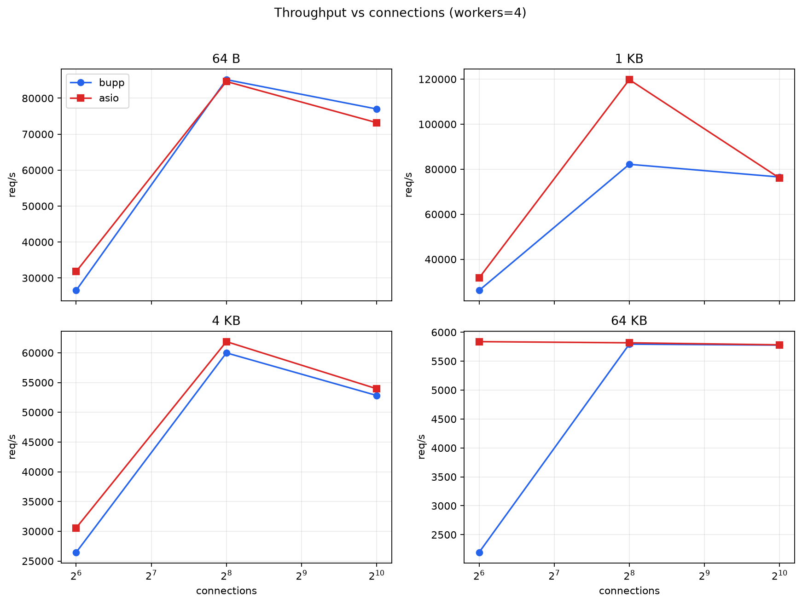
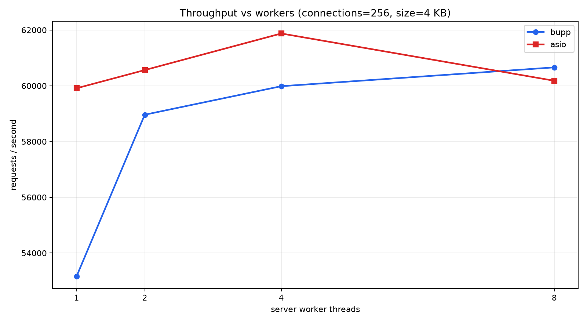
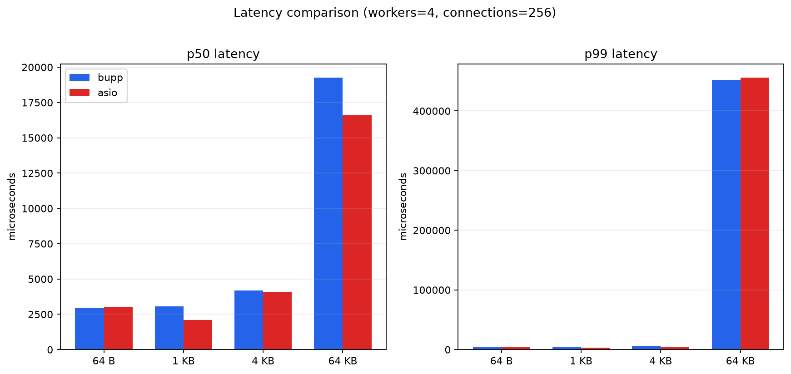
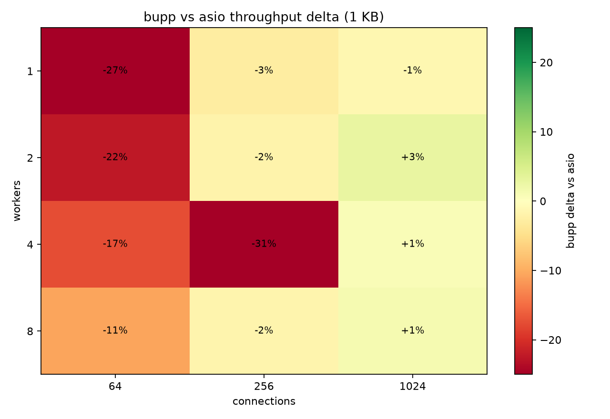
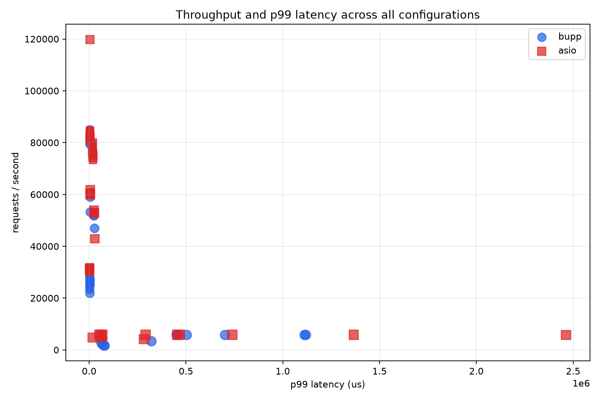
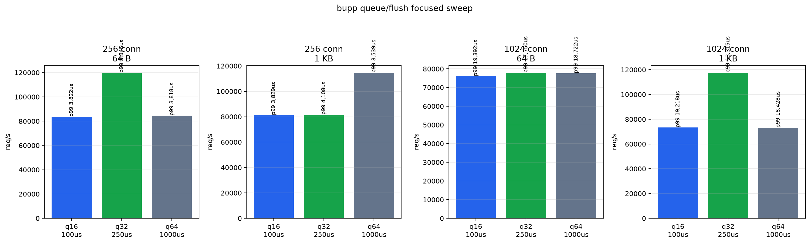

# bupp vs asio TCP Echo Benchmark

## 1. Test Environment

| Item | Server | Client |
| --- | --- | --- |
| OS | Linux | Linux |
| Kernel | 6.6.119-49.27.tl4.x86_64 | 6.6.119-49.27.tl4.x86_64 |
| Architecture | x86_64 | x86_64 |
| CPU | Intel(R) Xeon(R) Gold 6148 CPU @ 2.40GHz | AMD EPYC 9K65 192-Core Processor |
| Logical CPUs | 8 | 8 |
| Python | 3.11.6 | 3.11.6 |

Hostnames, usernames, absolute paths, and IP addresses are intentionally omitted from this report.

## 2. Methodology

The benchmark compares two functionally equivalent TCP echo servers:

- `bupp_raw_echo`: C++20 coroutine echo server using bupp on io_uring.
- `asio_raw_echo`: C++20 coroutine echo server using standalone Asio.
- Client: a neutral Python `asyncio` TCP echo load generator running on a separate client machine.

Each connection runs a strict ping-pong loop: send one fixed-size payload, read the echoed payload, then repeat. The warmup phase is excluded from the recorded throughput and latency samples.

Fairness controls:

- Both servers are rebuilt in Release mode immediately before the benchmark.
- The same remote client script drives both servers.
- The server process is restarted for every measured configuration.
- The client raises its `nofile` soft limit before high-concurrency runs.
- The server INPUT firewall policy observed by the runner was `ACCEPT`; remote TCP connectivity was checked before each measured run.

## 3. Configuration Matrix

| Dimension | Values |
| --- | --- |
| Server | bupp, asio |
| Worker threads | 1, 2, 4, 8 |
| Concurrent connections | 64, 256, 1024 |
| Message size | 64 B, 1 KB, 4 KB, 64 KB |
| Warmup per run | 10 s |
| Measurement per run | 30 s |
| Repeats | 1 |

All 96 main-matrix configurations completed successfully. The main matrix uses one longer measurement window per configuration; isolated peaks should be interpreted with that limitation in mind.

Latency values are sampled round-trip times in microseconds. Throughput is reported as completed echo requests per second; MB/s counts the echoed payload size once per completed request.

## 4. Results

### 4.1 Overview (workers=4, connections=256)

| Message Size | bupp req/s | asio req/s | Ratio | bupp p50 | asio p50 | bupp p99 | asio p99 |
| --- | ---: | ---: | ---: | ---: | ---: | ---: | ---: |
| 64 B | 85,167 | 84,651 | 1.01x | 2,976 us | 3,016 us | 3,963 us | 3,599 us |
| 1 KB | 82,178 | 119,780 | 0.69x | 3,075 us | 2,110 us | 3,908 us | 3,426 us |
| 4 KB | 59,985 | 61,875 | 0.97x | 4,181 us | 4,106 us | 6,273 us | 4,988 us |
| 64 KB | 5,794 | 5,817 | 1.00x | 19,255 us | 16,603 us | 452,043 us | 455,680 us |

At the reference point, most rows are close enough that workload shape matters more than the library name. The 1 KB / 256-connection point showed noticeable run-to-run variance in the focused sweep, so it should be treated as a high-water mark rather than a durable 30%+ gap. Small payloads emphasize event-loop overhead, while larger payloads increasingly shift the bottleneck into the TCP stack, memory copies, and the remote client.

### 4.2 Throughput vs Connections

Connection scaling is not monotonic for every payload size. With small messages, request rate is dominated by scheduling and completion overhead. With large messages, more concurrent connections can increase outstanding bytes on the wire, but the test becomes less sensitive to the server event library itself.

### 4.3 Throughput vs Worker Threads

| Workers | bupp req/s | asio req/s | Ratio |
| ---: | ---: | ---: | ---: |
| 1 | 53,159 | 59,910 | 0.89x |
| 2 | 58,962 | 60,563 | 0.97x |
| 4 | 59,985 | 61,875 | 0.97x |
| 8 | 60,660 | 60,180 | 1.01x |

Worker scaling should be read together with the client-side limit. Once the remote Python client or network path is saturated, adding server workers no longer translates directly into higher request rate.

### 4.4 Latency

Median latency mostly tracks the number of concurrent ping-pong loops. Tail latency is more sensitive to batching, scheduler wakeups, TCP buffering, and client runtime pauses.

### 4.5 bupp/asio Ratio Heatmap

Positive cells mean bupp has higher throughput than asio for that worker/connection point; negative cells mean asio is ahead.

### 4.6 Throughput and Tail Latency Scatter

The scatter plot shows the expected trade-off: configurations with very high request rates often sit in the low-payload region, while high-payload configurations trade request rate for higher per-request latency.

### 4.7 Best and Worst Relative Cases

Best bupp/asio throughput ratio:

- Configuration: workers=1, connections=1024, message_size=4 KB
- bupp: 46,906 req/s, p99 28,175 us
- asio: 42,891 req/s, p99 29,895 us
- Ratio: 1.09x

Most challenging bupp/asio throughput ratio:

- Configuration: workers=2, connections=64, message_size=64 KB
- bupp: 1,694 req/s, p99 76,384 us
- asio: 5,794 req/s, p99 52,545 us
- Ratio: 0.29x

### 4.8 bupp Queue/Flush Tuning Sweep

This focused sweep used 5 s warmup and 20 s measurement per point. It is not a full replacement for the main matrix; it checks whether bupp's queue length and timer flush values are worth tuning.

| Queue / flush | Connections | Size | req/s | p50 us | p99 us |
| --- | ---: | ---: | ---: | ---: | ---: |
| 16 / 100 us | 256 | 64 B | 83,592 | 3,017 | 3,822 |
| 16 / 100 us | 256 | 1 KB | 81,288 | 3,120 | 3,829 |
| 16 / 100 us | 1024 | 64 B | 76,121 | 12,970 | 19,392 |
| 16 / 100 us | 1024 | 1 KB | 73,344 | 13,530 | 19,218 |
| 32 / 250 us | 256 | 64 B | 119,864 | 2,112 | 3,345 |
| 32 / 250 us | 256 | 1 KB | 81,595 | 3,098 | 4,108 |
| 32 / 250 us | 1024 | 64 B | 77,918 | 12,780 | 17,750 |
| 32 / 250 us | 1024 | 1 KB | 117,554 | 8,609 | 13,315 |
| 64 / 1000 us | 256 | 64 B | 84,561 | 2,992 | 3,818 |
| 64 / 1000 us | 256 | 1 KB | 114,644 | 2,206 | 3,539 |
| 64 / 1000 us | 1024 | 64 B | 77,695 | 12,853 | 18,722 |
| 64 / 1000 us | 1024 | 1 KB | 73,152 | 13,490 | 18,428 |

256 connections / 64 B: `32 / 250 us` was fastest at 119,864 req/s (p99 3,345 us); 256 connections / 1 KB: `64 / 1000 us` was fastest at 114,644 req/s (p99 3,539 us); 1024 connections / 64 B: `32 / 250 us` was fastest at 77,918 req/s (p99 17,750 us); 1024 connections / 1 KB: `32 / 250 us` was fastest at 117,554 req/s (p99 13,315 us).

Raw tuning data: `.artifacts/results/tuning_q16_f100`, `.artifacts/results/tuning_q32_f250`, `.artifacts/results/tuning_q64_f1000`.

The sweep shows that tuning can matter. The default `64 / 1000 us` setting is a reasonable baseline, but `32 / 250 us` was materially better on the tested high-concurrency 1 KB point. The 256-connection / 1 KB point varied between runs, so the practical takeaway is not a single magic value; it is that the fixed 1 ms flush timer can leave performance on the table for some ping-pong workloads.

## 5. Why bupp and Asio Differ

These are plausible explanations from the implementation model and the observed benchmark shape; they were not separately validated with profiling in this run.

1. Asio's reactor path is very mature and lightweight for small socket operations. On tiny payloads, the fixed cost of dispatching one read and one write can dominate the actual data movement.
2. bupp uses io_uring and queues I/O submissions for batching. That can reduce syscall pressure when enough work is available, but it can also add a small queueing delay for latency-sensitive tiny messages.
3. bupp's one-context-per-worker style can scale well when there is enough parallel work. Asio can still be very competitive because socket echo is already a favorable workload for epoll-based readiness notification.
4. At larger payload sizes, both implementations spend more time in TCP, copying, and client-side processing. In that region the benchmark is less a pure comparison of async libraries.
5. Because the client runs remotely, network path behavior and the Python asyncio client can cap absolute throughput. The relative comparison is still useful because both servers see the same client and network path.

## 6. Full Results

The table below shows the aggregated rows for workers=4. Full per-repeat JSON is preserved under `.artifacts/results/remote_echo_20260710T101119Z`.

#### message_size = 64 B

| server | workers | connections | req/s | MB/s | p50 us | p99 us | p999 us |
| --- | ---: | ---: | ---: | ---: | ---: | ---: | ---: |
| asio | 4 | 64 | 31,765 | 1.9 | 2,002 | 2,130 | 2,227 |
| asio | 4 | 256 | 84,651 | 5.2 | 3,016 | 3,599 | 3,961 |
| asio | 4 | 1024 | 73,201 | 4.5 | 13,465 | 19,674 | 24,787 |
| bupp | 4 | 64 | 26,524 | 1.6 | 2,364 | 2,938 | 3,170 |
| bupp | 4 | 256 | 85,167 | 5.2 | 2,976 | 3,963 | 4,939 |
| bupp | 4 | 1024 | 77,002 | 4.7 | 12,752 | 18,675 | 21,549 |

#### message_size = 1 KB

| server | workers | connections | req/s | MB/s | p50 us | p99 us | p999 us |
| --- | ---: | ---: | ---: | ---: | ---: | ---: | ---: |
| asio | 4 | 64 | 31,664 | 30.9 | 2,007 | 2,142 | 2,233 |
| asio | 4 | 256 | 119,780 | 117.0 | 2,110 | 3,426 | 3,603 |
| asio | 4 | 1024 | 76,042 | 74.3 | 13,100 | 17,834 | 19,290 |
| bupp | 4 | 64 | 26,143 | 25.5 | 2,390 | 3,046 | 3,303 |
| bupp | 4 | 256 | 82,178 | 80.3 | 3,075 | 3,908 | 4,728 |
| bupp | 4 | 1024 | 76,534 | 74.7 | 13,146 | 18,322 | 19,962 |

#### message_size = 4 KB

| server | workers | connections | req/s | MB/s | p50 us | p99 us | p999 us |
| --- | ---: | ---: | ---: | ---: | ---: | ---: | ---: |
| asio | 4 | 64 | 30,552 | 119.3 | 2,085 | 2,259 | 3,029 |
| asio | 4 | 256 | 61,875 | 241.7 | 4,106 | 4,988 | 5,614 |
| asio | 4 | 1024 | 53,958 | 210.8 | 18,606 | 24,730 | 26,746 |
| bupp | 4 | 64 | 26,440 | 103.3 | 2,333 | 4,498 | 5,025 |
| bupp | 4 | 256 | 59,985 | 234.3 | 4,181 | 6,273 | 7,325 |
| bupp | 4 | 1024 | 52,827 | 206.4 | 19,189 | 24,640 | 26,475 |

#### message_size = 64 KB

| server | workers | connections | req/s | MB/s | p50 us | p99 us | p999 us |
| --- | ---: | ---: | ---: | ---: | ---: | ---: | ---: |
| asio | 4 | 64 | 5,838 | 364.8 | 6,407 | 68,575 | 270,512 |
| asio | 4 | 256 | 5,817 | 363.6 | 16,603 | 455,680 | 889,876 |
| asio | 4 | 1024 | 5,782 | 361.4 | 60,877 | 1,366,521 | 3,436,437 |
| bupp | 4 | 64 | 2,193 | 137.1 | 24,862 | 67,561 | 93,780 |
| bupp | 4 | 256 | 5,794 | 362.1 | 19,255 | 452,043 | 885,258 |
| bupp | 4 | 1024 | 5,777 | 361.1 | 66,545 | 1,119,716 | 3,067,933 |
