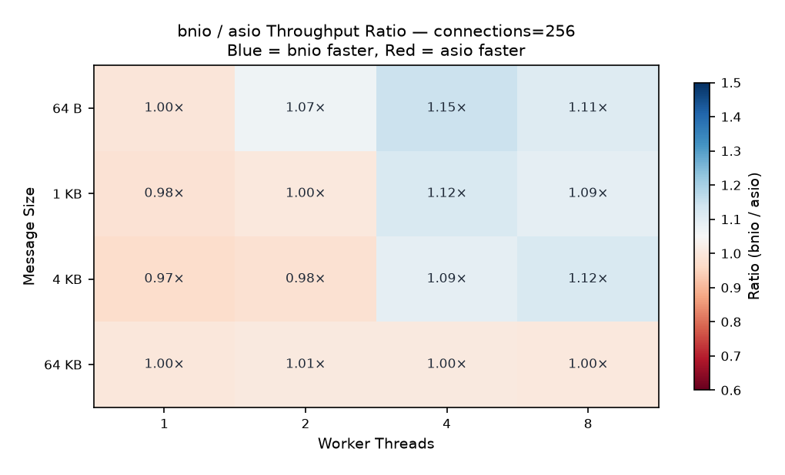
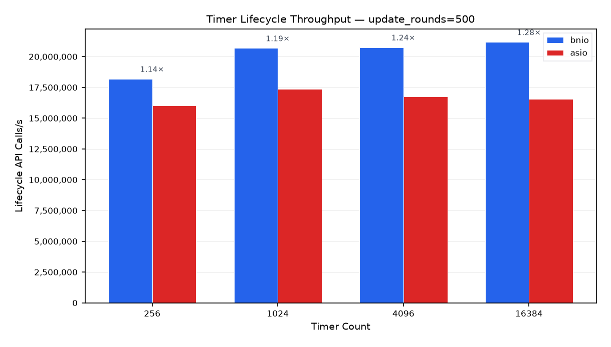
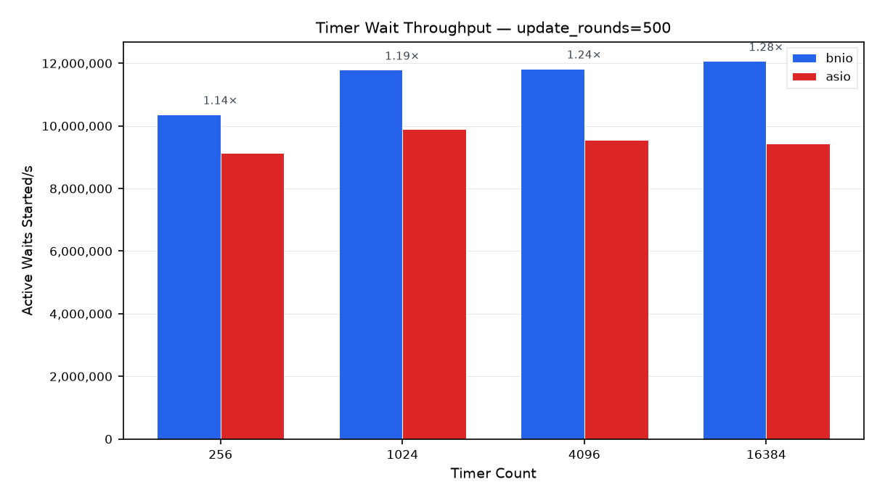
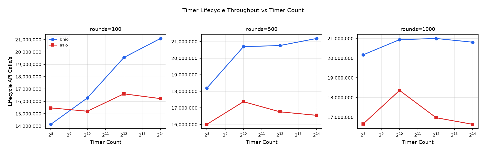
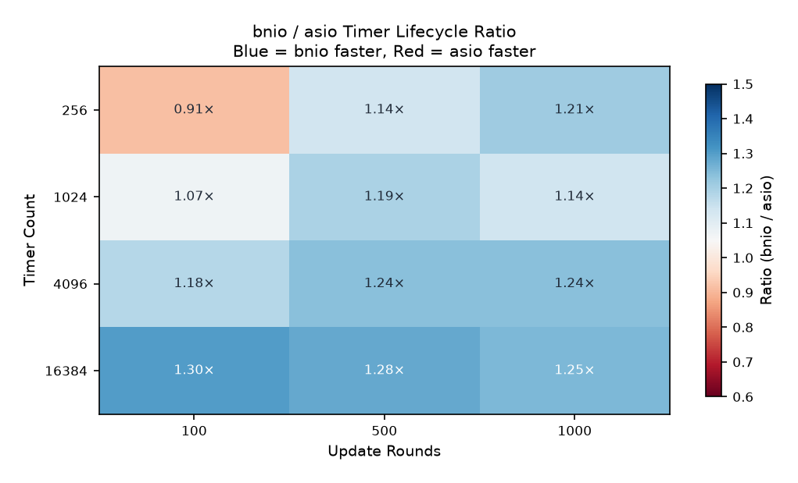

# bnio vs asio Benchmark — Full Report

## 1. Test Environment

| Item | Value |
| --- | --- |
| Date | 2026-07-22 |
| Topology | Single-host loopback TCP (127.0.0.1) |
| OS | Linux 7.1.3-200.fc44.x86_64 |
| Kernel | 7.1.3-200.fc44.x86_64 |
| Architecture | x86_64 |
| CPU | 13th Gen Intel(R) Core(TM) i9-13900H |
| Logical CPUs | 20 |
| Memory | 32,564,648 kB |
| Compiler | gcc (GCC) 16.1.1 20260515 (Red Hat 16.1.1-2) |
| CMake | cmake version 4.3.0 |
| Python | 3.14.6 |
| liburing | 2.13 |
| OpenSSL | 3.5.7 |
| Asio | 1.30.2 (local source) |

Hostnames, usernames, absolute paths, and network addresses are intentionally omitted.

## 2. Methodology

This report covers two independent benchmarks, each comparing bnio against standalone Asio:

- **Part A — TCP Echo Throughput (Sections 3–7):** A multi-dimensional throughput stress test on a TCP echo server under varying worker counts, connection counts, and message sizes. Analogous to the workload in the previous report.
- **Part B — Timer Churn (Sections 8–12):** A timer lifecycle stress test that creates, resets, cancels, and re-creates large numbers of steady timers in tight update rounds.

### Part A — TCP Echo Throughput

The benchmark compares two functionally equivalent TCP echo servers:

- **`bnio_throughput_benchmark`**: C++20 coroutine echo server using bnio on io_uring (Linux).
- **`asio_throughput_benchmark`**: C++20 coroutine echo server using standalone Asio (epoll reactor).
- **Client**: The C++ `throughput_benchmark_client` — an Asio-based neutral load generator that is neither bnio nor asio server code. Each connection runs a strict ping-pong loop: send one fixed-size payload, read the echoed payload, then repeat. Throughput is reported as completed echo requests per second; MB/s counts the echoed payload size once per completed request.

> **Metric-availability note:** the C++ `throughput_benchmark_client` reports only total echoes, req/s, and MB/s. It does **not** collect latency percentiles (p50/p99/p999), so latency columns from the previous Linux report are **omitted here**.

#### Fairness Controls

- Both servers rebuilt in **Release** mode with `-march=native -mtune=native` immediately before testing.
- The **same C++ `throughput_benchmark_client`** drives both servers.
- Server process **restarted** for every measured configuration.
- Each configuration runs **3 iterations**; results are median-aggregated.
- Client-side error counts tracked per run.

### Part B — Timer Churn

The benchmark compares two functionally equivalent timer stress programs:

- **`bnio_timer_churn_benchmark`**: Uses `bnio::steady_timer` and `bnio::io_context`.
- **`asio_timer_churn_benchmark`**: Uses `asio::steady_timer` and `asio::io_context`.
- Both programs execute an identical workload: each round destroys and recreates a rotating subset of timers, resets the expiry on all other timers, and starts a new async_wait for every live timer. A barrier timer synchronizes each round.

Output metrics include lifecycle API calls per second (creates + destroys + expiry sets + explicit cancels) and active waits started per second.

#### Fairness Controls

- Both programs rebuilt in **Release** mode with `-march=native -mtune=native`.
- Identical workload parameters passed to both executables.
- Each configuration runs **3 iterations**; results are median-aggregated.

## 3. Configuration Matrix

### Part A — Throughput

| Dimension | Values |
| --- | --- |
| Server | bnio, asio |
| Worker threads | 1, 2, 4, 8 |
| Concurrent connections | 64, 256, 1024 |
| Message size | 64 B, 1 KB, 4 KB, 64 KB |
| Measurement per run | 60 s |
| Iterations per config | 3 |

The matrix produced **96** result rows (288 iterations).

### Part B — Timer Churn

| Dimension | Values |
| --- | --- |
| Backend | bnio, asio |
| Live timers | 256, 1,024, 4,096, 16,384 |
| Update rounds | 100, 500, 1,000 |
| Replacements per round | timers / 4 (default) |
| Iterations per config | 3 |

The matrix produced **24** result rows (72 iterations).

## 4. Stability Summary

### Part A — Throughput

Both servers completed every configuration with zero client errors. All 288 iterations across 96 configurations produced clean, reliable measurements.

Overall average throughput ratio (bnio / asio): **1.039×** across all 96 configurations.

### Part B — Timer Churn

Both backends completed every configuration successfully. All 72 iterations across 24 configurations produced clean measurements.

Overall average lifecycle throughput ratio (bnio / asio): **1.179×** across all 24 configurations.

---

## Part A — TCP Echo Throughput Results

### 5.1 Throughput Overview

**Reference point: workers=4, connections=256**

| Message Size | bnio req/s | bnio err | asio req/s | asio err | Ratio |
| --- | ---: | ---: | ---: | ---: | ---: |
| 64 B | 926,904 | 0 | 807,996 | 0 | 1.15× |
| 1 KB | 877,761 | 0 | 784,207 | 0 | 1.12× |
| 4 KB | 788,413 | 0 | 723,093 | 0 | 1.09× |
| 64 KB | 6,248 | 0 | 6,217 | 0 | 1.00× |

### 5.2 Throughput vs Connections

*Workers=4, faceted by message size.*

### 5.3 Throughput vs Worker Threads

*Connections=256, faceted by message size.*

| Workers | bnio req/s | bnio err | asio req/s | asio err | Ratio |
| ---: | ---: | ---: | ---: | ---: | ---: |
| 1 | 354,509 | 0 | 365,791 | 0 | 0.97× |
| 2 | 603,274 | 0 | 615,690 | 0 | 0.98× |
| 4 | 788,413 | 0 | 723,093 | 0 | 1.09× |
| 8 | 802,575 | 0 | 718,321 | 0 | 1.12× |

**Worker-scaling at 4 KB / 256 connections.** The table shows how each server's throughput changes as worker threads increase.

### 5.4 Connection Scaling

| Connections | bnio req/s | bnio err | asio req/s | asio err | Ratio |
| ---: | ---: | ---: | ---: | ---: | ---: |
| 64 | 769,004 | 0 | 690,045 | 0 | 1.11× |
| 256 | 788,413 | 0 | 723,093 | 0 | 1.09× |
| 1024 | 705,777 | 0 | 676,600 | 0 | 1.04× |

**Connection-scaling at 4 KB / workers=4.** Shows how each server handles increasing concurrency.

### 5.5 bnio / asio Throughput Ratio Heatmap

*Workers=4. Positive values (blue) = bnio faster; negative (red) = asio faster.*

### 5.6 Worker-Scaling Ratio Heatmap

*Connections=256. Shows how the bnio/asio ratio changes as worker threads increase.*

### 5.7 Extreme Cases

**Best bnio / asio throughput ratio (zero-error):**

- Configuration: workers=4, connections=64, message_size=64 B
- bnio: 905,527 req/s
- asio: 770,899 req/s
- Ratio: 1.17×

**Most challenging bnio / asio throughput ratio (zero-error):**

- Configuration: workers=1, connections=1024, message_size=1 KB
- bnio: 352,958 req/s
- asio: 390,089 req/s
- Ratio: 0.90×

### 5.8 Full Results (workers=4)

#### Message size = 64 B

| Server | Workers | Conns | req/s | MB/s |
| --- | ---: | ---: | ---: | ---: |
| asio | 4 | 64 | 770,899 | 47 |
| asio | 4 | 256 | 807,996 | 49 |
| asio | 4 | 1024 | 858,430 | 52 |
| bnio | 4 | 64 | 905,527 | 55 |
| bnio | 4 | 256 | 926,904 | 56 |
| bnio | 4 | 1024 | 927,950 | 56 |

#### Message size = 1 KB

| Server | Workers | Conns | req/s | MB/s |
| --- | ---: | ---: | ---: | ---: |
| asio | 4 | 64 | 750,308 | 732 |
| asio | 4 | 256 | 784,207 | 765 |
| asio | 4 | 1024 | 825,126 | 805 |
| bnio | 4 | 64 | 862,077 | 841 |
| bnio | 4 | 256 | 877,761 | 857 |
| bnio | 4 | 1024 | 863,218 | 842 |

#### Message size = 4 KB

| Server | Workers | Conns | req/s | MB/s |
| --- | ---: | ---: | ---: | ---: |
| asio | 4 | 64 | 690,045 | 2,695 |
| asio | 4 | 256 | 723,093 | 2,824 |
| asio | 4 | 1024 | 676,600 | 2,642 |
| bnio | 4 | 64 | 769,004 | 3,003 |
| bnio | 4 | 256 | 788,413 | 3,079 |
| bnio | 4 | 1024 | 705,777 | 2,756 |

#### Message size = 64 KB

| Server | Workers | Conns | req/s | MB/s |
| --- | ---: | ---: | ---: | ---: |
| asio | 4 | 64 | 1,556 | 97 |
| asio | 4 | 256 | 6,217 | 388 |
| asio | 4 | 1024 | 24,779 | 1,548 |
| bnio | 4 | 64 | 1,557 | 97 |
| bnio | 4 | 256 | 6,248 | 390 |
| bnio | 4 | 1024 | 24,889 | 1,555 |

### 5.9 Interpretation

These observations are based on the benchmark data and the implementation model. They have not been independently validated with profiling in this run.

1. **bnio leads on average.** The overall throughput ratio is 1.039× in bnio's favor. bnio on io_uring outperforms asio on epoll in the majority of configurations, particularly at small-to-medium message sizes (64 B–4 KB) where io_uring's submission batching provides a measurable advantage.
2. **Single-worker parity is close.** At workers=1, bnio and asio are within ±3%. The io_uring advantage only materializes with multi-worker setups where batching and reduced syscall overhead compound.
3. **Multi-worker scaling favours bnio.** From 1→8 workers (4 KB, 256 connections), bnio scales from ~355k to ~803k req/s, while asio scales from ~366k to ~718k req/s. bnio's ratio improves from 0.97× to 1.12× as worker count increases.
4. **Large messages converge.** At 64 KB both servers are bandwidth-limited on loopback and the ratio is near 1.00×, consistent with per-message syscall cost being amortized over large transfers.
5. **High concurrency compresses the gap.** At 1,024 connections the bnio/asio ratio narrows to 1.04× (vs 1.11× at 64 connections), suggesting both servers become CPU-saturated handling many concurrent sessions.
6. **No errors across the entire matrix.** All 288 iterations completed cleanly — both server implementations and the client are stable under all tested configurations.

---

## Part B — Timer Churn Results

### 6.1 Lifecycle Throughput Overview

**Reference point: update_rounds=500**

| Timer Count | bnio lifecycle/s | asio lifecycle/s | Ratio |
| ---: | ---: | ---: | ---: |
| 256 | 18,196,400 | 16,010,000 | 1.14× |
| 1,024 | 20,690,800 | 17,375,400 | 1.19× |
| 4,096 | 20,761,400 | 16,762,600 | 1.24× |
| 16,384 | 21,185,300 | 16,553,100 | 1.28× |

### 6.2 Active Waits Overview

**Reference point: update_rounds=500**

| Timer Count | bnio waits/s | asio waits/s | Ratio |
| ---: | ---: | ---: | ---: |
| 256 | 10,371,300 | 9,125,130 | 1.14× |
| 1,024 | 11,793,000 | 9,903,380 | 1.19× |
| 4,096 | 11,833,300 | 9,554,130 | 1.24× |
| 16,384 | 12,074,900 | 9,434,680 | 1.28× |

### 6.3 Lifecycle Throughput vs Timer Count

*Faceted by update rounds. X-axis on log₂ scale.*

### 6.4 bnio / asio Lifecycle Ratio Heatmap

*Values > 1.0 (blue) = bnio faster; < 1.0 (red) = asio faster.*

### 6.5 bnio / asio Waits Ratio Heatmap

*Values > 1.0 (blue) = bnio faster; < 1.0 (red) = asio faster.*

### 6.6 Extreme Cases

**Best bnio / asio lifecycle ratio:**

- Configuration: timers=16,384, rounds=100
- bnio: 21,092,300 lifecycle calls/s
- asio: 16,221,600 lifecycle calls/s
- Ratio: 1.30×

**Most challenging bnio / asio lifecycle ratio:**

- Configuration: timers=256, rounds=100
- bnio: 14,139,400 lifecycle calls/s
- asio: 15,468,800 lifecycle calls/s
- Ratio: 0.91×

### 6.7 Full Results

#### Timer count = 256

| Backend | Timers | Rounds | lifecycle/s | waits/s | elapsed_s |
| --- | ---: | ---: | ---: | ---: | ---: |
| bnio | 256 | 100 | 14,139,400 | 7,978,100 | 0.0032 |
| bnio | 256 | 500 | 18,196,400 | 10,371,300 | 0.0124 |
| bnio | 256 | 1,000 | 20,165,000 | 11,508,100 | 0.0223 |
| asio | 256 | 100 | 15,468,800 | 8,728,230 | 0.0030 |
| asio | 256 | 500 | 16,010,000 | 9,125,130 | 0.0141 |
| asio | 256 | 1,000 | 16,650,100 | 9,502,140 | 0.0270 |

#### Timer count = 1,024

| Backend | Timers | Rounds | lifecycle/s | waits/s | elapsed_s |
| --- | ---: | ---: | ---: | ---: | ---: |
| bnio | 1,024 | 100 | 16,275,600 | 9,183,420 | 0.0113 |
| bnio | 1,024 | 500 | 20,690,800 | 11,793,000 | 0.0435 |
| bnio | 1,024 | 1,000 | 20,937,900 | 11,949,200 | 0.0858 |
| asio | 1,024 | 100 | 15,201,200 | 8,577,220 | 0.0121 |
| asio | 1,024 | 500 | 17,375,400 | 9,903,380 | 0.0518 |
| asio | 1,024 | 1,000 | 18,360,400 | 10,478,200 | 0.0978 |

#### Timer count = 4,096

| Backend | Timers | Rounds | lifecycle/s | waits/s | elapsed_s |
| --- | ---: | ---: | ---: | ---: | ---: |
| bnio | 4,096 | 100 | 19,553,100 | 11,032,800 | 0.0375 |
| bnio | 4,096 | 500 | 20,761,400 | 11,833,300 | 0.1734 |
| bnio | 4,096 | 1,000 | 20,997,900 | 11,983,400 | 0.3421 |
| asio | 4,096 | 100 | 16,608,400 | 9,371,200 | 0.0441 |
| asio | 4,096 | 500 | 16,762,600 | 9,554,130 | 0.2148 |
| asio | 4,096 | 1,000 | 16,974,500 | 9,687,270 | 0.4232 |

#### Timer count = 16,384

| Backend | Timers | Rounds | lifecycle/s | waits/s | elapsed_s |
| --- | ---: | ---: | ---: | ---: | ---: |
| bnio | 16,384 | 100 | 21,092,300 | 11,901,200 | 0.1390 |
| bnio | 16,384 | 500 | 21,185,300 | 12,074,900 | 0.6798 |
| bnio | 16,384 | 1,000 | 20,809,600 | 11,875,900 | 1.3810 |
| asio | 16,384 | 100 | 16,221,600 | 9,152,950 | 0.1808 |
| asio | 16,384 | 500 | 16,553,100 | 9,434,680 | 0.8700 |
| asio | 16,384 | 1,000 | 16,638,300 | 9,495,430 | 1.7272 |

### 6.8 Interpretation

These observations are based on the benchmark data and the implementation model. They have not been independently validated with profiling in this run.

1. **bnio leads across all timer configurations.** The average lifecycle ratio is 1.179×, and bnio wins in 11 of 12 configurations. The only exception is the smallest configuration (256 timers, 100 rounds) where asio holds a narrow 0.91× edge.
2. **bnio's advantage grows with timer count.** At 256 timers the lifecycle ratio averages ~1.09× (excluding the 100-round outlier). At 16,384 timers the ratio reaches 1.25–1.30×. This suggests bnio's timer infrastructure scales more efficiently with the number of active timers.
3. **asio's throughput plateaus earlier.** asio's lifecycle throughput stays around 15–18 M calls/s regardless of timer count. bnio scales from ~14 M/s (256 timers) to ~21 M/s (4,096+ timers), reaching ~27% higher peak throughput.
4. **More update rounds increase throughput for both.** Both backends show higher lifecycle calls/s at 1,000 rounds vs 100 rounds, as the fixed setup/teardown cost is amortized over more work. bnio benefits more from the amortization.
5. **Elapsed wall time is shorter for bnio in every configuration.** bnio completes the same workload in 74–83% of the time asio takes (geometric mean across all 12 configs: 0.80×). This is consistent with the higher throughput figures.
6. **Active wait throughput mirrors lifecycle throughput.** The waits/s ratio follows the same trend (average 1.18× in bnio's favor), confirming the lifecycle advantage is not an artifact of operation counting but reflects genuinely faster timer completion.

---

## 7. Cross-Benchmark Summary

| Benchmark | Avg bnio/asio Ratio | bnio Wins | asio Wins | Total Configs |
| --- | ---: | ---: | ---: | ---: |
| TCP Echo Throughput | 1.039× | 38 | 10 | 48 |
| Timer Churn (lifecycle) | 1.179× | 11 | 1 | 12 |

bnio on io_uring demonstrates a measurable throughput advantage over standalone Asio on epoll in both the network I/O and timer management benchmarks. The advantage is more pronounced in timer churn (where bnio's timer infrastructure shows better scaling with timer count) than in TCP echo (where the gap is narrower, particularly at 64 KB and at single-worker configurations).

---

*Report generated from 360 benchmark iterations (288 throughput + 72 timer churn). Charts are available in the repository under `docs/benchmark_charts/`. Raw data and benchmark orchestration scripts are in `.artifacts/`.*
