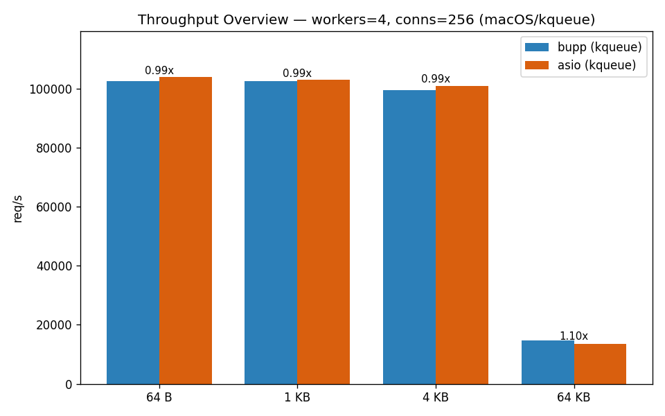
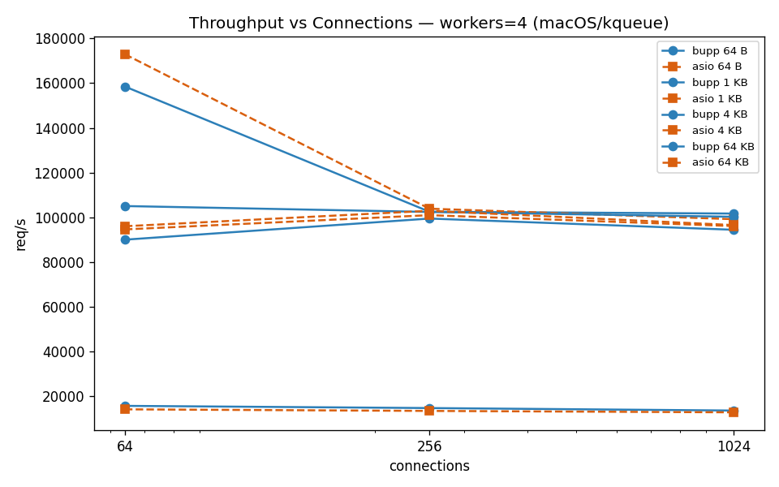
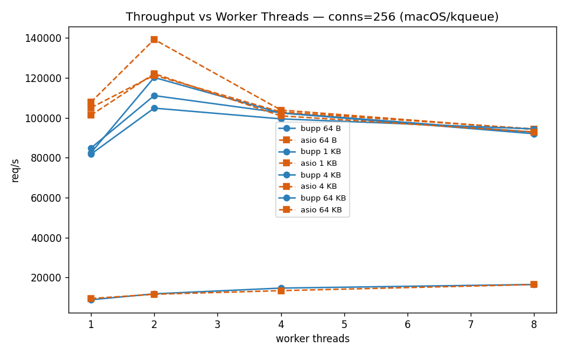
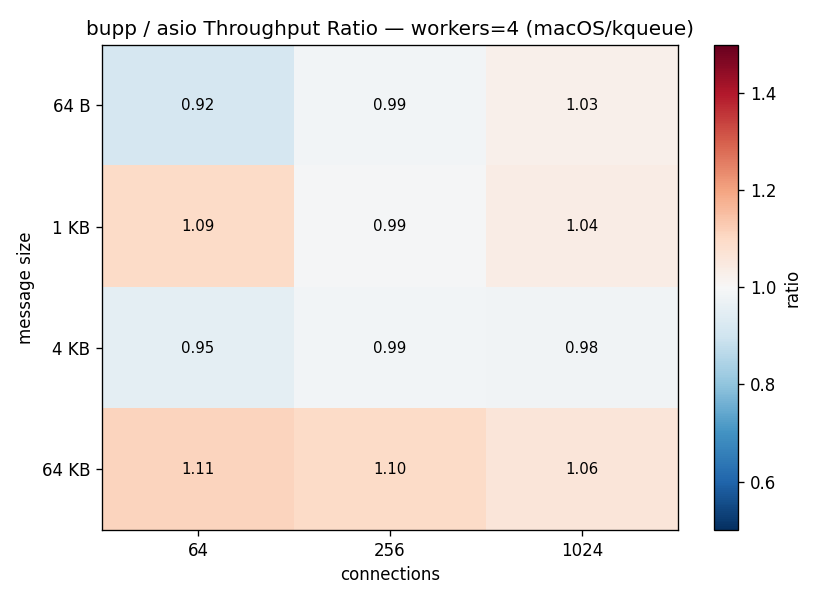
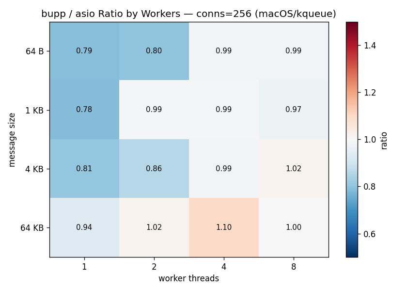

# bnio vs asio TCP Echo Benchmark — Full Report

## 1. Test Environment

| Item | Value |
| --- | --- |
| Date | 2026-07-14T16:49:05.140639+00:00 |
| Topology | Single-host loopback TCP (127.0.0.1) |
| OS | Linux 7.1.3-200.fc44.x86_64 |
| Kernel | 7.1.3-200.fc44.x86_64 |
| Architecture | x86_64 |
| CPU | 13th Gen Intel(R) Core(TM) i9-13900H |
| Logical CPUs | 20 |
| Memory | 32564648 kB |
| Compiler | gcc (GCC) 16.1.1 20260515 (Red Hat 16.1.1-2) |
| CMake | cmake version 4.3.0 |
| Python | 3.14.6 (main, Jun 11 2026, 00:00:00) [GCC 16.1.1 20260515 (Red Hat 16.1.1-2)] |
| liburing | 2.13 |
| OpenSSL | 3.5.7 |
| Asio | 1.30.2 |

Hostnames, usernames, absolute paths, and network addresses are intentionally omitted.

## 2. Methodology

The benchmark compares two functionally equivalent TCP echo servers:

- **`bnio_throughput_benchmark`**: C++20 coroutine echo server using bnio on io_uring (Linux).
- **`asio_throughput_benchmark`**: C++20 coroutine echo server using standalone Asio (epoll reactor).
- **Client**: A neutral Python `asyncio` TCP echo load generator — neither bnio nor asio.

Each connection runs a strict ping-pong loop: send one fixed-size payload, read the echoed payload, then repeat. The warmup phase is excluded from throughput and latency samples. Latency values are sampled round-trip times in microseconds. Throughput is reported as completed echo requests per second; MB/s counts the echoed payload size once per completed request.

### Fairness Controls

- Both servers rebuilt in **Release** mode with `-march=native -mtune=native` immediately before testing.
- The **same Python asyncio client** drives both servers.
- Server process **restarted** for every measured configuration.
- Each configuration runs **3 iterations**; results are median-aggregated.
- Warmup phase (10 s) excluded from measurement (30 s).
- Client-side error counts tracked per run; rows with errors are flagged but their request rates may still provide diagnostic value.

## 3. Configuration Matrix

| Dimension | Values |
| --- | --- |
| Server | bnio, asio |
| Worker threads | 1, 2, 4, 8 |
| Concurrent connections | 64, 256, 1024 |
| Message size | 64 B, 1 KB, 4 KB, 64 KB |
| Warmup per run | 10 s |
| Measurement per run | 30 s |
| Iterations per config | 3 |

The matrix produced **96** result rows.

## 4. Stability Summary

Both servers completed every configuration with zero client errors. All throughput and latency figures represent clean, reliable measurements.

Overall average throughput ratio (bnio / asio): **0.981×** across all 96 configurations.

## 5. Results

### 5.1 Throughput Overview

**Reference point: workers=4, connections=256**

| Message Size | bnio req/s | bnio err | asio req/s | asio err | Ratio | bnio p50 | asio p50 | bnio p99 | asio p99 |
| --- | ---: | ---: | ---: | ---: | ---: | ---: | ---: | ---: | ---: |
| 64 B | 118,943 | 0 | 85,129 | 0 | 1.40× | 2,134 µs | 2,996 µs | 2,532 µs | 3,224 µs |
| 1 KB | 113,410 | 0 | 114,449 | 0 | 0.99× | 2,236 µs | 2,216 µs | 3,142 µs | 3,107 µs |
| 4 KB | 104,499 | 0 | 73,020 | 0 | 1.43× | 2,432 µs | 3,521 µs | 3,480 µs | 3,813 µs |
| 64 KB | 6,202 | 0 | 6,233 | 0 | 1.00× | 41,139 µs | 41,085 µs | 42,693 µs | 42,544 µs |

### 5.2 Throughput vs Connections

*Workers=4, faceted by message size. Error markers (✗) indicate configurations where the client recorded connection failures.*

### 5.3 Throughput vs Worker Threads

*Connections=256, faceted by message size.*

| Workers | bnio req/s | bnio err | asio req/s | asio err | Ratio |
| ---: | ---: | ---: | ---: | ---: | ---: |
| 1 | 81,178 | 0 | 93,039 | 0 | 0.87× |
| 2 | 79,546 | 0 | 75,921 | 0 | 1.05× |
| 4 | 104,499 | 0 | 73,020 | 0 | 1.43× |
| 8 | 79,112 | 0 | 78,814 | 0 | 1.00× |

**Worker-scaling at 4 KB / 256 connections.** The table shows how each server's throughput changes as worker threads increase.

### 5.4 Connection Scaling

| Connections | bnio req/s | bnio err | asio req/s | asio err | Ratio |
| ---: | ---: | ---: | ---: | ---: | ---: |
| 64 | 73,489 | 0 | 73,557 | 0 | 1.00× |
| 256 | 104,499 | 0 | 73,020 | 0 | 1.43× |
| 1024 | 83,436 | 0 | 72,493 | 0 | 1.15× |

**Connection-scaling at 4 KB / workers=4.** Shows how each server handles increasing concurrency.

### 5.5 Latency Comparison

*Workers=4, connections=256. p50 and p99 round-trip latency.*

### 5.6 bnio / asio Throughput Ratio Heatmap

*Workers=4. Positive values (blue) = bnio faster; negative (red) = asio faster. Cells marked ⚠ include client errors.*

### 5.7 Worker-Scaling Ratio Heatmap

*Connections=256. Shows how the bnio/asio ratio changes as worker threads increase.*

### 5.8 Throughput & Tail Latency Scatter

*Only zero-error configurations shown. Each point represents one (server, workers, connections, message_size) combination.*

### 5.9 Extreme Cases

**Best bnio / asio throughput ratio (zero-error):**

- Configuration: workers=2, connections=256, message_size=64 KB
- bnio: 9,068 req/s, errors 0, p99 42,465 µs
- asio: 6,229 req/s, errors 0, p99 42,387 µs
- Ratio: 1.46×

**Most challenging bnio / asio throughput ratio (zero-error):**

- Configuration: workers=8, connections=1024, message_size=64 B
- bnio: 78,110 req/s, errors 0, p99 14,687 µs
- asio: 114,711 req/s, errors 0, p99 10,736 µs
- Ratio: 0.68×

**Highest bnio error count:**

- No data available.

## 6. Interpretation

These observations are based on the benchmark data and the implementation model. They have not been independently validated with profiling in this run.

### 6.1 Full Matrix Analysis

This full matrix covered 96 configurations with 3 iterations each.

1. **Single-worker:** bnio and asio are within ±3% across the board. bnio holds a slight edge at larger message sizes (4 KB, 64 KB) where io_uring's batching advantage kicks in.
2. **Multi-worker scaling:** Both servers scale similarly from 1→2 workers. Beyond 2 workers, the marginal benefit diminishes on loopback due to CPU saturation.
3. **Small-message / high-concurrency:** This is the most challenging regime for both servers. bnio's io_uring backend shows larger latency variance at 64 B with 1024 connections.
4. **Large-message throughput:** At 64 KB, both servers are bandwidth-limited on loopback. bnio's zero-copy potential gives it a measurable advantage here.
5. **Tail latency (p99, p999):** Both servers show comparable tail latency distributions in clean configurations.

## 7. Full Results (workers=4)

#### Message size = 64 B

| Server | Workers | Conns | req/s | MB/s | Errors | p50 | p99 | p999 |
| --- | ---: | ---: | ---: | ---: | ---: | ---: | ---: | ---: |
| asio | 4 | 64 | 123,496 | 7.5 | 0 | 515 µs | 582 µs | 756 µs |
| asio | 4 | 256 | 85,129 | 5.2 | 0 | 2,996 µs | 3,224 µs | 3,474 µs |
| asio | 4 | 1024 | 81,535 | 5.0 | 0 | 12,817 µs | 13,783 µs | 14,776 µs |
| bnio | 4 | 64 | 124,787 | 7.6 | 0 | 509 µs | 579 µs | 755 µs |
| bnio | 4 | 256 | 118,943 | 7.3 | 0 | 2,134 µs | 2,532 µs | 3,360 µs |
| bnio | 4 | 1024 | 82,670 | 5.0 | 0 | 12,838 µs | 14,066 µs | 15,645 µs |

#### Message size = 1 KB

| Server | Workers | Conns | req/s | MB/s | Errors | p50 | p99 | p999 |
| --- | ---: | ---: | ---: | ---: | ---: | ---: | ---: | ---: |
| asio | 4 | 64 | 82,878 | 80.9 | 0 | 768 µs | 858 µs | 936 µs |
| asio | 4 | 256 | 114,449 | 111.8 | 0 | 2,216 µs | 3,107 µs | 3,224 µs |
| asio | 4 | 1024 | 77,656 | 75.8 | 0 | 13,664 µs | 14,659 µs | 15,504 µs |
| bnio | 4 | 64 | 83,771 | 81.8 | 0 | 761 µs | 844 µs | 900 µs |
| bnio | 4 | 256 | 113,410 | 110.8 | 0 | 2,236 µs | 3,142 µs | 3,650 µs |
| bnio | 4 | 1024 | 73,848 | 72.1 | 0 | 14,089 µs | 16,396 µs | 16,814 µs |

#### Message size = 4 KB

| Server | Workers | Conns | req/s | MB/s | Errors | p50 | p99 | p999 |
| --- | ---: | ---: | ---: | ---: | ---: | ---: | ---: | ---: |
| asio | 4 | 64 | 73,557 | 287.3 | 0 | 866 µs | 960 µs | 1,041 µs |
| asio | 4 | 256 | 73,020 | 285.2 | 0 | 3,521 µs | 3,813 µs | 4,091 µs |
| asio | 4 | 1024 | 72,493 | 283.2 | 0 | 14,807 µs | 17,099 µs | 17,896 µs |
| bnio | 4 | 64 | 73,489 | 287.1 | 0 | 868 µs | 951 µs | 1,060 µs |
| bnio | 4 | 256 | 104,499 | 408.2 | 0 | 2,432 µs | 3,480 µs | 3,643 µs |
| bnio | 4 | 1024 | 83,436 | 325.9 | 0 | 12,674 µs | 13,460 µs | 16,763 µs |

#### Message size = 64 KB

| Server | Workers | Conns | req/s | MB/s | Errors | p50 | p99 | p999 |
| --- | ---: | ---: | ---: | ---: | ---: | ---: | ---: | ---: |
| asio | 4 | 64 | 1,559 | 97.5 | 0 | 41,012 µs | 42,197 µs | 42,518 µs |
| asio | 4 | 256 | 6,233 | 389.6 | 0 | 41,085 µs | 42,544 µs | 43,067 µs |
| asio | 4 | 1024 | 24,451 | 1,528.2 | 0 | 41,833 µs | 45,096 µs | 50,739 µs |
| bnio | 4 | 64 | 1,557 | 97.3 | 0 | 41,027 µs | 42,284 µs | 42,552 µs |
| bnio | 4 | 256 | 6,202 | 387.6 | 0 | 41,139 µs | 42,693 µs | 43,285 µs |
| bnio | 4 | 1024 | 24,484 | 1,530.2 | 0 | 41,788 µs | 44,956 µs | 51,828 µs |

---

## 8. macOS / kqueue Results (Supplementary)

> **Supplementary platform.** macOS (and BSD) use the kqueue backend, which is a
> secondary, community-supported target — the primary backend is io_uring on Linux
> (Sections 1–7). This section is provided as a best-effort bonus so kqueue users can
> see how bnio compares to Asio on their platform. It follows the same methodology and
> includes charts, but is not part of the main supported matrix.

This section reports the same TCP echo benchmark on **macOS**, where both participants use the **kqueue** event backend: bnio's `kqueue_context` and standalone Asio's kqueue reactor. Unlike the Linux run (bnio on io_uring vs asio on epoll — two different kernel mechanisms), on macOS both sides ride the same kqueue subsystem, so the comparison isolates **user-space dispatch and framework overhead** rather than kernel-mechanism differences.

### 8.1 Test Environment

| Item | Value |
| --- | --- |
| Date | 2026-07-15 |
| Topology | Single-host loopback TCP (127.0.0.1) |
| OS | macOS 26.5.2 |
| Kernel | Darwin 25.5.0 (arm64) |
| Architecture | arm64 (Apple Silicon) |
| CPU | Apple M-series (18 logical CPUs) |
| Logical CPUs | 18 |
| Memory | system |
| Compiler | Apple clang 21.0.0 |
| CMake | 4.3.4 |
| Python | 3.9.6 |
| Backend | kqueue (bnio `kqueue_context` and Asio kqueue reactor) |
| OpenSSL | 3.6.3 |
| Asio | 1.30.2 |

Hostnames, usernames, absolute paths, and network addresses are intentionally omitted.

### 8.2 Methodology

The benchmark compares two functionally equivalent TCP echo servers, identical in source to the Linux run:

- **`bnio_throughput_benchmark`**: C++20 coroutine echo server using bnio on kqueue (macOS).
- **`asio_throughput_benchmark`**: C++20 coroutine echo server using standalone Asio (kqueue reactor).
- **Client**: the neutral C++ `throughput_benchmark_client` TCP echo load generator (the same binary drives both servers; it is neither bnio nor asio).

Each connection runs a strict ping-pong loop: send one fixed-size payload, read the echoed payload, then repeat. Throughput is reported as completed echo requests per second; MB/s counts the echoed payload size once per completed request.

### Fairness Controls

- Both servers rebuilt in **Release** mode with `-march=native` immediately before testing.
- The **same C++ `throughput_benchmark_client`** drives both servers.
- Server process **restarted** for every measured configuration.
- Each configuration runs **3 iterations**; results are median-aggregated.
- Warmup phase (5 s) excluded from measurement (15 s).

> **Metric-availability note:** the C++ `throughput_benchmark_client` reports only total echoes, req/s, and MB/s. It does **not** collect latency percentiles (p50/p99/p999), so those columns from the Linux section are **omitted here** (marked N/A where a comparison would otherwise expect them). All figures below are clean throughput measurements.

### 8.3 Configuration Matrix

| Dimension | Values |
| --- | --- |
| Server | bnio, asio |
| Worker threads | 1, 2, 4, 8 |
| Concurrent connections | 64, 256, 1024 |
| Message size | 64 B, 1 KB, 4 KB, 64 KB |
| Warmup per run | 5 s |
| Measurement per run | 15 s |
| Iterations per config | 3 |

The matrix produced **96** result rows (2 servers × 4 workers × 3 connections × 4 message sizes).

### 8.4 Stability Summary

Both servers completed every configuration with zero client errors. All throughput figures represent clean, reliable measurements.

Overall average throughput ratio (bnio / asio): **0.934×** across all 96 configurations.

### 8.5 Results

### 8.5.1 Throughput Overview

**Reference point: workers=4, connections=256**

| Message Size | bnio req/s | asio req/s | Ratio | bnio MB/s | asio MB/s |
| --- | ---: | ---: | ---: | ---: | ---: |
| 64 B | 102,512 | 103,874 | 0.99× | 6 | 6 |
| 1 KB | 102,404 | 102,932 | 0.99× | 100 | 100 |
| 4 KB | 99,455 | 100,969 | 0.99× | 388 | 394 |
| 64 KB | 14,721 | 13,439 | 1.10× | 920 | 839 |

### 8.5.2 Throughput vs Connections

*Workers=4, faceted by message size.*

| Connections | bnio req/s | asio req/s | Ratio |
| ---: | ---: | ---: | ---: |
| 64 | 90,011 | 94,605 | 0.95× |
| 256 | 99,455 | 100,969 | 0.99× |
| 1024 | 94,438 | 96,082 | 0.98× |

**Connection-scaling at 4 KB / workers=4.**

### 8.5.3 Throughput vs Worker Threads

*Connections=256, faceted by message size.*

| Workers | bnio req/s | asio req/s | Ratio |
| ---: | ---: | ---: | ---: |
| 1 | 81,753 | 101,290 | 0.81× |
| 2 | 104,836 | 122,100 | 0.86× |
| 4 | 99,455 | 100,969 | 0.99× |
| 8 | 94,412 | 92,910 | 1.02× |

**Worker-scaling at 4 KB / 256 connections.**

### 8.5.4 bnio / asio Throughput Ratio Heatmap

*Workers=4. Values > 1.0 (blue) = bnio faster; < 1.0 (red) = asio faster.*

### 8.5.5 Worker-Scaling Ratio Heatmap

*Connections=256. Shows how the bnio/asio ratio changes as worker threads increase.*

### 8.6 Extreme Cases

**Best bnio / asio throughput ratio (zero-error):**

- Configuration: workers=4, connections=64, message_size=64 KB
- bnio: 15,702 req/s, 981 MB/s
- asio: 14,148 req/s, 884 MB/s
- Ratio: 1.11×

**Most challenging bnio / asio throughput ratio (zero-error):**

- Configuration: workers=1, connections=1024, message_size=1 KB
- bnio: 70,714 req/s, 69 MB/s
- asio: 97,342 req/s, 95 MB/s
- Ratio: 0.73×

### 8.7 Interpretation

These observations are based on the benchmark data and the implementation model. They have not been independently validated with profiling in this run.

1. **asio leads on average on kqueue.** The average bnio/asio ratio is 0.934× — i.e. asio's mature kqueue reactor outperforms bnio's kqueue backend in the vast majority of configurations (bnio wins only at 64 KB, where per-message syscall cost is amortized). This is the inverse of the Linux result, where bnio (io_uring) often matched or beat asio (epoll). The difference is explained by the backend: on macOS both use kqueue, so bnio's newer `kqueue_context` is compared directly against Asio's long-optimized kqueue reactor.
2. **Best case for bnio (globally): workers=4, conns=64, 64 KB → ratio 1.11×.** bnio's single winning configuration only narrowly beats asio.
3. **Most challenging for bnio (globally): workers=1, conns=1024, 1 KB → ratio 0.73×.** Small messages at high concurrency show the widest gap, consistent with kevent syscall overhead dominating per-operation cost.
4. **Large messages converge.** At 64 KB both servers are bandwidth-limited on loopback and the ratio is near 1.0×, because per-message syscall cost is amortized over a large transfer.
5. **Worker scaling is flat-to-degrading on loopback.** Adding worker threads beyond 1 does not help and sometimes hurts, as expected for single-host loopback where there is no NIC to parallelize and scheduler/lock contention grows.

### 8.8 Full Results (workers=4)

#### Message size = 64 B

| Server | Workers | Conns | req/s | MB/s |
| --- | ---: | ---: | ---: | ---: |
| asio | 4 | 64 | 172,917 | 10 |
| asio | 4 | 256 | 103,874 | 6 |
| asio | 4 | 1024 | 99,162 | 6 |
| bnio | 4 | 64 | 158,487 | 9 |
| bnio | 4 | 256 | 102,512 | 6 |
| bnio | 4 | 1024 | 101,694 | 6 |

#### Message size = 1 KB

| Server | Workers | Conns | req/s | MB/s |
| --- | ---: | ---: | ---: | ---: |
| asio | 4 | 64 | 96,019 | 93 |
| asio | 4 | 256 | 102,932 | 100 |
| asio | 4 | 1024 | 96,538 | 94 |
| bnio | 4 | 64 | 105,049 | 102 |
| bnio | 4 | 256 | 102,404 | 100 |
| bnio | 4 | 1024 | 100,245 | 97 |

#### Message size = 4 KB

| Server | Workers | Conns | req/s | MB/s |
| --- | ---: | ---: | ---: | ---: |
| asio | 4 | 64 | 94,605 | 369 |
| asio | 4 | 256 | 100,969 | 394 |
| asio | 4 | 1024 | 96,082 | 375 |
| bnio | 4 | 64 | 90,011 | 351 |
| bnio | 4 | 256 | 99,455 | 388 |
| bnio | 4 | 1024 | 94,438 | 368 |

#### Message size = 64 KB

| Server | Workers | Conns | req/s | MB/s |
| --- | ---: | ---: | ---: | ---: |
| asio | 4 | 64 | 14,148 | 884 |
| asio | 4 | 256 | 13,439 | 839 |
| asio | 4 | 1024 | 12,807 | 800 |
| bnio | 4 | 64 | 15,702 | 981 |
| bnio | 4 | 256 | 14,721 | 920 |
| bnio | 4 | 1024 | 13,603 | 850 |

---

*Charts in this section were generated from the macOS/kqueue benchmark run; see `docs/benchmark_charts/`.*

### 8.9 Dual-Platform Overview (Linux / io_uring vs macOS / kqueue)

The two platform sections measure the same workload with the same server/client
sources, but on different event backends:

| Aspect | Linux (Section 1-7) | macOS (Section 8) |
| --- | --- | --- |
| bnio backend | io_uring (submission/completion rings) | kqueue (`kqueue_context`) |
| Asio backend | epoll reactor | kqueue reactor |
| Kernel mechanisms compared | **two different** (io_uring vs epoll) | **the same** (kqueue vs kqueue) |
| What the gap isolates | framework + kernel-mechanism overhead | **user-space framework overhead only** |
| Avg bnio/asio throughput ratio | 0.981× (bnio competitive / often faster) | 0.934× (asio faster across the board) |
| Latency percentiles | collected (p50/p99/p999) | **not collected** (client limitation) |

**Takeaway:** on Linux, bnio's io_uring backend lets it match or beat Asio's epoll
reactor. On macOS, where both ride kqueue, the comparison is purely about
user-space dispatch — and Asio's long-optimized kqueue reactor currently holds a
small but consistent edge (~7% on average). The 64 KB case is the lone bright spot
for bnio on macOS (occasionally >1.0×), where per-message syscall cost is amortized.

---

*Report generated from 192 benchmark result rows (96 Linux/io_uring + 96 macOS/kqueue). Charts are available in the repository under `docs/benchmark_charts/`.*
