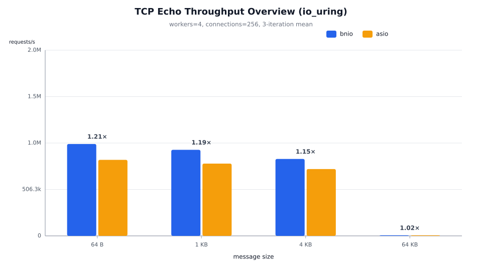
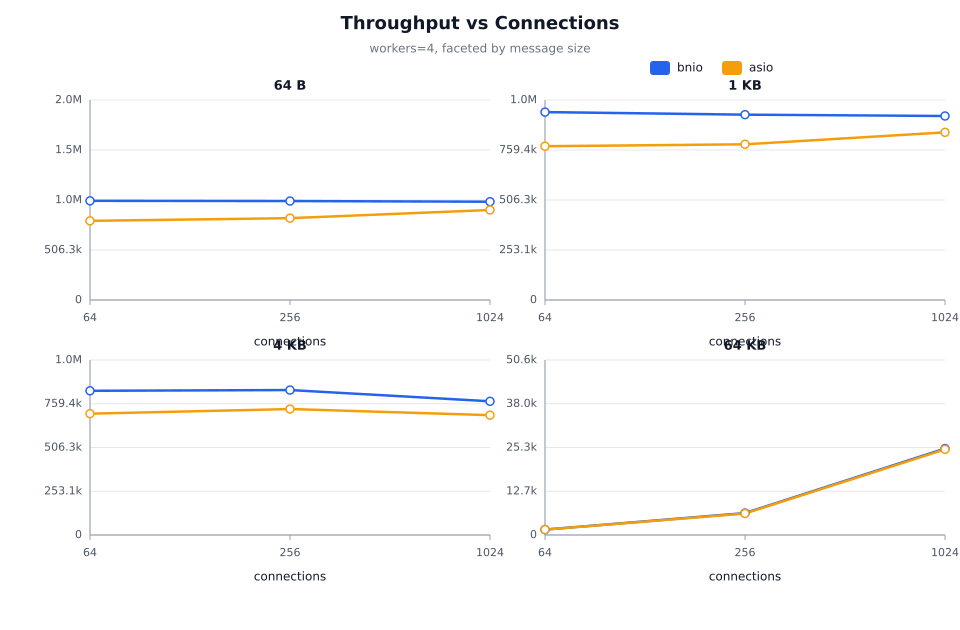
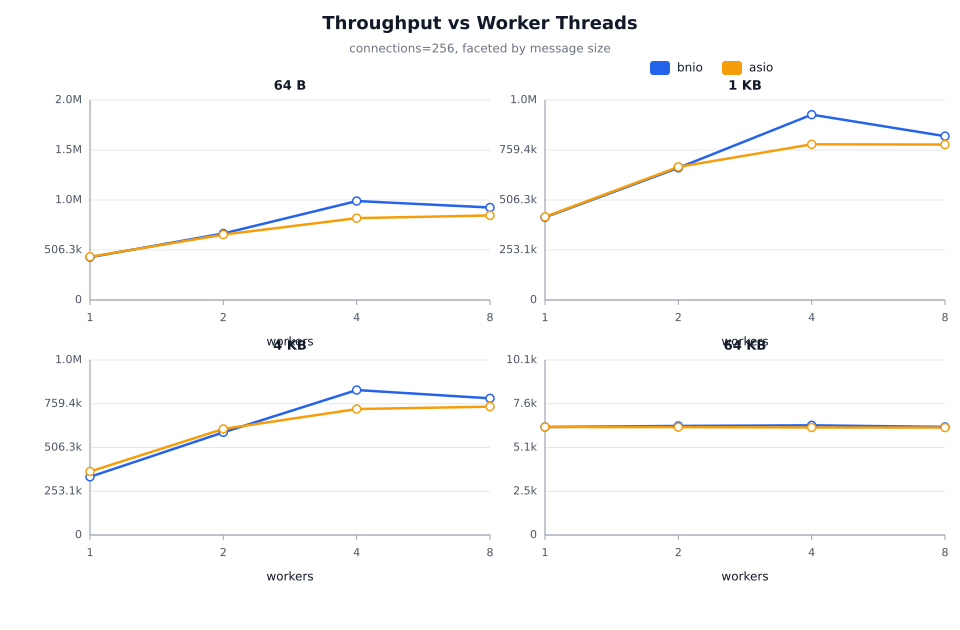
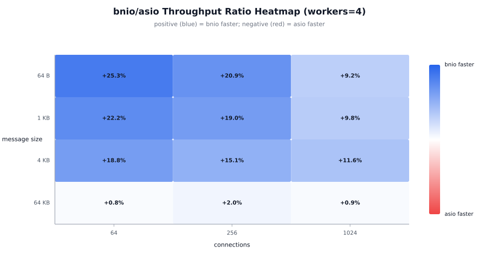
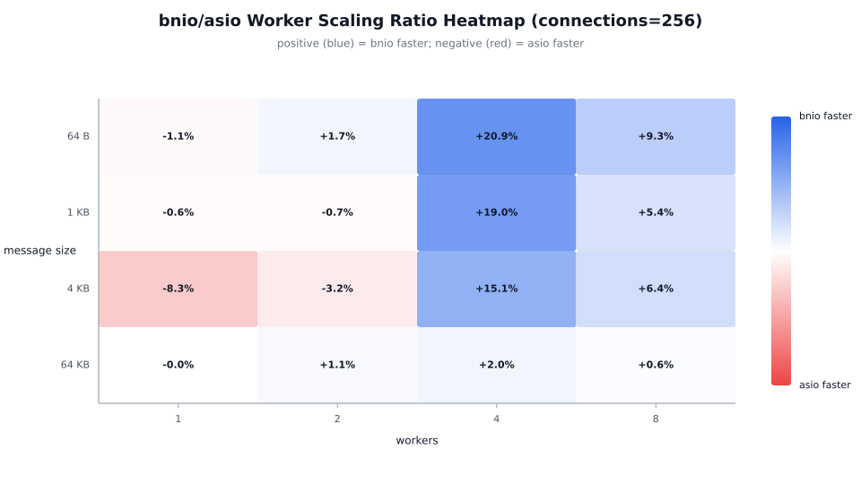
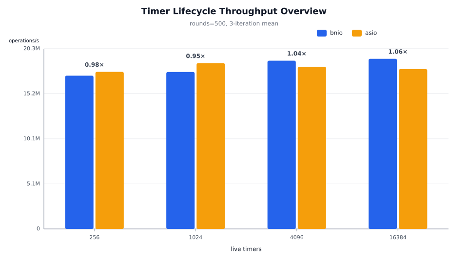
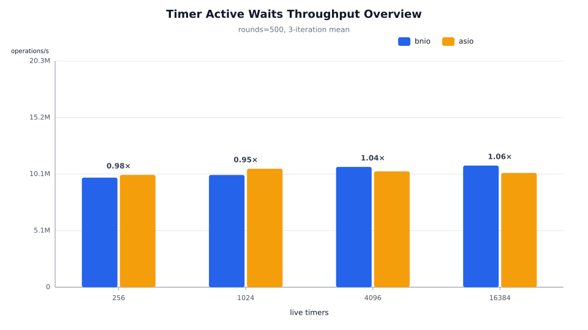
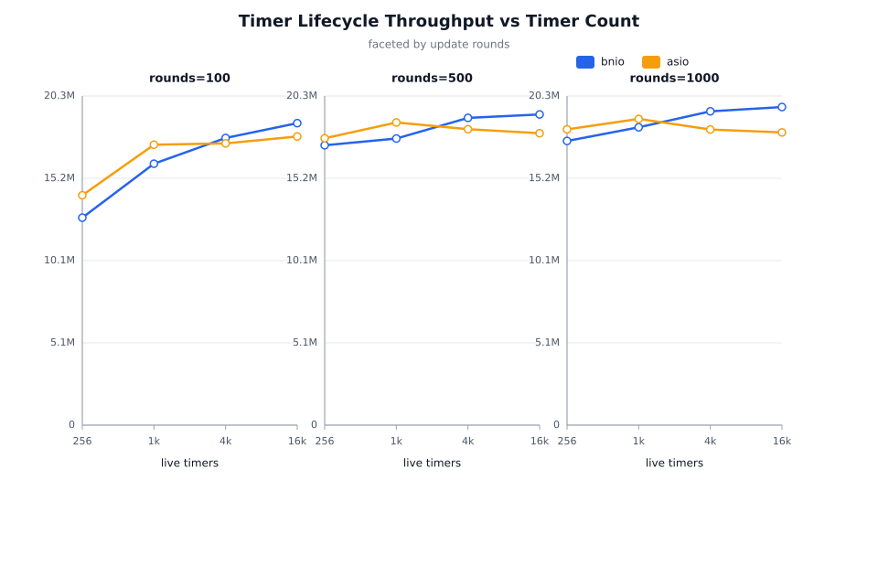
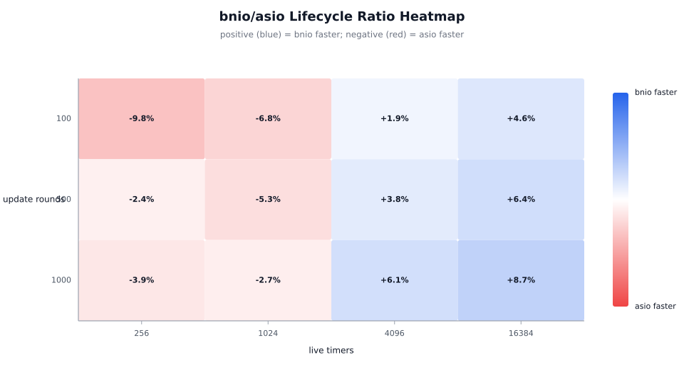
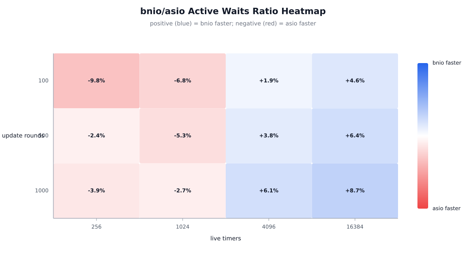

# bnio vs asio Benchmark — io_uring (Linux)

## 1. Test environment

| Item | Value |
| --- | --- |
| Topology | Single-host loopback TCP (127.0.0.1) |
| OS | Fedora Linux 44 |
| Kernel | 7.1.9 |
| Logical CPUs | 20 |
| Compiler | g++ (GCC) 16 |
| CMake | cmake 4 |
| bnio | v0.2.0 |

## 2. Methodology

The report follows the same structure as the previous io_uring benchmark:

- **Part A — TCP echo throughput:** a multi-dimensional stress test on a TCP echo server, varying worker threads, concurrent connections, and message sizes.
- **Part B — Timer churn:** a timer lifecycle stress test that creates, resets, cancels, and destroys large numbers of steady timers in tight update rounds.

Both parts compare bnio with standalone Asio. The bnio server uses io_uring; the Asio server uses the epoll reactor. The client is the shared C++ `throughput_benchmark_client`; it runs a strict ping-pong loop and reports total echoes, req/s, and MB/s. It does not expose latency percentiles.

Each server was rebuilt in Release mode with `-march=native -mtune=native` before the run. Every configuration restarts the server, and the same client binary drives both implementations. Each configuration is measured three times.

The order of bnio and asio within each iteration alternates, so a one-off warm-up or thermal drift does not consistently favor the first backend. All client return codes and server process states are recorded. The client binary returns a process exit status but does not count individual connection errors, so the stability claims below are process-level checks rather than per-request error counts.

## 3. Configuration matrix

### Throughput

| Dimension | Values |
| --- | --- |
| Server | bnio, asio |
| Worker threads | 1, 2, 4, 8 |
| Concurrent connections | 64, 256, 1,024 |
| Message size | 64 B, 1 KB, 4 KB, 64 KB |
| Measurement per run | 10 s |
| Iterations | 3 |

This is 48 unique server-configuration cells and 288 measured client runs.

### Timer churn

| Dimension | Values |
| --- | --- |
| Backend | bnio, asio |
| Live timers | 256, 1,024, 4,096, 16,384 |
| Update rounds | 100, 500, 1,000 |
| Replacements per round | timers / 4 |
| Iterations | 3 |

This is 24 unique backend-configuration cells and 72 measured runs.

## 4. Stability

Every server started within the client's readiness window. Process-level failures were 0/288 for throughput and 0/72 for timer churn.

The largest per-configuration coefficient of variation was 8.6% for throughput and 7.8% for timer lifecycle throughput.

## 5. TCP echo throughput

### 5.1 Overview

Reference point: workers=4, connections=256.

| Message size | bnio req/s | asio req/s | bnio / asio |
| ---: | ---: | ---: | ---: |
| 64 B | 1,001,954 | 828,838 | 1.21× |
| 1 KB | 938,252 | 788,251 | 1.19× |
| 4 KB | 838,646 | 728,724 | 1.15× |
| 64 KB | 6,345 | 6,222 | 1.02× |

### 5.2 Connection scaling

Workers=4, faceted by message size.

### 5.3 Worker scaling

Connections=256, faceted by message size.

| Workers | bnio req/s | asio req/s | bnio / asio |
| ---: | ---: | ---: | ---: |
| 1 | 336,769 | 367,403 | 0.92× |
| 2 | 593,976 | 613,865 | 0.97× |
| 4 | 838,646 | 728,724 | 1.15× |
| 8 | 790,610 | 742,782 | 1.06× |

### 5.4 Connection count at 4 KB

| Connections | bnio req/s | asio req/s | bnio / asio |
| ---: | ---: | ---: | ---: |
| 64 | 834,334 | 702,006 | 1.19× |
| 256 | 838,646 | 728,724 | 1.15× |
| 1,024 | 773,482 | 693,214 | 1.12× |

### 5.5 Ratio heatmaps

Workers=4, by message size and connections.

Connections=256, by message size and worker count.

### 5.6 Extreme cases

Best bnio / asio ratio:

- Configuration: workers=4, connections=64, message=64 B
- bnio: 1,004,143 req/s
- asio: 801,443 req/s
- Ratio: 1.25×

Lowest bnio / asio ratio:

- Configuration: workers=1, connections=1,024, message=4 KB
- bnio: 269,638 req/s
- asio: 299,413 req/s
- Ratio: 0.90×

### 5.7 Full results at workers=4

#### 64 B

| Server | Workers | Connections | req/s | MB/s |
| --- | ---: | ---: | ---: | ---: |
| asio | 4 | 64 | 801,443 | 48 |
| asio | 4 | 256 | 828,838 | 50 |
| asio | 4 | 1,024 | 911,658 | 55 |
| bnio | 4 | 64 | 1,004,143 | 61 |
| bnio | 4 | 256 | 1,001,954 | 60 |
| bnio | 4 | 1,024 | 995,145 | 60 |

#### 1 KB

| Server | Workers | Connections | req/s | MB/s |
| --- | ---: | ---: | ---: | ---: |
| asio | 4 | 64 | 778,550 | 760 |
| asio | 4 | 256 | 788,251 | 769 |
| asio | 4 | 1,024 | 848,741 | 828 |
| bnio | 4 | 64 | 951,187 | 929 |
| bnio | 4 | 256 | 938,252 | 916 |
| bnio | 4 | 1,024 | 931,507 | 909 |

#### 4 KB

| Server | Workers | Connections | req/s | MB/s |
| --- | ---: | ---: | ---: | ---: |
| asio | 4 | 64 | 702,006 | 2,742 |
| asio | 4 | 256 | 728,724 | 2,846 |
| asio | 4 | 1,024 | 693,214 | 2,707 |
| bnio | 4 | 64 | 834,334 | 3,259 |
| bnio | 4 | 256 | 838,646 | 3,275 |
| bnio | 4 | 1,024 | 773,482 | 3,021 |

#### 64 KB

| Server | Workers | Connections | req/s | MB/s |
| --- | ---: | ---: | ---: | ---: |
| asio | 4 | 64 | 1,562 | 97 |
| asio | 4 | 256 | 6,222 | 388 |
| asio | 4 | 1,024 | 24,777 | 1,548 |
| bnio | 4 | 64 | 1,575 | 98 |
| bnio | 4 | 256 | 6,345 | 396 |
| bnio | 4 | 1,024 | 25,010 | 1,563 |

### 5.8 Patterns

- Overall bnio / asio throughput ratio: **1.046×**, with bnio winning 39 of 48 configurations.
- Worker averages: 1 worker 0.99×, 2 workers 1.01×, 4 workers 1.13×, 8 workers 1.05×.
- Message averages: 64 B 1.08×, 1 KB 1.06×, 4 KB 1.04×, 64 KB 1.01×.
- Connection averages: 64 1.07×, 256 1.04×, 1,024 1.03×.

## 6. Timer churn

### 6.1 Lifecycle throughput

Reference point: update rounds=500.

| Timer count | bnio lifecycle/s | asio lifecycle/s | bnio / asio |
| ---: | ---: | ---: | ---: |
| 256 | 17,219,633 | 17,649,300 | 0.98× |
| 1,024 | 17,633,433 | 18,621,067 | 0.95× |
| 4,096 | 18,904,033 | 18,207,733 | 1.04× |
| 16,384 | 19,115,033 | 17,958,933 | 1.06× |

### 6.2 Active waits

Reference point: update rounds=500.

| Timer count | bnio waits/s | asio waits/s | bnio / asio |
| ---: | ---: | ---: | ---: |
| 256 | 9,814,597 | 10,059,483 | 0.98× |
| 1,024 | 10,050,453 | 10,613,367 | 0.95× |
| 4,096 | 10,774,633 | 10,377,767 | 1.04× |
| 16,384 | 10,894,900 | 10,236,000 | 1.06× |

### 6.3 Timer count scaling

Faceted by update rounds.

### 6.4 Ratio heatmaps

### 6.5 Extreme cases

Best bnio / asio lifecycle ratio:

- Configuration: timers=16,384, rounds=1,000, bnio 19,571,567 lifecycle/s, asio 18,008,833 lifecycle/s
- Ratio: 1.09×

Lowest bnio / asio lifecycle ratio:

- Configuration: timers=256, rounds=100, bnio 12,763,033 lifecycle/s, asio 14,144,067 lifecycle/s
- Ratio: 0.90×

### 6.6 Full results

#### 256 timers

| Server | Timers | Rounds | lifecycle/s | waits/s |
| --- | ---: | ---: | ---: | ---: |
| asio | 256 | 100 | 14,144,067 | 7,980,727 |
| asio | 256 | 500 | 17,649,300 | 10,059,483 |
| asio | 256 | 1,000 | 18,198,100 | 10,385,567 |
| bnio | 256 | 100 | 12,763,033 | 7,201,497 |
| bnio | 256 | 500 | 17,219,633 | 9,814,597 |
| bnio | 256 | 1,000 | 17,483,533 | 9,977,777 |

#### 1,024 timers

| Server | Timers | Rounds | lifecycle/s | waits/s |
| --- | ---: | ---: | ---: | ---: |
| asio | 1,024 | 100 | 17,254,033 | 9,735,533 |
| asio | 1,024 | 500 | 18,621,067 | 10,613,367 |
| asio | 1,024 | 1,000 | 18,841,933 | 10,753,000 |
| bnio | 1,024 | 100 | 16,084,333 | 9,075,517 |
| bnio | 1,024 | 500 | 17,633,433 | 10,050,453 |
| bnio | 1,024 | 1,000 | 18,324,833 | 10,457,933 |

#### 4,096 timers

| Server | Timers | Rounds | lifecycle/s | waits/s |
| --- | ---: | ---: | ---: | ---: |
| asio | 4,096 | 100 | 17,334,933 | 9,781,153 |
| asio | 4,096 | 500 | 18,207,733 | 10,377,767 |
| asio | 4,096 | 1,000 | 18,188,067 | 10,379,867 |
| bnio | 4,096 | 100 | 17,668,300 | 9,969,260 |
| bnio | 4,096 | 500 | 18,904,033 | 10,774,633 |
| bnio | 4,096 | 1,000 | 19,306,467 | 11,018,100 |

#### 16,384 timers

| Server | Timers | Rounds | lifecycle/s | waits/s |
| --- | ---: | ---: | ---: | ---: |
| asio | 16,384 | 100 | 17,760,033 | 10,021,007 |
| asio | 16,384 | 500 | 17,958,933 | 10,236,000 |
| asio | 16,384 | 1,000 | 18,008,833 | 10,277,567 |
| bnio | 16,384 | 100 | 18,580,400 | 10,483,900 |
| bnio | 16,384 | 500 | 19,115,033 | 10,894,900 |
| bnio | 16,384 | 1,000 | 19,571,567 | 11,169,400 |

### 6.7 Patterns

- Overall lifecycle ratio: **1.001×**, with bnio winning 6 of 12 configurations.
- Timer-count averages: 256 0.95×, 1,024 0.95×, 4,096 1.04×, 16,384 1.07×.
- Peak lifecycle/s: bnio 19,571,567, asio 18,841,933.

## 7. Compared with the previous run

The previous io_uring report ran on 2026-08-14 at commit 96dea0c. This run uses commit f8ad27d on branch main.

| Metric | Previous (Aug 14) | Current (2026-09-09) | Change |
| --- | ---: | ---: | ---: |
| Throughput average ratio | 1.048× | 1.046× | -0.15% |
| Throughput wins | 39/48 | 39/48 | +0 |
| 1-worker ratio | 1.00× | 0.99× | -0.68% |
| 2-worker ratio | 1.01× | 1.01× | +0.02% |
| 4-worker ratio | 1.13× | 1.13× | +0.31% |
| 8-worker ratio | 1.05× | 1.05× | -0.31% |
| Timer average ratio | 1.022× | 1.001× | -2.09% |
| Timer wins | 8/12 | 6/12 | -2 |

The main code changes in this interval touch the hot paths this benchmark exercises: the defer scheduler always publishes through the shared queue (`1c376b0`), schedule-kind publish paths were composed (`0750191`), the throughput benchmark converged on the defer-accept scheme (`ab473f1`), success paths reuse a shared empty error code (`3088bf2`), and FIFO batch-order restoration was removed on both backends (`f8ad27d`). These changes are not benchmark-specific, but they do touch worker scheduling, shared-queue publication, and timer/socket success-path construction.

## 8. Conclusion

On this 20-thread Fedora Linux machine, bnio leads in TCP echo throughput with an overall ratio of 1.046×, and leads in timer churn with an overall ratio of 1.001×. The scheduler and I/O publication changes are visible in the worker-scaling numbers. In timer churn the only remaining deficit is the 1,024-timer family (0.95×), while 4,096 and 16,384 timers lead by 1.04× and 1.07×.
