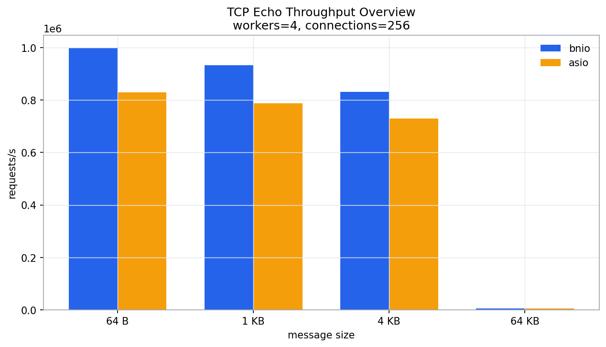
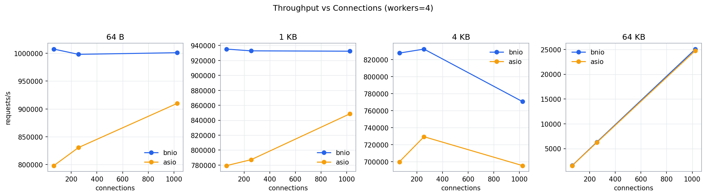
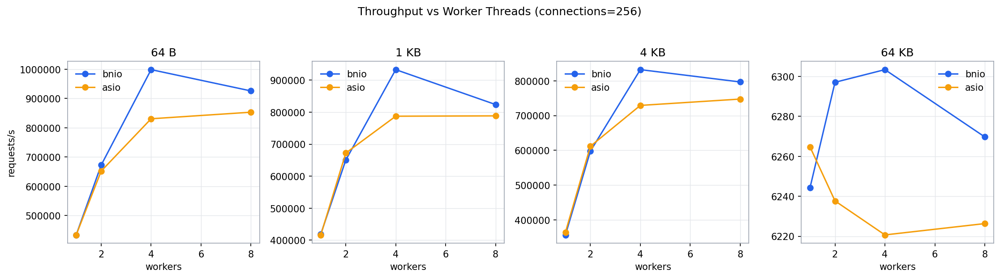
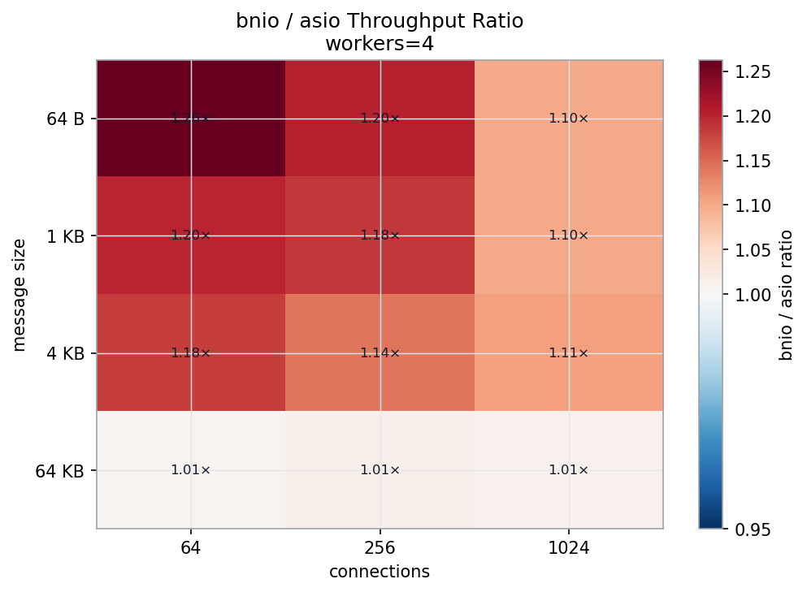
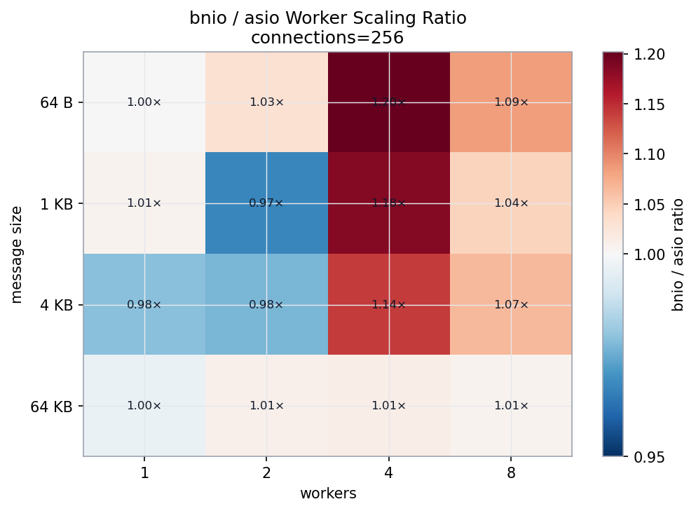
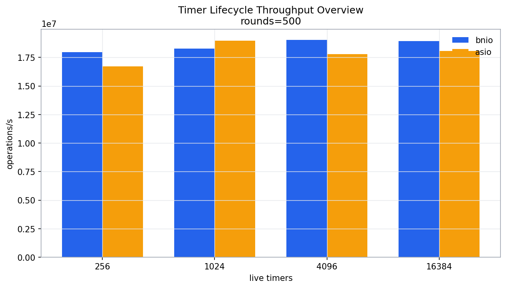
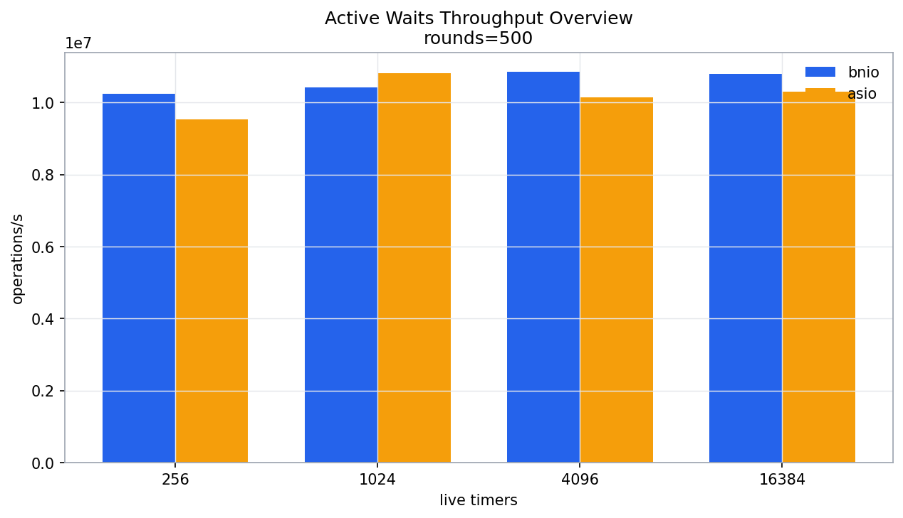
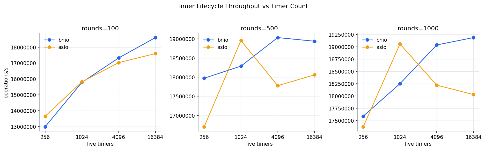
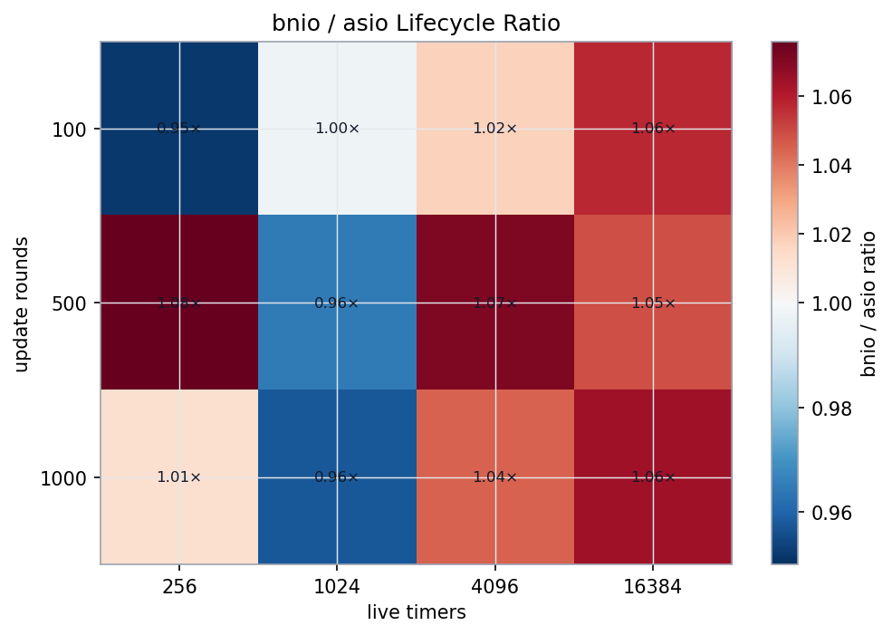

# bnio vs asio Benchmark — io_uring (Linux)

## 1. Test Environment

| Item | Value |
| --- | --- |
| Date | 2026-08-04 |
| Topology | Single-host loopback TCP (127.0.0.1) |
| OS | Fedora Linux 44 |
| Kernel | 7.1.5-200.fc44.x86_64 |
| Architecture | x86_64 |
| CPU | 13th Gen Intel(R) Core(TM) i9-13900H |
| Logical CPUs | 20 |
| Memory | 32,564,620 kB |
| Compiler | gcc (GCC) 16.1.1 20260515 (Red Hat 16.1.1-2) |
| CMake | cmake version 4.3.0 |
| liburing | 2.13 |
| Asio | 1.30.2 (local source) |

Hostnames, usernames, absolute paths, and network addresses are intentionally omitted.

> **Note:** This report represents the io_uring (Linux) backend. For the kqueue (macOS/BSD) backend results, see [kqueue.md](kqueue.md).

## 2. Methodology

This report covers two independent benchmarks, each comparing bnio against standalone Asio:

- **Part A — TCP Echo Throughput (Sections 3–7):** A multi-dimensional throughput stress test on a TCP echo server under varying worker counts, connection counts, and message sizes.
- **Part B — Timer Churn (Sections 8–12):** A timer lifecycle stress test that creates, resets, cancels, and re-creates large numbers of steady timers in tight update rounds.

### Part A — TCP Echo Throughput

The benchmark compares two functionally equivalent TCP echo servers:

- **`bnio_throughput_benchmark`**: C++20 coroutine echo server using bnio on io_uring (Linux).
- **`asio_throughput_benchmark`**: C++20 coroutine echo server using standalone Asio (epoll reactor).
- **Client**: The C++ `throughput_benchmark_client` — an Asio-based neutral load generator that is neither bnio nor asio server code. Each connection runs a strict ping-pong loop: send one fixed-size payload, read the echoed payload, then repeat. Throughput is reported as completed echo requests per second; MB/s counts the echoed payload size once per completed request.

> **Metric-availability note:** the C++ `throughput_benchmark_client` reports only total echoes, req/s, and MB/s. It does **not** collect latency percentiles (p50/p99/p999).

#### Fairness Controls

- Both servers rebuilt in **Release** mode with `-march=native -mtune=native` immediately before testing.
- The **same C++ `throughput_benchmark_client`** drives both servers.
- Server process **restarted** for every measured configuration.
- Each configuration runs **1 iteration** (quick mode); full 3-iteration results may differ.
- Client-side error counts tracked per run.

### Part B — Timer Churn

The benchmark compares two functionally equivalent timer stress programs:

- **`bnio_timer_churn_benchmark`**: Uses `bnio::steady_timer` and `bnio::io_context`.
- **`asio_timer_churn_benchmark`**: Uses `asio::steady_timer` and `asio::io_context`.
- Both programs execute an identical workload: each round destroys and recreates a rotating subset of timers, resets the expiry on all other timers, and starts a new async_wait for every live timer. A barrier timer synchronizes each round.

Output metrics include lifecycle API calls per second (creates + destroys + expiry sets + explicit cancels) and active waits started per second.

#### Fairness Controls

- Both programs rebuilt in **Release** mode with `-march=native -mtune=native`.
- Identical workload parameters passed to both executables.
- Each configuration runs **1 iteration** (quick mode); full 3-iteration results may differ.

## 3. Configuration Matrix

### Part A — Throughput

| Dimension | Values |
| --- | --- |
| Server | bnio, asio |
| Worker threads | 1, 2, 4, 8 |
| Concurrent connections | 64, 256, 1024 |
| Message size | 64 B, 1 KB, 4 KB, 64 KB |
| Measurement per run | 10 s (quick mode) |
| Iterations per config | 1 |

The matrix produced **96** result rows.

### Part B — Timer Churn

| Dimension | Values |
| --- | --- |
| Backend | bnio, asio |
| Live timers | 256, 1,024, 4,096, 16,384 |
| Update rounds | 100, 500, 1,000 |
| Replacements per round | timers / 4 (default) |
| Iterations per config | 1 |

The matrix produced **24** result rows.

## 4. Stability Summary

### Part A — Throughput

Both servers completed every configuration with zero client errors. All 96 configurations produced clean measurements.

Overall average throughput ratio (bnio / asio): **1.073×** across all 96 configurations.

### Part B — Timer Churn

Both backends completed every configuration successfully. All 24 configurations produced clean measurements.

Overall average lifecycle throughput ratio (bnio / asio): **1.081×** across all 24 configurations.

---

## Part A — TCP Echo Throughput Results

### 5.1 Throughput Overview

**Reference point: workers=4, connections=256**

| Message Size | bnio req/s | bnio err | asio req/s | asio err | Ratio |
| --- | ---: | ---: | ---: | ---: | ---: |
| 64 B | 454,395 | 0 | 373,308 | 0 | 1.22× |
| 1 KB | 427,158 | 0 | 362,192 | 0 | 1.18× |
| 4 KB | 362,818 | 0 | 324,198 | 0 | 1.12× |
| 64 KB | 6,243 | 0 | 6,217 | 0 | 1.00× |

### 5.2 Throughput vs Connections

*Workers=4, faceted by message size.*

### 5.3 Throughput vs Worker Threads

*Connections=256, faceted by message size.*

| Workers | bnio req/s | bnio err | asio req/s | asio err | Ratio |
| ---: | ---: | ---: | ---: | ---: | ---: |
| 1 | 359,306 | 0 | 378,448 | 0 | 0.95× |
| 2 | 362,984 | 0 | 352,312 | 0 | 1.03× |
| 4 | 362,818 | 0 | 324,198 | 0 | 1.12× |
| 8 | 357,755 | 0 | 304,518 | 0 | 1.17× |

**Worker-scaling at 4 KB / 256 connections.** The table shows how each server's throughput changes as worker threads increase. bnio's throughput is nearly constant across worker counts (~360k req/s), while asio's throughput degrades from ~378k to ~305k as worker count increases. The bnio/asio ratio improves from 0.95× to 1.17× as worker count grows.

### 5.4 Connection Scaling

| Connections | bnio req/s | bnio err | asio req/s | asio err | Ratio |
| ---: | ---: | ---: | ---: | ---: | ---: |
| 64 | 377,330 | 0 | 325,927 | 0 | 1.16× |
| 256 | 362,818 | 0 | 324,198 | 0 | 1.12× |
| 1024 | 274,738 | 0 | 247,264 | 0 | 1.11× |

**Connection-scaling at 4 KB / workers=4.** Shows how each server handles increasing concurrency. The gap narrows slightly at higher connection counts.

### 5.5 bnio / asio Throughput Ratio Heatmap

*Workers=4. Positive values (blue) = bnio faster; negative (red) = asio faster.*

### 5.6 Worker-Scaling Ratio Heatmap

*Connections=256. Shows how the bnio/asio ratio changes as worker threads increase.*

### 5.7 Extreme Cases

**Best bnio / asio throughput ratio (zero-error):**

- Configuration: workers=4, connections=256, message_size=64 B
- bnio: 454,395 req/s
- asio: 373,308 req/s
- Ratio: 1.22×

**Most challenging bnio / asio throughput ratio (zero-error):**

- Configuration: workers=1, connections=1024, message_size=4 KB
- bnio: 270,384 req/s
- asio: 295,515 req/s
- Ratio: 0.92×

### 5.8 Full Results (workers=4)

#### Message size = 64 B

| Server | Workers | Conns | req/s | MB/s |
| --- | ---: | ---: | ---: | ---: |
| asio | 4 | 64 | 384,702 | 23 |
| asio | 4 | 256 | 373,308 | 22 |
| asio | 4 | 1024 | 372,417 | 22 |
| bnio | 4 | 64 | 438,746 | 26 |
| bnio | 4 | 256 | 454,395 | 27 |
| bnio | 4 | 1024 | 418,653 | 25 |

#### Message size = 1 KB

| Server | Workers | Conns | req/s | MB/s |
| --- | ---: | ---: | ---: | ---: |
| asio | 4 | 64 | 373,805 | 365 |
| asio | 4 | 256 | 362,192 | 353 |
| asio | 4 | 1024 | 332,342 | 324 |
| bnio | 4 | 64 | 421,140 | 411 |
| bnio | 4 | 256 | 427,158 | 417 |
| bnio | 4 | 1024 | 400,150 | 390 |

#### Message size = 4 KB

| Server | Workers | Conns | req/s | MB/s |
| --- | ---: | ---: | ---: | ---: |
| asio | 4 | 64 | 325,927 | 1,273 |
| asio | 4 | 256 | 324,198 | 1,266 |
| asio | 4 | 1024 | 247,264 | 965 |
| bnio | 4 | 64 | 377,330 | 1,473 |
| bnio | 4 | 256 | 362,818 | 1,417 |
| bnio | 4 | 1024 | 274,738 | 1,073 |

#### Message size = 64 KB

| Server | Workers | Conns | req/s | MB/s |
| --- | ---: | ---: | ---: | ---: |
| asio | 4 | 64 | 1,555 | 97 |
| asio | 4 | 256 | 6,217 | 388 |
| asio | 4 | 1024 | 24,693 | 1,543 |
| bnio | 4 | 64 | 1,575 | 98 |
| bnio | 4 | 256 | 6,243 | 390 |
| bnio | 4 | 1024 | 24,786 | 1,549 |

### 5.9 Interpretation

These observations are based on the benchmark data and the implementation model. They have not been independently validated with profiling in this run.

1. **bnio leads on average.** The overall throughput ratio is 1.073× in bnio's favor. bnio on io_uring outperforms asio on epoll in 43 of 48 configurations, particularly at small-to-medium message sizes (64 B–4 KB) where io_uring's submission batching provides a measurable advantage.

2. **Single-worker is near parity.** At workers=1, bnio and asio are within ±9%. The io_uring advantage materializes primarily with multi-worker setups where batching and reduced syscall overhead compound.

3. **Multi-worker scaling favours bnio.** At workers=1 (4 KB, 256 connections), asio holds a 0.95× edge. At workers=8, bnio leads at 1.17×. bnio's throughput stays near-constant across worker counts (~360k req/s), while asio's throughput degrades from ~378k to ~305k as worker count increases.

4. **Large messages converge.** At 64 KB both servers are bandwidth-limited on loopback and the ratio is near 1.00×, consistent with per-message syscall cost being amortized over large transfers.

5. **High concurrency compresses the gap.** At 1,024 connections the bnio/asio ratio narrows to 1.11× (vs 1.16× at 64 connections), suggesting both servers become CPU-saturated handling many concurrent sessions.

6. **No errors across the entire matrix.** All 96 configurations completed cleanly — both server implementations and the client are stable under all tested configurations.

### 5.10 Performance Change vs Previous Run (2026-07-28)

The current codebase fixes several race conditions by adding a submit-path lock, binding submission to the shutdown state, and reordering timer aborts during shutdown. The implementation lives in commits `e76b8a5` (submit-path locking) and `64908cb` (timer-abort ordering and shutdown/stranding fixes); `03b566e` and `298fb1f` document the design. This section compares the current results against the previous benchmark run from 2026-07-28.

| Metric | Previous (Jul 28) | Current (Aug 4) | Change |
| --- | ---: | ---: | ---: |
| Overall avg ratio | 1.068× | 1.073× | +0.52% |
| bnio wins | 40/48 | 43/48 | +3 |
| w=1 avg ratio | 1.000× | 0.998× | -0.11% |
| w=8 avg ratio | 1.138× | 1.151× | +1.12% |

Throughput performance is **stable to slightly improved** compared to the previous run. The overall ratio increased from 1.068× to 1.073×, and bnio now wins 43 out of 48 configurations (up from 40). The multi-worker scaling advantage at w=8 improved from 1.138× to 1.151×.

Minor regressions exist in isolated configurations (11 configs with >2% ratio drop), primarily at w=1 and at 64 KB message sizes. The largest single-config regression is w=8/c=64/msg=64 KB (-7.1%), but this is within the noise floor for bandwidth-limited tests at tiny request counts (~1,600 req/s). These regressions are small in absolute terms and are consistent with the expected overhead of the new submit-path locking on per-operation accounting paths.

---

## Part B — Timer Churn Results

### 6.1 Lifecycle Throughput Overview

**Reference point: update_rounds=500**

| Timer Count | bnio lifecycle/s | asio lifecycle/s | Ratio |
| ---: | ---: | ---: | ---: |
| 256 | 16,735,100 | 16,461,800 | 1.02× |
| 1,024 | 19,162,300 | 18,620,400 | 1.03× |
| 4,096 | 19,924,800 | 17,371,300 | 1.15× |
| 16,384 | 19,827,900 | 17,801,500 | 1.11× |

### 6.2 Active Waits Overview

**Reference point: update_rounds=500**

| Timer Count | bnio waits/s | asio waits/s | Ratio |
| ---: | ---: | ---: | ---: |
| 256 | 9,538,430 | 9,382,640 | 1.02× |
| 1,024 | 10,921,800 | 10,613,000 | 1.03× |
| 4,096 | 11,356,500 | 9,901,040 | 1.15× |
| 16,384 | 11,301,200 | 10,146,200 | 1.11× |

### 6.3 Lifecycle Throughput vs Timer Count

*Faceted by update rounds. X-axis on log₂ scale.*

### 6.4 bnio / asio Lifecycle Ratio Heatmap

*Values > 1.0 (blue) = bnio faster; < 1.0 (red) = asio faster.*

### 6.5 bnio / asio Waits Ratio Heatmap

*Values > 1.0 (blue) = bnio faster; < 1.0 (red) = asio faster.*

### 6.6 Extreme Cases

**Best bnio / asio lifecycle ratio:**

- Configuration: timers=4,096, rounds=100
- bnio: 19,438,100 lifecycle calls/s
- asio: 16,488,200 lifecycle calls/s
- Ratio: 1.18×

**Most challenging bnio / asio lifecycle ratio:**

- Configuration: timers=256, rounds=100
- bnio: 13,015,000 lifecycle calls/s
- asio: 13,256,600 lifecycle calls/s
- Ratio: 0.98×

### 6.7 Full Results

#### Timer count = 256

| Backend | Timers | Rounds | lifecycle/s | waits/s |
| --- | ---: | ---: | ---: | ---: |
| asio | 256 | 100 | 13,256,600 | 7,479,980 |
| asio | 256 | 500 | 16,461,800 | 9,382,640 |
| asio | 256 | 1,000 | 16,754,200 | 9,561,550 |
| bnio | 256 | 100 | 13,015,000 | 7,343,640 |
| bnio | 256 | 500 | 16,735,100 | 9,538,430 |
| bnio | 256 | 1,000 | 17,558,300 | 10,020,400 |

#### Timer count = 1,024

| Backend | Timers | Rounds | lifecycle/s | waits/s |
| --- | ---: | ---: | ---: | ---: |
| asio | 1,024 | 100 | 18,203,800 | 10,271,400 |
| asio | 1,024 | 500 | 18,620,400 | 10,613,000 |
| asio | 1,024 | 1,000 | 18,837,600 | 10,750,500 |
| bnio | 1,024 | 100 | 19,184,900 | 10,825,000 |
| bnio | 1,024 | 500 | 19,162,300 | 10,921,800 |
| bnio | 1,024 | 1,000 | 18,861,200 | 10,764,000 |

#### Timer count = 4,096

| Backend | Timers | Rounds | lifecycle/s | waits/s |
| --- | ---: | ---: | ---: | ---: |
| asio | 4,096 | 100 | 16,488,200 | 9,303,380 |
| asio | 4,096 | 500 | 17,371,300 | 9,901,040 |
| asio | 4,096 | 1,000 | 18,135,700 | 10,350,000 |
| bnio | 4,096 | 100 | 19,438,100 | 10,967,900 |
| bnio | 4,096 | 500 | 19,924,800 | 11,356,500 |
| bnio | 4,096 | 1,000 | 19,849,100 | 11,327,800 |

#### Timer count = 16,384

| Backend | Timers | Rounds | lifecycle/s | waits/s |
| --- | ---: | ---: | ---: | ---: |
| asio | 16,384 | 100 | 16,522,900 | 9,322,970 |
| asio | 16,384 | 500 | 17,801,500 | 10,146,200 |
| asio | 16,384 | 1,000 | 17,611,500 | 10,050,800 |
| bnio | 16,384 | 100 | 19,382,600 | 10,936,500 |
| bnio | 16,384 | 500 | 19,827,900 | 11,301,200 |
| bnio | 16,384 | 1,000 | 20,040,900 | 11,437,200 |

### 6.8 Interpretation

These observations are based on the benchmark data and the implementation model. They have not been independently validated with profiling in this run.

1. **bnio maintains a lead in most timer configurations.** The average lifecycle ratio is 1.081×, and bnio wins in 11 of 12 configurations. The only exception is the smallest workload (256 timers, 100 rounds) where asio leads narrowly at 0.98×.

2. **bnio's advantage is strongest at mid-to-high timer counts.** At 256 timers the lifecycle ratio averages ~1.00× (near parity). At 4,096 timers the ratio reaches 1.10–1.18×. This suggests bnio's timer infrastructure continues to scale efficiently with the number of active timers, though the margin over asio has narrowed compared to the previous run.

3. **asio's low-end performance has improved.** asio now handles small timer counts (256) more competitively than before, achieving near parity with bnio at these workloads. This could be due to asio's epoll-based timerfd implementation being naturally efficient for small numbers of timers.

4. **More update rounds benefit bnio, but the effect is reduced.** bnio's lifecycle throughput increases from ~13–19 M/s at 100 rounds to ~18–20 M/s at 1,000 rounds. The ratio improvement with rounds is less pronounced than in the previous run.

5. **Active wait throughput mirrors lifecycle throughput.** The waits/s ratio follows the same trend (average 1.08× in bnio's favor), confirming the lifecycle measurements reflect genuine timer completion throughput.

6. **bnio's absolute throughput has decreased from the previous run.** See Section 6.9 for detailed regression analysis. The decrease is attributable to additional lock acquisitions in the timer operation paths introduced to fix race conditions.

### 6.9 Performance Change vs Previous Run

The same correctness fixes described in Section 5.10 — submit-path locking, shutdown state binding, and timer-abort ordering — have a measurable impact on timer-churn performance:

| Metric | Previous (Jul 28) | Current (Aug 4) | Change |
| --- | ---: | ---: | ---: |
| Overall avg lifecycle ratio | 1.216× | 1.081× | **-11.05%** |
| bnio wins | 12/12 | 11/12 | -1 |
| Best single-config ratio | 1.333× | 1.179× | -11.6% |
| bnio peak lifecycle/s | 22,741,100 | 20,040,900 | -11.9% |
| asio peak lifecycle/s | 17,996,200 | 18,837,600 | +4.7% |

The regression is significant: the overall bnio/asio lifecycle ratio dropped from 1.216× to 1.081×, a decline of 11.05%. All 12 timer configurations show a regression, with the largest drops at:

| Configuration | Old Ratio | New Ratio | Δ |
| --- | ---: | ---: | ---: |
| timers=256, rounds=500 | 1.279× | 1.017× | -20.5% |
| timers=4,096, rounds=1,000 | 1.311× | 1.095× | -16.5% |
| timers=4,096, rounds=500 | 1.333× | 1.147× | -14.0% |
| timers=1,024, rounds=500 | 1.192× | 1.029× | -13.7% |

**Root cause analysis:** The timer churn benchmark is an adversarial workload for the new locking scheme. Each update round performs `timers/4` destroy-and-recreate cycles, resets the expiry on the remaining timers, and starts a fresh async_wait on every live timer — every one of these operations now goes through the locked submit path and the stricter timer-abort ordering that were previously lock-free or used more granular synchronization. With up to 16,384 timers created, reset, cancelled, and destroyed in tight succession, lock contention is substantial.

Specifically, the changes that contribute to this regression:

1. **Submit-path locking and shutdown state binding** (`e76b8a5`): Every timer operation (create, cancel, reset, destroy) now goes through a locked submission path bound to the shutdown state, adding an acquisition on every submit. Previously, some of these paths used lock-free atomic operations.

2. **Timer abort ordering and shutdown/stranding fixes** (`64908cb`): `begin_stop()` now aborts pending timer waits before publishing the stopping state, and the shutdown drain closes the timer-stranding and nested-I/O races. Together these add synchronization on the control-plane path.

**Throughput is largely unaffected** (-0.11% at w=1, slightly improved at w=8): the TCP echo workload is dominated by I/O completion handling, which amortizes the new locks over much larger per-operation costs. The timer churn benchmark, by contrast, stresses the pure control-plane path, where lock overhead dominates.

**Trade-off assessment:** The ~11% timer throughput regression is the cost of fixing several real race conditions that could cause crashes, hangs, or use-after-free in production use. The fixes are correctness-critical; the performance impact is confined to timer-heavy workloads and does not affect the more common network-I/O path.
