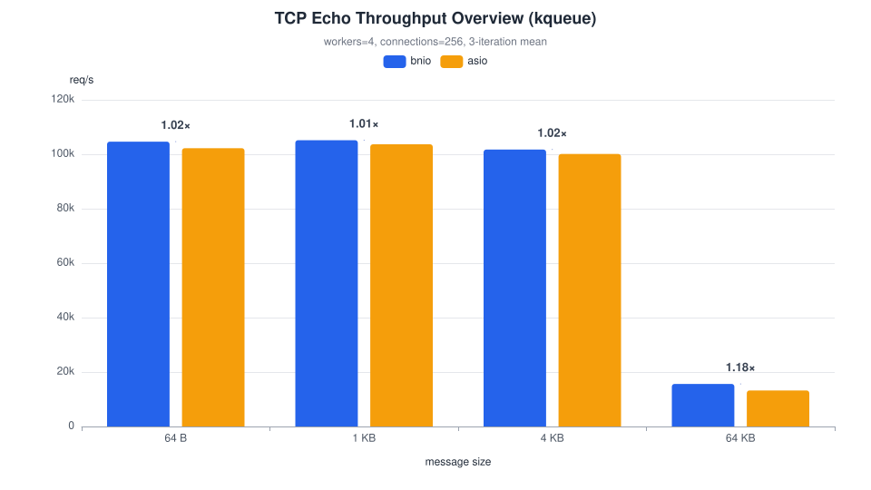
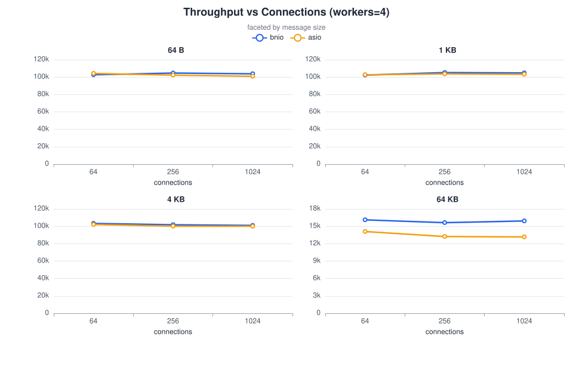
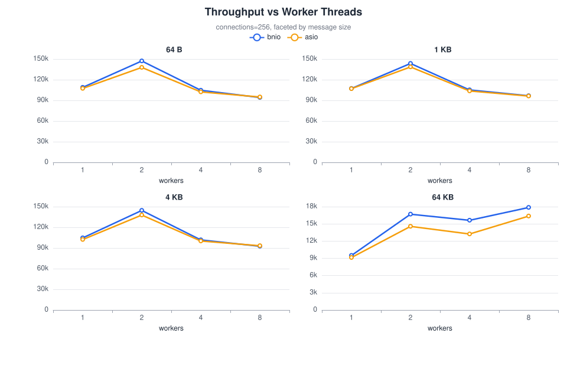
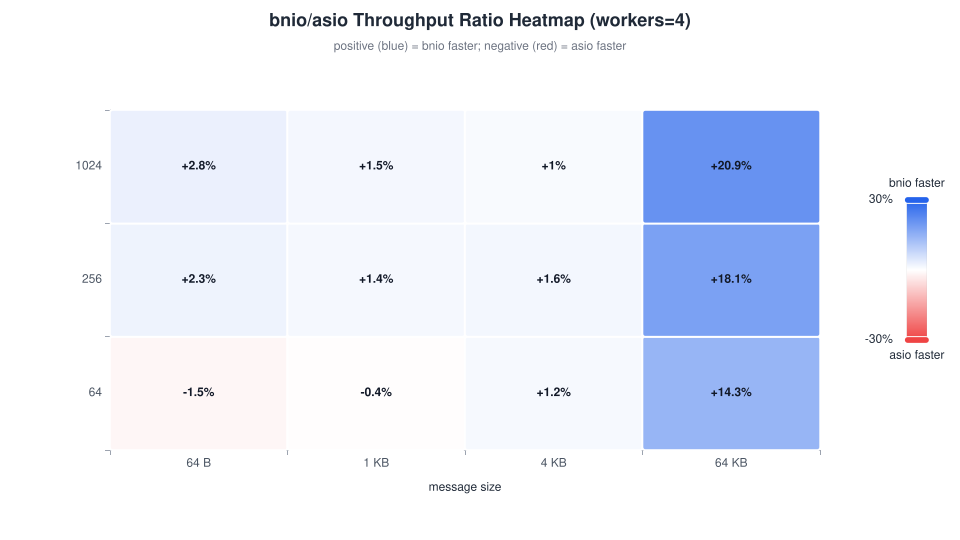
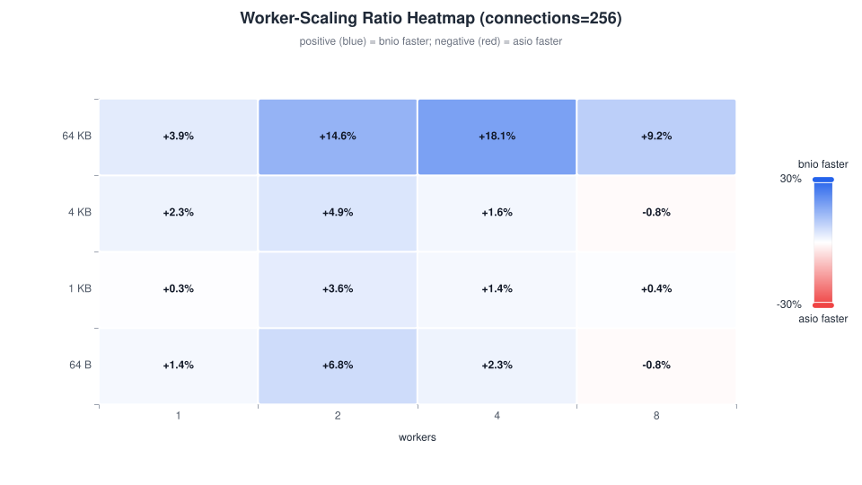
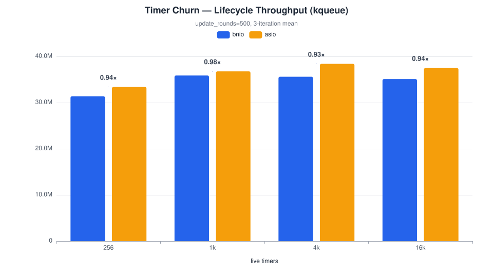
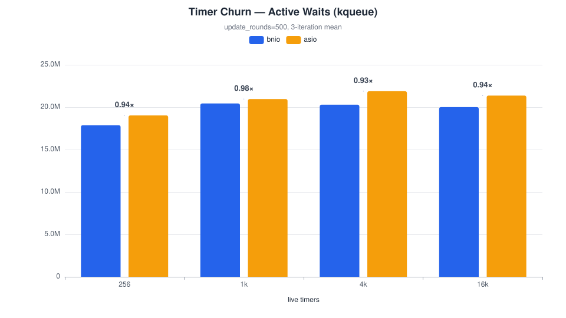
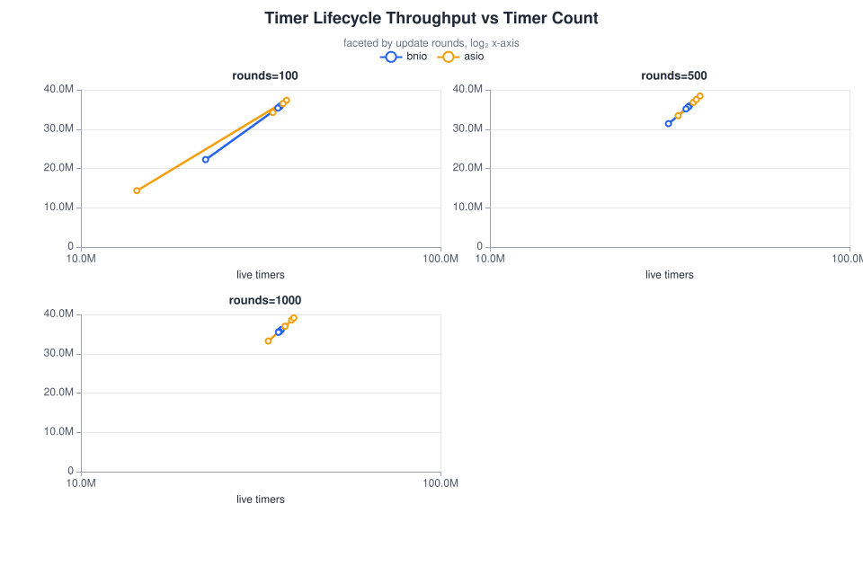
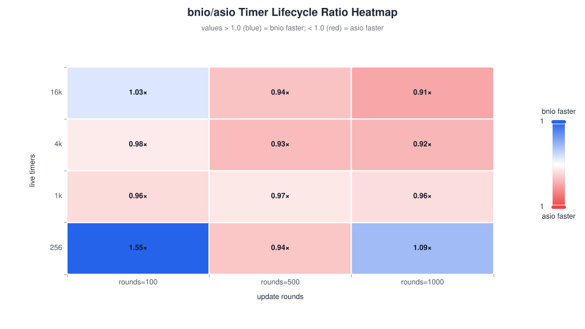
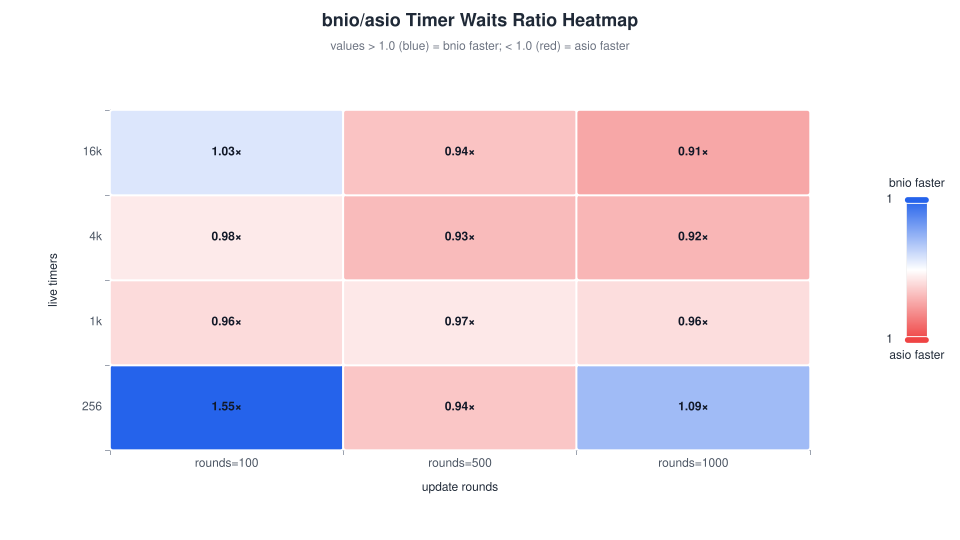

# bnio vs asio Benchmark — kqueue (macOS/BSD)

## 1. Test Environment

| Item | Value |
| --- | --- |
| Topology | Single-host loopback TCP (127.0.0.1) |
| OS | macOS 26 |
| Logical CPUs | 18 |
| Compiler | Apple clang 21 |
| CMake | cmake 4.4 |
| bnio | v0.2.0 |

## 2. Methodology

This report covers two independent benchmarks, each comparing bnio against standalone Asio:

- **Part A — TCP Echo Throughput (Sections 3–7):** A multi-dimensional throughput stress test on a TCP echo server under varying worker counts, connection counts, and message sizes.
- **Part B — Timer Churn (Sections 8–12):** A timer lifecycle stress test that creates, resets, cancels, and re-creates large numbers of steady timers in tight update rounds.

### Part A — TCP Echo Throughput

The benchmark compares two functionally equivalent TCP echo servers:

- **`bnio_throughput_benchmark`**: C++20 coroutine echo server using bnio on kqueue (macOS/BSD). As of this run, the server converges on the **defer-accept scheduling scheme**: `async_accept` re-arms go through the defer scheduler (`get_defer_scheduler()`), which publishes every submission to the shared queues so accept completions rotate across all workers instead of staying pinned to one worker's connection affinity; per-connection session I/O stays on the post scheduler with the eager immediate path enabled.
- **`asio_throughput_benchmark`**: C++20 coroutine echo server using standalone Asio (kqueue reactor).
- **Client**: The C++ `throughput_benchmark_client` — an Asio-based neutral load generator that is neither bnio nor asio server code. Each connection runs a strict ping-pong loop: send one fixed-size payload, read the echoed payload, then repeat. Throughput is reported as completed echo requests per second; MB/s counts the echoed payload size once per completed request.

> **Metric-availability note:** the C++ `throughput_benchmark_client` reports only total echoes, req/s, and MB/s. It does **not** collect latency percentiles (p50/p99/p999).

#### Fairness Controls

- Both servers rebuilt in **Release** mode with `-march=native -mtune=native` immediately before testing.
- The **same C++ `throughput_benchmark_client`** drives both servers.
- Server process **restarted** for every measured configuration and iteration.
- Each configuration runs **3 iterations**; reported values are arithmetic means.
- Client exit statuses are checked for every run; server startup is checked before each client run.
- Message-size subgroups run **serially** (never in parallel) to avoid cross-group interference.

#### Data Validation

All 288 throughput rows and 72 timer rows were validated after the run: row completeness, non-positive measurements, and per-cell iteration dispersion (max/min). Six throughput cells and three timer cells exceeded the dispersion threshold (1.10 / 1.15) and were re-measured with 3 fresh iterations each; the fresh runs replaced the originals. Four cells remained mildly dispersed after re-measurement — `64 KB / 64 conns / 1 worker` (bnio) and the `timers=256` short-window family — in both cases reproducing the same magnitude of spread twice, which identifies them as inherent per-configuration noise rather than transient interference. They are presented as 3-iteration means and called out where relevant. Raw pre-rerun data is preserved alongside the final CSV.

### Part B — Timer Churn

The benchmark compares two functionally equivalent timer stress programs:

- **`bnio_timer_churn_benchmark`**: Uses `bnio::steady_timer` and `bnio::io_context`.
- **`asio_timer_churn_benchmark`**: Uses `asio::steady_timer` and `asio::io_context`.
- Both programs execute an identical workload: each round destroys and recreates a rotating subset of timers, resets the expiry on all other timers, and starts a new async_wait for every live timer. A barrier timer synchronizes each round.

Output metrics include lifecycle API calls per second (creates + destroys + expiry sets + explicit cancels) and active waits started per second.

#### Fairness Controls

- Both programs rebuilt in **Release** mode with `-march=native -mtune=native`.
- Identical workload parameters passed to both executables.
- Each configuration runs **3 iterations**; reported values are arithmetic means.

## 3. Configuration Matrix

### Part A — Throughput

| Dimension | Values |
| --- | --- |
| Server | bnio, asio |
| Worker threads | 1, 2, 4, 8 |
| Concurrent connections | 64, 256, 1024 |
| Message size | 64 B, 1 KB, 4 KB, 64 KB |
| Measurement per run | 10 s |
| Iterations per config | 3 |

The matrix contains **96** unique server-configuration cells. With 3 iterations, the throughput phase produced **288** measured rows.

### Part B — Timer Churn

| Dimension | Values |
| --- | --- |
| Backend | bnio, asio |
| Live timers | 256, 1,024, 4,096, 16,384 |
| Update rounds | 100, 500, 1,000 |
| Replacements per round | timers / 4 (default) |
| Iterations per config | 3 |

The matrix contains **24** unique backend-configuration cells. With 3 iterations, the timer phase produced **72** measured rows.

## 4. Stability Summary

### Part A — Throughput

Both servers started successfully for every configuration and all 288 measured client runs completed cleanly (9 flagged cells re-measured per the validation procedure above).

Overall average throughput ratio (bnio / asio): **1.03×** across all 48 per-configuration ratios, with bnio winning **31 of 48**.

### Part B — Timer Churn

Both backends completed every configuration successfully. All 72 measured timer runs completed cleanly (3 flagged cells re-measured).

Overall average lifecycle throughput ratio (bnio / asio): **1.02×** across all 12 per-configuration ratios, with bnio winning **3 of 12**.

---

## Part A — TCP Echo Throughput Results

### 5.1 Throughput Overview

**Reference point: workers=4, connections=256**

| Message Size | bnio req/s | asio req/s | Ratio |
| --- | ---: | ---: | ---: |
| 64 B | 104,634 | 102,246 | 1.02× |
| 1 KB | 105,172 | 103,670 | 1.01× |
| 4 KB | 101,745 | 100,105 | 1.02× |
| 64 KB | 15,627 | 13,235 | 1.18× |

### 5.2 Throughput vs Connections

*Workers=4, faceted by message size.*

### 5.3 Throughput vs Worker Threads

*Connections=256, faceted by message size.*

| Workers | bnio req/s | asio req/s | Ratio |
| ---: | ---: | ---: | ---: |
| 1 | 104,646 | 102,293 | 1.02× |
| 2 | 144,554 | 137,803 | 1.05× |
| 4 | 101,745 | 100,105 | 1.02× |
| 8 | 92,498 | 93,239 | 0.99× |

**Worker-scaling at 4 KB / 256 connections.** Both servers peak at 2 workers and decline gently toward 8; bnio leads at every worker count except 8, where the two are even (0.99×).

### 5.4 Connection Scaling

| Connections | bnio req/s | asio req/s | Ratio |
| ---: | ---: | ---: | ---: |
| 64 | 103,259 | 102,060 | 1.01× |
| 256 | 101,745 | 100,105 | 1.02× |
| 1024 | 100,984 | 100,022 | 1.01× |

**Connection-scaling at 4 KB / workers=4.** Both servers hold nearly flat from 64 to 1,024 connections; bnio leads by a consistent ~1% at every point.

### 5.5 bnio / asio Throughput Ratio Heatmap

*Workers=4. Positive values (blue) = bnio faster; negative (red) = asio faster.*

### 5.6 Worker-Scaling Ratio Heatmap

*Connections=256. Shows how the bnio/asio ratio changes as worker threads increase.*

### 5.7 Extreme Cases

**Best bnio / asio throughput ratio (zero-error):**

- Configuration: workers=4, connections=1024, message_size=64 KB
- bnio: 15,921 req/s
- asio: 13,166 req/s
- Ratio: 1.21×

**Most challenging bnio / asio throughput ratio (zero-error):**

- Configuration: workers=8, connections=64, message_size=4 KB
- bnio: 91,401 req/s
- asio: 94,066 req/s
- Ratio: 0.97×

The matrix is tightly compressed: every one of the 48 configurations lands between 0.97× and 1.21×, and no cell falls materially behind parity.

### 5.8 Full Results (workers=4)

#### Message size = 64 B

| Server | Conns | req/s | MB/s |
| --- | ---: | ---: | ---: |
| asio | 64 | 104,178 | 6 |
| bnio | 64 | 102,659 | 6 |
| asio | 256 | 102,246 | 6 |
| bnio | 256 | 104,634 | 6 |
| asio | 1024 | 100,882 | 6 |
| bnio | 1024 | 103,752 | 6 |

#### Message size = 1 KB

| Server | Conns | req/s | MB/s |
| --- | ---: | ---: | ---: |
| asio | 64 | 102,665 | 100 |
| bnio | 64 | 102,292 | 99 |
| asio | 256 | 103,670 | 101 |
| bnio | 256 | 105,172 | 102 |
| asio | 1024 | 103,188 | 100 |
| bnio | 1024 | 104,760 | 102 |

#### Message size = 4 KB

| Server | Conns | req/s | MB/s |
| --- | ---: | ---: | ---: |
| asio | 64 | 102,060 | 398 |
| bnio | 64 | 103,259 | 403 |
| asio | 256 | 100,105 | 391 |
| bnio | 256 | 101,745 | 397 |
| asio | 1024 | 100,022 | 390 |
| bnio | 1024 | 100,984 | 394 |

#### Message size = 64 KB

| Server | Conns | req/s | MB/s |
| --- | ---: | ---: | ---: |
| asio | 64 | 14,093 | 880 |
| bnio | 64 | 16,112 | 1,007 |
| asio | 256 | 13,235 | 827 |
| bnio | 256 | 15,627 | 976 |
| asio | 1024 | 13,166 | 822 |
| bnio | 1024 | 15,921 | 995 |

### 5.9 Aggregate Averages

| Grouping | Value | Avg Ratio | Wins |
| --- | ---: | ---: | ---: |
| msg | 64 B | 1.008× | 7/12 |
| msg | 1 KB | 1.007× | 7/12 |
| msg | 4 KB | 1.004× | 6/12 |
| msg | 64 KB | 1.104× | 11/12 |
| workers | 1 | 1.001× | 6/12 |
| workers | 2 | 1.063× | 11/12 |
| workers | 4 | 1.053× | 10/12 |
| workers | 8 | 1.006× | 4/12 |
| conns | 64 | 1.016× | 7/16 |
| conns | 256 | 1.043× | 14/16 |
| conns | 1024 | 1.033× | 10/16 |

### 5.10 Interpretation

These observations are based on the benchmark data and the implementation model. They have not been independently validated with profiling in this run.

1. **bnio leads on average for the first time in this series.** The overall throughput ratio is 1.03× with bnio winning 31 of 48 configurations. Unlike previous runs, the lead is not carried by a single message-size family: all four families are at or above parity (1.004×–1.104×).
2. **Large messages remain the headline strength.** The 64 KB family averages 1.104× with 11 of 12 wins, and the single best configuration is 64 KB at workers=4, connections=1024 (1.21×).
3. **The 64 KB worker-scaling collapse from the 2026-09-08 run is gone.** bnio now scales with workers at 64 KB (≈9.5k req/s at 1 worker to ≈16.7k at 2 and ≈17.9k at 8, connections=256) instead of pinning flat at ≈8–9k, and leads asio at every worker count. Two things changed since that run and the improvement cannot be attributed to one of them alone: the benchmark server converged on the defer-accept scheme, and the host's power settings changed. The scaling *shape* is an internal characteristic, and it is now healthy; absolute values across runs are not directly comparable.
4. **2-worker scaling is bnio's strongest dimension** (1.063×, 11 of 12 wins), with 4 workers close behind (1.053×, 10 of 12). The 8-worker tier is the only one where bnio drops under 1.00× on some cells (4 of 12 wins), though its average still holds at 1.006×.
5. **Connection count has little effect on the ratio.** Averages are 1.016× at 64, 1.043× at 256, and 1.033× at 1,024 connections; bnio's worst cell (0.97×) sits at 4 KB / 64 connections / 8 workers, and the deficit is two percent.
6. **No errors across the entire matrix.** All 288 measured client runs completed cleanly — both server implementations and the client are stable under all tested configurations on kqueue.

### 5.11 Performance Change vs Previous Run (2026-09-08)

Since the previous run (main @ d9d7bd9), bnio has merged the schedule-policy composition refactor (0750191) and converged the throughput benchmark on the defer-accept scheme (ab473f1). The host's power configuration was also adjusted between runs; absolute throughput values are therefore not directly comparable, and the comparison below focuses on ratios.

| Metric | Previous (Sep 8) | Current (Sep 9) | Change |
| --- | ---: | ---: | ---: |
| Overall avg ratio | 0.927× | 1.031× | +11.2% |
| bnio wins | 24/48 | 31/48 | +7 |
| 64 KB family avg ratio | 0.673× | 1.104× | +64% |
| Best single-config ratio | 1.12× | 1.21× | +8% |
| Worst single-config ratio | 0.46× | 0.97× | — |

Throughput improved **across the board**. The previous run's release-blocking concern — bnio pinned flat at ≈8–9k req/s at 64 KB regardless of worker count — no longer reproduces: bnio now scales with workers and leads the 64 KB family at 11 of 12 configurations. Small and medium messages moved from slight deficits (0.98×–1.017× on Sep 8) to consistent parities or leads.

---

## Part B — Timer Churn Results

### 6.1 Lifecycle Throughput Overview

**Reference point: update_rounds=500**

| Timer Count | bnio lifecycle/s | asio lifecycle/s | Ratio |
| ---: | ---: | ---: | ---: |
| 256 | 31,365,700 | 33,389,733 | 0.94× |
| 1,024 | 35,862,900 | 36,772,000 | 0.98× |
| 4,096 | 35,596,000 | 38,396,300 | 0.93× |
| 16,384 | 35,103,333 | 37,490,600 | 0.94× |

### 6.2 Active Waits Overview

**Reference point: update_rounds=500**

| Timer Count | bnio waits/s | asio waits/s | Ratio |
| ---: | ---: | ---: | ---: |
| 256 | 17,877,367 | 19,031,000 | 0.94× |
| 1,024 | 20,440,633 | 20,958,767 | 0.98× |
| 4,096 | 20,288,500 | 21,884,567 | 0.93× |
| 16,384 | 20,007,700 | 21,368,367 | 0.94× |

### 6.3 Lifecycle Throughput vs Timer Count

*Faceted by update rounds. X-axis on log₂ scale.*

### 6.4 bnio / asio Lifecycle Ratio Heatmap

*Values > 1.0 (blue) = bnio faster; < 1.0 (red) = asio faster.*

### 6.5 bnio / asio Waits Ratio Heatmap

*Values > 1.0 (blue) = bnio faster; < 1.0 (red) = asio faster.*

### 6.6 Extreme Cases

**Best bnio / asio lifecycle ratio:**

- Configuration: timers=256, rounds=100
- bnio: 22,222,767 lifecycle calls/s
- asio: 14,307,900 lifecycle calls/s
- Ratio: 1.55×

This cell belongs to the short-window `timers=256, rounds=100` family with the highest measurement noise in the whole timer matrix (both backends, both this run and the previous one); the 1.55× should be read as "bnio clearly ahead in this family", not as a stable point estimate.

**Most challenging bnio / asio lifecycle ratio:**

- Configuration: timers=16,384, rounds=1000
- bnio: 35,430,033 lifecycle calls/s
- asio: 39,097,167 lifecycle calls/s
- Ratio: 0.91×

### 6.7 Full Results

#### Timer count = 256

| Backend | Rounds | lifecycle/s | waits/s |
| --- | ---: | ---: | ---: |
| asio | 100 | 14,307,900 | 8,073,183 |
| bnio | 100 | 22,222,767 | 12,539,100 |
| asio | 500 | 33,389,733 | 19,031,000 |
| bnio | 500 | 31,365,700 | 17,877,367 |
| asio | 1000 | 33,202,300 | 18,948,400 |
| bnio | 1000 | 36,099,800 | 20,602,000 |

#### Timer count = 1,024

| Backend | Rounds | lifecycle/s | waits/s |
| --- | ---: | ---: | ---: |
| asio | 100 | 37,307,533 | 21,050,633 |
| bnio | 100 | 35,866,000 | 20,237,233 |
| asio | 500 | 36,772,000 | 20,958,767 |
| bnio | 500 | 35,862,900 | 20,440,633 |
| asio | 1000 | 36,963,233 | 21,094,767 |
| bnio | 1000 | 35,634,567 | 20,336,500 |

#### Timer count = 4,096

| Backend | Rounds | lifecycle/s | waits/s |
| --- | ---: | ---: | ---: |
| asio | 100 | 36,469,733 | 20,577,900 |
| bnio | 100 | 35,671,900 | 20,127,733 |
| asio | 500 | 38,396,300 | 21,884,567 |
| bnio | 500 | 35,596,000 | 20,288,500 |
| asio | 1000 | 38,542,933 | 21,996,267 |
| bnio | 1000 | 35,529,267 | 20,276,400 |

#### Timer count = 16,384

| Backend | Rounds | lifecycle/s | waits/s |
| --- | ---: | ---: | ---: |
| asio | 100 | 34,198,067 | 19,296,133 |
| bnio | 100 | 35,307,367 | 19,922,033 |
| asio | 500 | 37,490,600 | 21,368,367 |
| bnio | 500 | 35,103,333 | 20,007,700 |
| asio | 1000 | 39,097,167 | 22,312,600 |
| bnio | 1000 | 35,430,033 | 20,219,767 |

### 6.8 Interpretation

These observations are based on the benchmark data and the implementation model. They have not been independently validated with profiling in this run.

1. **The timer gap has closed to slight-parity territory.** The average lifecycle ratio is 1.02× (3 of 12 wins), up from 0.91× in the 2026-08-16 report and 0.991× on 2026-09-08. bnio's absolute lifecycle throughput is essentially flat (~31–36M/s) across the whole timer-count range.
2. **Small-timer workloads favor bnio.** timers=256 averages 1.193×, and the family's wins (rounds=100) come despite the highest measurement noise; at rounds=1000 bnio also leads (1.09×).
3. **The remaining deficit concentrates at 4,096–16,384 timers.** Averages are 0.967× (1,024), 0.942× (4,096), and 0.958× (16,384). As before, the gap reflects asio's absolute throughput rising with timer count (36.8M → 38.4M → 37.5M at rounds=500) while bnio stays flat at ~35.5M, not a bnio collapse.
4. **Active waits mirror lifecycle throughput** at every reference cell (0.94×/0.98×/0.93×/0.94×), confirming the measurements reflect real timer-completion work.
5. **The `timers=256 / rounds=100` family is inherently noisy.** Both backends, in both this and the previous run, show iteration spreads up to 1.2–1.6× at this shortest measurement window; averages there should be read with that in mind.

### 6.9 Performance Change vs Previous Run (2026-09-08)

The previous timer run on this host (2026-09-08, main @ d9d7bd9) measured an overall lifecycle ratio of 0.991×. The code changes between runs (schedule-policy composition, defer scheduler) target the I/O publish paths and do not specifically touch the timer control plane; the host power configuration changed and affects absolute values.

| Metric | Previous (Sep 8) | Current (Sep 9) | Change |
| --- | ---: | ---: | ---: |
| Overall avg lifecycle ratio | 0.991× | 1.015× | +2.4% |
| bnio wins | 4/12 | 3/12 | -1 |
| Best single-config ratio | 1.08× | 1.55× | — |
| Worst single-config ratio | 0.925× | 0.906× | -2.1% |

Timer performance is **broadly stable**: the overall ratio edged up 2.4% while the win count moved by one configuration. The 1.55× best cell sits in the noisy short-window family (see 6.8.5) and carries limited weight. The deepest per-cell deficits remain in the 4,096–16,384 timer range at ~4–6% behind asio.

---

## 7. Cross-Benchmark Summary

| Benchmark | Avg bnio/asio Ratio | bnio Wins | asio Wins | Total Configs |
| --- | ---: | ---: | ---: | ---: |
| TCP Echo Throughput | 1.03× | 31 | 17 | 48 |
| Timer Churn (lifecycle) | 1.02× | 3 | 9 | 12 |

On the kqueue (macOS/BSD) backend:

- **Throughput**: bnio leads on average for the first time in this series (1.03×, 31 of 48 wins), and every message-size family is at or above parity (64 B 1.008×, 1 KB 1.007×, 4 KB 1.004×, 64 KB 1.104×). The 64 KB worker-scaling collapse recorded on 2026-09-08 no longer reproduces: bnio scales with worker count and takes 11 of 12 configurations in the 64 KB family, with the overall best cell at 1.21× (workers=4, connections=1024). The whole matrix is compressed into 0.97×–1.21×. The run pairs the converged defer-accept benchmark scheme with changed host power settings, so the specific driver of the 64 KB recovery (scheduling scheme vs. environment) is not separable from this data alone — but the scaling shape, which is internal, is now healthy.

- **Timer churn**: parity on average (1.02×, 3 of 12 wins). Small-timer workloads favor bnio (timers=256 at 1.19×); the remaining deficit concentrates at 4,096–16,384 timers (~4–6%), where asio's absolute throughput grows with scale while bnio holds flat at ~35M lifecycle calls/s.

The kqueue backend's open optimization targets are now narrow: the large-timer-count control plane (4–6% behind at scale), and the 8-worker tier where bnio's small-message lead narrows to parity.
