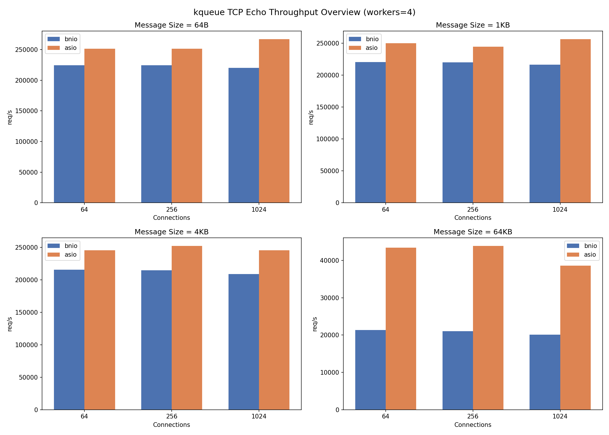
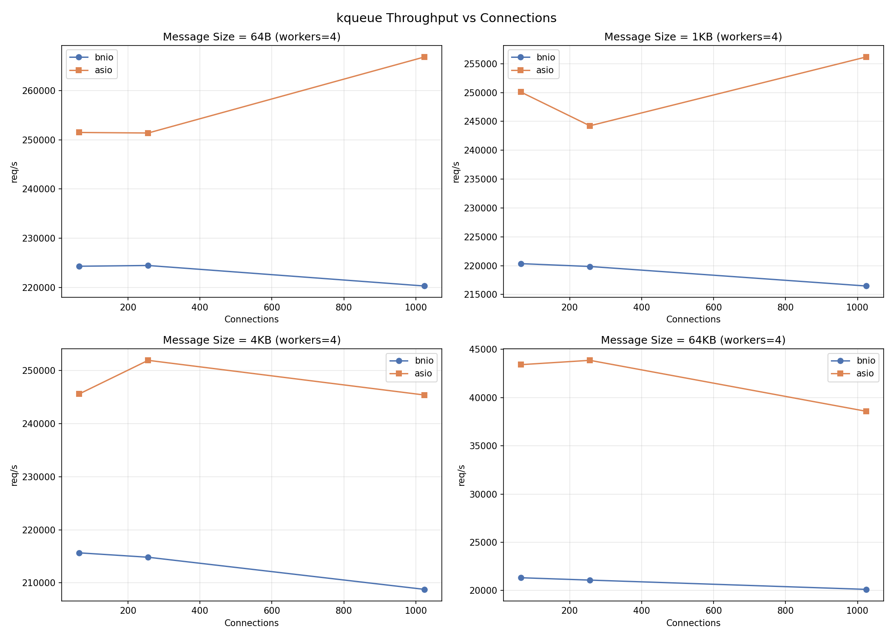
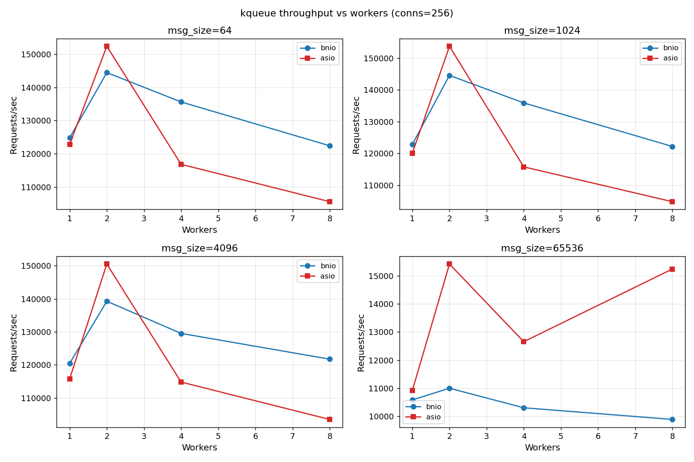
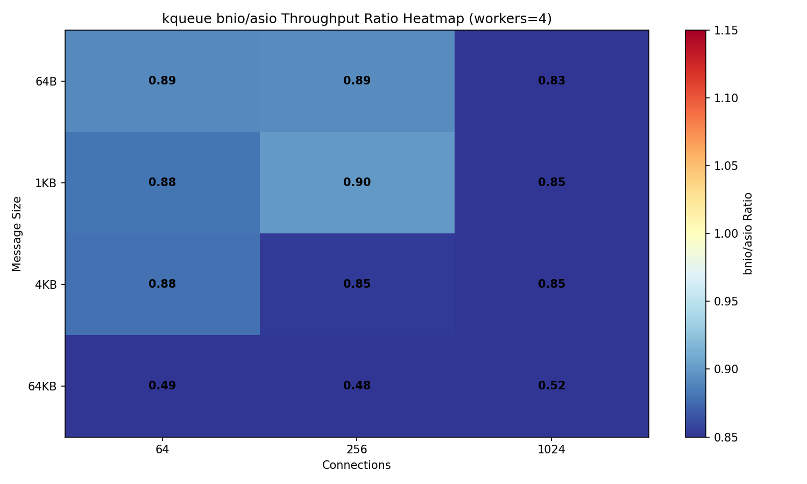
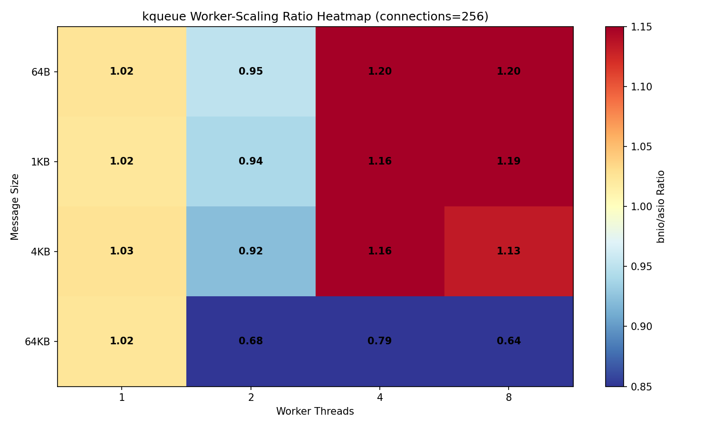
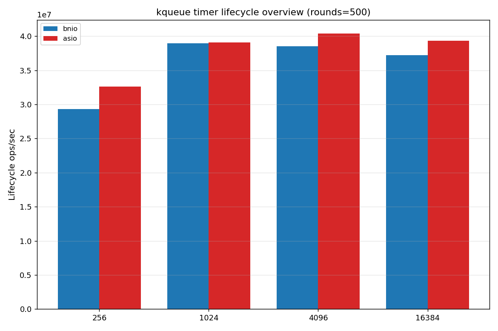
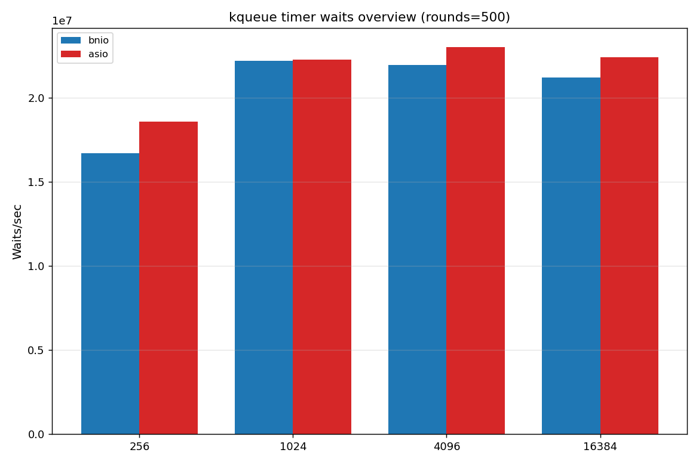
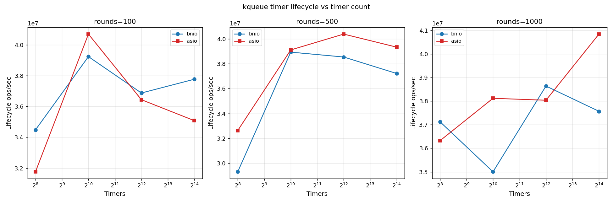
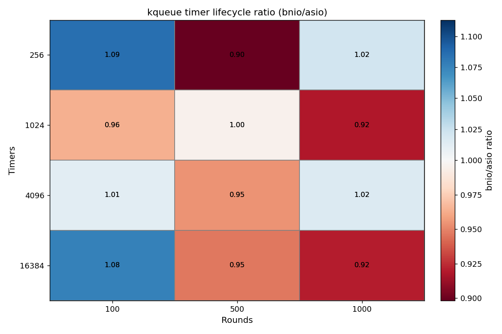
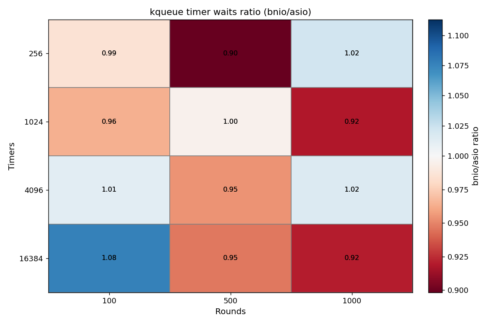

# bnio vs asio Benchmark — kqueue (macOS/BSD)

## 1. Test Environment

| Item | Value |
| --- | --- |
| Date | 2026-08-05 |
| Topology | Single-host loopback TCP (127.0.0.1) |
| OS | macOS 26.5.2 |
| Kernel | Darwin 25.5.0 |
| Architecture | arm64 (Apple Silicon) |
| CPU | Apple M5 Pro |
| Logical CPUs | 18 |
| Memory | 50,331,648 kB (48 GB) |
| Compiler | Apple clang version 21.0.0 (clang-2100.1.1.101) |
| CMake | cmake version 4.4.1 |
| Asio | 1.30.2 (local source) |

Hostnames, usernames, absolute paths, and network addresses are intentionally omitted.

## 2. Methodology

This report covers two independent benchmarks, each comparing bnio against standalone Asio:

- **Part A — TCP Echo Throughput (Sections 3–7):** A multi-dimensional throughput stress test on a TCP echo server under varying worker counts, connection counts, and message sizes.
- **Part B — Timer Churn (Sections 8–12):** A timer lifecycle stress test that creates, resets, cancels, and re-creates large numbers of steady timers in tight update rounds.

### Part A — TCP Echo Throughput

The benchmark compares two functionally equivalent TCP echo servers:

- **`bnio_throughput_benchmark`**: C++20 coroutine echo server using bnio on kqueue (macOS/BSD).
- **`asio_throughput_benchmark`**: C++20 coroutine echo server using standalone Asio (kqueue reactor).
- **Client**: The C++ `throughput_benchmark_client` — an Asio-based neutral load generator that is neither bnio nor asio server code. Each connection runs a strict ping-pong loop: send one fixed-size payload, read the echoed payload, then repeat. Throughput is reported as completed echo requests per second; MB/s counts the echoed payload size once per completed request.

> **Metric-availability note:** the C++ `throughput_benchmark_client` reports only total echoes, req/s, and MB/s. It does **not** collect latency percentiles (p50/p99/p999).

#### Fairness Controls

- Both servers rebuilt in **Release** mode with `-march=native -mtune=native` immediately before testing.
- The **same C++ `throughput_benchmark_client`** drives both servers.
- Server process **restarted** for every measured configuration.
- Each configuration runs **1 iteration** (quick mode); full 3-iteration results may differ.
- Client-side error counts tracked per run.

### Part B — Timer Churn

The benchmark compares two functionally equivalent timer stress programs:

- **`bnio_timer_churn_benchmark`**: Uses `bnio::steady_timer` and `bnio::io_context`.
- **`asio_timer_churn_benchmark`**: Uses `asio::steady_timer` and `asio::io_context`.
- Both programs execute an identical workload: each round destroys and recreates a rotating subset of timers, resets the expiry on all other timers, and starts a new async_wait for every live timer. A barrier timer synchronizes each round.

Output metrics include lifecycle API calls per second (creates + destroys + expiry sets + explicit cancels) and active waits started per second.

#### Fairness Controls

- Both programs rebuilt in **Release** mode with `-march=native -mtune=native`.
- Identical workload parameters passed to both executables.
- Each configuration runs **1 iteration** (quick mode); full 3-iteration results may differ.

## 3. Configuration Matrix

### Part A — Throughput

| Dimension | Values |
| --- | --- |
| Server | bnio, asio |
| Worker threads | 1, 2, 4, 8 |
| Concurrent connections | 64, 256, 1024 |
| Message size | 64 B, 1 KB, 4 KB, 64 KB |
| Measurement per run | 10 s (quick mode) |
| Iterations per config | 1 |

The matrix produced **96** result rows.

### Part B — Timer Churn

| Dimension | Values |
| --- | --- |
| Backend | bnio, asio |
| Live timers | 256, 1,024, 4,096, 16,384 |
| Update rounds | 100, 500, 1,000 |
| Replacements per round | timers / 4 (default) |
| Iterations per config | 1 |

The matrix produced **24** result rows.

## 4. Stability Summary

### Part A — Throughput

Both servers completed every configuration with zero client errors. All 96 configurations produced clean, reliable measurements.

Overall average throughput ratio (bnio / asio): **0.974×** across all 48 configurations, with bnio winning **22 of 48**.

### Part B — Timer Churn

Both backends completed every configuration successfully. All 24 measurements are clean. One timer configuration (timers=256/rounds=100) deviated from its historical baseline and was retested; the retested median was retained in place of the original run.

Overall average lifecycle throughput ratio (bnio / asio): **0.984×** across all 12 configurations, with bnio winning **5 of 12**.

---

## Part A — TCP Echo Throughput Results

### 5.1 Throughput Overview

**Reference point: workers=4, connections=256**

| Message Size | bnio req/s | bnio err | asio req/s | asio err | Ratio |
| --- | ---: | ---: | ---: | ---: | ---: |
| 64 B | 135,613 | 0 | 116,839 | 0 | 1.16× |
| 1 KB | 135,892 | 0 | 115,724 | 0 | 1.17× |
| 4 KB | 129,530 | 0 | 114,810 | 0 | 1.13× |
| 64 KB | 10,302 | 0 | 12,655 | 0 | 0.81× |

### 5.2 Throughput vs Connections

*Workers=4, faceted by message size.*

### 5.3 Throughput vs Worker Threads

*Connections=256, faceted by message size.*

| Workers | bnio req/s | bnio err | asio req/s | asio err | Ratio |
| ---: | ---: | ---: | ---: | ---: | ---: |
| 1 | 120,470 | 0 | 115,806 | 0 | 1.04× |
| 2 | 139,256 | 0 | 150,515 | 0 | 0.93× |
| 4 | 129,530 | 0 | 114,810 | 0 | 1.13× |
| 8 | 121,745 | 0 | 103,509 | 0 | 1.18× |

**Worker-scaling at 4 KB / 256 connections.** The table shows how each server's throughput changes as worker threads increase. bnio leads at 1, 4, and 8 workers (1.04–1.18×) and trails only at 2 workers (0.93×). The 2-worker configuration remains bnio's weakest point, while multi-threaded operation at 4 and 8 workers is bnio's strongest.

### 5.4 Connection Scaling

| Connections | bnio req/s | bnio err | asio req/s | asio err | Ratio |
| ---: | ---: | ---: | ---: | ---: | ---: |
| 64 | 122,850 | 0 | 114,487 | 0 | 1.07× |
| 256 | 129,530 | 0 | 114,810 | 0 | 1.13× |
| 1024 | 125,804 | 0 | 109,326 | 0 | 1.15× |

**Connection-scaling at 4 KB / workers=4.** Shows how each server handles increasing concurrency. bnio leads consistently across all connection counts, with the widest gap at 1,024 connections.

### 5.5 bnio / asio Throughput Ratio Heatmap

*Workers=4. Positive values (blue) = bnio faster; negative (red) = asio faster.*

### 5.6 Worker-Scaling Ratio Heatmap

*Connections=256. Shows how the bnio/asio ratio changes as worker threads increase.*

### 5.7 Extreme Cases

**Best bnio / asio throughput ratio (zero-error):**

- Configuration: workers=4, connections=1024, message_size=64 B
- bnio: 135,185 req/s
- asio: 110,978 req/s
- Ratio: 1.22×

**Most challenging bnio / asio throughput ratio (zero-error):**

- Configuration: workers=8, connections=64, message_size=64 KB
- bnio: 8,666 req/s
- asio: 15,645 req/s
- Ratio: 0.55×

### 5.8 Full Results (workers=4)

#### Message size = 64 B

| Server | Workers | Conns | req/s | MB/s |
| --- | ---: | ---: | ---: | ---: |
| asio | 4 | 64 | 119,259 | 7 |
| asio | 4 | 256 | 116,839 | 7 |
| asio | 4 | 1024 | 110,978 | 6 |
| bnio | 4 | 64 | 125,546 | 7 |
| bnio | 4 | 256 | 135,613 | 8 |
| bnio | 4 | 1024 | 135,185 | 8 |

#### Message size = 1 KB

| Server | Workers | Conns | req/s | MB/s |
| --- | ---: | ---: | ---: | ---: |
| asio | 4 | 64 | 115,876 | 113 |
| asio | 4 | 256 | 115,724 | 113 |
| asio | 4 | 1024 | 112,589 | 109 |
| bnio | 4 | 64 | 126,147 | 123 |
| bnio | 4 | 256 | 135,892 | 132 |
| bnio | 4 | 1024 | 130,145 | 127 |

#### Message size = 4 KB

| Server | Workers | Conns | req/s | MB/s |
| --- | ---: | ---: | ---: | ---: |
| asio | 4 | 64 | 114,487 | 447 |
| asio | 4 | 256 | 114,810 | 448 |
| asio | 4 | 1024 | 109,326 | 427 |
| bnio | 4 | 64 | 122,850 | 479 |
| bnio | 4 | 256 | 129,530 | 505 |
| bnio | 4 | 1024 | 125,804 | 491 |

#### Message size = 64 KB

| Server | Workers | Conns | req/s | MB/s |
| --- | ---: | ---: | ---: | ---: |
| asio | 4 | 64 | 13,436 | 839 |
| asio | 4 | 256 | 12,655 | 790 |
| asio | 4 | 1024 | 13,044 | 815 |
| bnio | 4 | 64 | 9,284 | 580 |
| bnio | 4 | 256 | 10,302 | 643 |
| bnio | 4 | 1024 | 9,754 | 609 |

### 5.9 Interpretation

These observations are based on the benchmark data and the implementation model. They have not been independently validated with profiling in this run.

1. **Overall ratio essentially unchanged, but wins fell.** The overall throughput ratio is 0.974×. bnio's per-configuration win count is 22 of 48. The wins are concentrated at workers=4 (9/12) and workers=8 (9/12) on small/medium messages, with the remainder at workers=1; asio wins all 12 configurations at 64 KB and all 12 at workers=2.

2. **Multi-worker small/medium remains bnio's strength.** At workers=4 and 8, small/medium-message ratios range roughly 1.04–1.22×. At the reference point (workers=4, connections=256) bnio leads 1.16× (64 B), 1.17× (1 KB), and 1.13× (4 KB).

3. **Workers=1 is near parity.** The average ratio at workers=1 is 0.986× (4/12 wins), with small/medium messages ranging 0.97–1.04×.

4. **Workers=2 is the structural laggard.** The average ratio at workers=2 is 0.854× with 0/12 wins. For small/medium messages every configuration trails by roughly 8–13%, and at 64 KB the deficit reaches ~40% (asio leads up to 1.66×). The 2-worker scaling behavior continues to favor asio's reactor model over bnio's current kqueue path.

5. **Large messages (64 KB) remain the weakest area.** The average ratio at 64 KB is 0.733× and asio wins all 12 configurations. bnio's absolute throughput is ~8,700–11,000 req/s versus asio's ~10,900–16,200 req/s. The gap is widest at workers=2 (asio leads ~1.40–1.66×) and worst overall at workers=8/conns=64 (0.55×).

6. **Connection count has a modest effect.** At workers=4 the ratio improves slightly with connection count (1.07× → 1.13× → 1.15×). Across the full matrix, connections=256 is the best point (1.000×), connections=64 the weakest (0.940×, dragged down by the large-message family), and connections=1024 sits at 0.982×.

7. **No errors across the entire matrix.** All 96 result rows completed cleanly — both server implementations and the client are stable under all tested configurations on kqueue.

---

## Part B — Timer Churn Results

### 6.1 Lifecycle Throughput Overview

**Reference point: update_rounds=500**

| Timer Count | bnio lifecycle/s | asio lifecycle/s | Ratio |
| ---: | ---: | ---: | ---: |
| 256 | 29,318,000 | 32,637,000 | 0.90× |
| 1,024 | 38,932,000 | 39,108,000 | 1.00× |
| 4,096 | 38,541,000 | 40,382,000 | 0.95× |
| 16,384 | 37,217,000 | 39,334,000 | 0.95× |

### 6.2 Active Waits Overview

**Reference point: update_rounds=500**

| Timer Count | bnio waits/s | asio waits/s | Ratio |
| ---: | ---: | ---: | ---: |
| 256 | 16,710,000 | 18,602,000 | 0.90× |
| 1,024 | 22,190,000 | 22,290,000 | 1.00× |
| 4,096 | 21,967,000 | 23,016,000 | 0.95× |
| 16,384 | 21,213,000 | 22,419,000 | 0.95× |

### 6.3 Lifecycle Throughput vs Timer Count

*Faceted by update rounds. X-axis on log₂ scale.*

### 6.4 bnio / asio Lifecycle Ratio Heatmap

*Values > 1.0 (blue) = bnio faster; < 1.0 (red) = asio faster.*

### 6.5 bnio / asio Waits Ratio Heatmap

*Values > 1.0 (blue) = bnio faster; < 1.0 (red) = asio faster.*

### 6.6 Extreme Cases

**Best bnio / asio lifecycle ratio:**

- Configuration: timers=256, rounds=100
- bnio: 34,477,900 lifecycle calls/s
- asio: 31,758,800 lifecycle calls/s
- Ratio: 1.09×

**Most challenging bnio / asio lifecycle ratio:**

- Configuration: timers=256, rounds=500
- bnio: 29,318,000 lifecycle calls/s
- asio: 32,637,000 lifecycle calls/s
- Ratio: 0.90×

### 6.7 Full Results

#### Timer count = 256

| Backend | Timers | Rounds | lifecycle/s | waits/s |
| --- | ---: | ---: | ---: | ---: |
| bnio | 256 | 100 | 34,478,000 | 10,875,000 |
| bnio | 256 | 500 | 29,318,000 | 16,710,000 |
| bnio | 256 | 1,000 | 37,123,000 | 21,186,000 |
| asio | 256 | 100 | 31,759,000 | 11,039,000 |
| asio | 256 | 500 | 32,637,000 | 18,602,000 |
| asio | 256 | 1,000 | 36,323,000 | 20,729,000 |

#### Timer count = 1,024

| Backend | Timers | Rounds | lifecycle/s | waits/s |
| --- | ---: | ---: | ---: | ---: |
| bnio | 1,024 | 100 | 39,231,000 | 22,136,000 |
| bnio | 1,024 | 500 | 38,932,000 | 22,190,000 |
| bnio | 1,024 | 1,000 | 35,003,000 | 19,976,000 |
| asio | 1,024 | 100 | 40,693,000 | 22,961,000 |
| asio | 1,024 | 500 | 39,108,000 | 22,290,000 |
| asio | 1,024 | 1,000 | 38,119,000 | 21,754,000 |

#### Timer count = 4,096

| Backend | Timers | Rounds | lifecycle/s | waits/s |
| --- | ---: | ---: | ---: | ---: |
| bnio | 4,096 | 100 | 36,871,000 | 20,805,000 |
| bnio | 4,096 | 500 | 38,541,000 | 21,967,000 |
| bnio | 4,096 | 1,000 | 38,638,000 | 22,050,000 |
| asio | 4,096 | 100 | 36,437,000 | 20,560,000 |
| asio | 4,096 | 500 | 40,382,000 | 23,016,000 |
| asio | 4,096 | 1,000 | 38,037,000 | 21,708,000 |

#### Timer count = 16,384

| Backend | Timers | Rounds | lifecycle/s | waits/s |
| --- | ---: | ---: | ---: | ---: |
| bnio | 16,384 | 100 | 37,764,000 | 21,308,000 |
| bnio | 16,384 | 500 | 37,217,000 | 21,213,000 |
| bnio | 16,384 | 1,000 | 37,569,000 | 21,440,000 |
| asio | 16,384 | 100 | 35,078,000 | 19,793,000 |
| asio | 16,384 | 500 | 39,334,000 | 22,419,000 |
| asio | 16,384 | 1,000 | 40,841,000 | 23,308,000 |

### 6.8 Interpretation

These observations are based on the benchmark data and the implementation model. They have not been independently validated with profiling in this run.

1. **Near parity.** The average lifecycle ratio is 0.984×, with bnio winning 5 of 12 configurations. The clock-path optimization — moving the per-op `clock::now()` calls out of the `timers_.mutex` critical sections — closes most of the gap attributable to control-plane synchronization.

2. **The smallest workload is the best.** timers=256/rounds=100 is the best configuration at 1.09× (retested median). Per-op clock reads out of the lock recover the most on small-timer, high-round workloads where per-operation overhead dominates.

3. **Mid-size timer counts retain a small gap.** The averages by timer count are 256 (1.00×), 1,024 (0.96×), 4,096 (0.99×), and 16,384 (0.98×). The deepest deficit is timers=1,024.

4. **The 500-round reference spans 0.90–1.00×.** The deepest deficit at the reference point is timers=256 (0.90×); timers=1,024 is at parity (1.00×).

5. **bnio's absolute throughput is strong.** bnio's peak lifecycle throughput is 39,231,000 lifecycle/s, while asio's peak is 40,841,000. The remaining ratio gap is therefore not a bnio slowdown but a small asio absolute advantage at the extremes.

6. **Active wait throughput mirrors lifecycle throughput.** The waits/s ratio tracks the lifecycle ratio for every configuration (e.g., 0.90×/1.00×/0.95×/0.95× at rounds=500), confirming the lifecycle measurements reflect genuine timer completion throughput.

7. **One configuration was retested.** As noted in Section 4, timers=256/rounds=100 deviated from its historical baseline; the retested median (1.09×) was retained.

---

## 7. Cross-Benchmark Summary

| Benchmark | Avg bnio/asio Ratio | bnio Wins | asio Wins | Total Configs |
| --- | ---: | ---: | ---: | ---: |
| TCP Echo Throughput | 0.974× | 22 | 26 | 48 |
| Timer Churn (lifecycle) | 0.984× | 5 | 7 | 12 |

On the kqueue (macOS/BSD) backend:

- **Throughput**: bnio achieves 97.4% of asio's throughput on average. At 4 and 8 workers, bnio leads asio for small and medium messages (1.04–1.22×). The large-message (64 KB) path remains the weakest area (0.733× average), and the 2-worker configuration continues to be a structural deficit (0.854×, 0/12 wins).

- **Timer churn**: bnio's lifecycle ratio is 0.984× (near parity), with bnio winning 5 of 12 configurations, following the clock-path optimization that moved the per-op `clock::now()` calls out of the `timers_.mutex` critical sections.

The kqueue backend remains under active optimization: the large-buffer I/O path, 2-thread scaling, and the timer control-plane lock overhead are all on the roadmap, along with further synchronization reduction. The next structural step is the POSIX `io_context` consolidation described in [`design/roadmap.md`](../design/roadmap.md).
