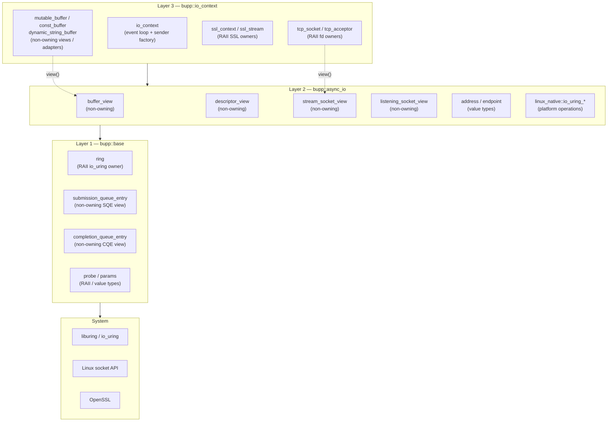
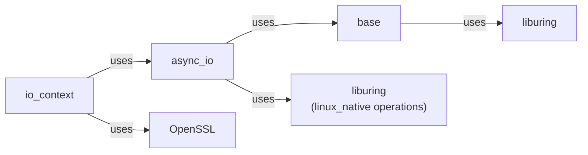
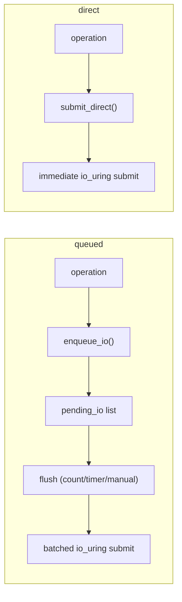
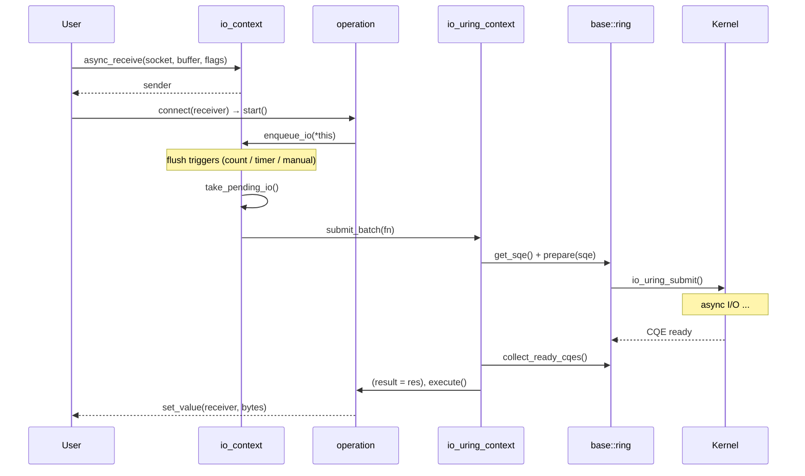

# Architecture

`bupp` is organized into three abstraction layers. Each layer has a distinct
responsibility, and layers depend strictly downward — higher layers use lower
layers; lower layers never reference higher ones.

## Layer Overview



## The Ownership Dimension

Each layer is further characterized by whether its types **own** resources or
are **non-owning references**:

| Layer | Non-owning Views | RAII Owners |
|-------|-----------------|-------------|
| Layer 1 (`base`) | `submission_queue_entry`, `completion_queue_entry` | `ring`, `probe` |
| Layer 2 (`async_io`) | `buffer_view`, `descriptor_view`, `stream_socket_view`, `listening_socket_view` | *(none — by design)* |
| Layer 3 (`io_context`) | `mutable_buffer`, `const_buffer`, `dynamic_string_buffer` | `tcp_socket`, `tcp_acceptor`, `ssl_context`, `ssl_stream`, `io_context` |

**Key invariant:** Layer 2 (`bupp::async_io`) deliberately contains **no RAII
owners**. Every type is either a non-owning view or a pure value type. This
keeps the layer reusable by any higher-level framework without hidden ownership
coupling.

## Layer Dependency Graph



---

## Layer 1: `bupp::base` — Thin `liburing` Wrappers

Namespace `bupp::base`. Headers in `include/bupp/base/linux/`.

Maps the `liburing` C API to C++ objects with RAII where appropriate. Method
names drop the `io_uring_` prefix (e.g. `io_uring_submit` →
`ring::submit()`).

### `ring` — io_uring Instance Owner

RAII wrapper around `struct io_uring`. **The sole owner of an `io_uring`
instance.**

```cpp
class ring {
public:
    ring() noexcept;
    ~ring() noexcept;                   // calls queue_exit()

    ring(const ring&) = delete;
    ring& operator=(const ring&) = delete;
    ring(ring&& other) noexcept;
    ring& operator=(ring&& other) noexcept;

    int queue_init(unsigned entries, unsigned flags = 0) noexcept;
    int queue_init_params(unsigned entries, params& p) noexcept;
    void queue_exit() noexcept;

    int submit() noexcept;
    int submit_and_wait(unsigned wait_nr) noexcept;

    [[nodiscard]] submission_queue_entry get_sqe() noexcept;
    int peek_cqe(completion_queue_entry& cqe) noexcept;
    int wait_cqe(completion_queue_entry& cqe) noexcept;
    int wait_cqe_timeout(completion_queue_entry& cqe,
                         __kernel_timespec* timeout) noexcept;
    void cqe_seen(completion_queue_entry cqe) noexcept;

    template <class Handler>
    unsigned consume_ready_cqes(unsigned max_count,
                                Handler&& handler) noexcept;

    [[nodiscard]] bool is_open() const noexcept;
    [[nodiscard]] int native_fd() const noexcept;
};
```

### `submission_queue_entry` — Non-owning SQE View

Wraps `io_uring_sqe*`. The SQE memory lives in the ring's submission queue.
Copying this object copies only the pointer. Valid until `ring::submit()`
consumes the entry.

### `completion_queue_entry` — Non-owning CQE View

Wraps `io_uring_cqe*`. The CQE slot is recycled after `ring::cqe_seen()`.
Read all needed fields **before** calling `cqe_seen()`.

### Design Rules

Per [`maintaince.md`](../maintaince.md):

- Return semantics mirror `liburing`: ≥ 0 on success, negative `errno` on failure.
- No exceptions thrown.
- No executors, coroutines, schedulers, or higher-level async models.
- Base layer does **not** own fd, buffer, address, path, or message lifetimes
  unless a type explicitly documents ownership.

---

## Layer 2: `bupp::async_io` — Platform-Neutral Vocabulary Types

Namespace `bupp::async_io`. Headers in `include/bupp/async_io/`.

This layer defines **vocabulary types only**: non-owning views and value types.
It intentionally contains **zero RAII owners**.

### Non-Owning Views

#### `buffer_view`

```cpp
struct buffer_view {
    void* data = nullptr;
    std::size_t size = 0;
};
```

Plain aggregate. Copy copies pointer and size; the data is not owned.

#### `descriptor_view`

Non-owning wrapper around a native file descriptor (`int`). Destruction does
**not** close the descriptor.

#### Socket View Family

Role-specialized non-owning socket views built on `socket_view`:

| Type | Role | Extra Operations |
|------|------|-----------------|
| `socket_view` | Generic socket | — |
| `listening_socket_view` | Passive socket | `bind()`, `listen()`, `shutdown()`, `set_reuse_address()` |
| `stream_socket_view` | Active socket | `connect()`, `shutdown()`, `set_reuse_address()` |

Views can be constructed from each other (e.g. `socket_view` →
`listening_socket_view`). All hold the same fd value — only the exposed
operation set differs.

### Value Types

| Type | Description |
|------|-------------|
| `async_io::ip::address` | IPv4 or IPv6 address |
| `async_io::ip::endpoint` | IP address + port number |
| `async_io::ip::tcp` | TCP protocol tag (v4/v6/any) |
| `async_io::ip::udp` | UDP protocol tag |

These are copyable, self-contained value types.

### `linux_native::io_uring_context` — Platform Operation Context

Within `bupp::async_io::linux_native`, `io_uring_context` owns a `base::ring`
and provides an event loop with intrusive operation scheduling:

```cpp
class io_uring_context {
public:
    io_uring_context() noexcept;
    explicit io_uring_context(const io_uring_context_options& opts) noexcept;
    ~io_uring_context() noexcept;

    // non-copyable, non-movable

    int queue_init(const io_uring_context_options& opts) noexcept;
    void queue_exit() noexcept;
    [[nodiscard]] bool is_open() const noexcept;

    template <class Operation>
    int prepare(Operation& op) noexcept;        // lock, get SQE, fill

    int submit() noexcept;

    template <class Operation>
    int submit(Operation& op) noexcept;          // prepare + submit

    template <class Function>
    void submit_batch(Function&& fn) noexcept;   // batch prepare+submit

    int post(io_uring_operation_base& op) noexcept;
    void run() noexcept;
    int stop() noexcept;
    [[nodiscard]] bool is_in_context() const noexcept;
};
```

All operations derive from `io_uring_operation_base`:

```cpp
class io_uring_operation_base {
public:
    io_uring_operation_base* next = nullptr;
    int result = 0;
    unsigned flags = 0;

    // non-copyable, non-movable (intrusive list node)

    virtual ~io_uring_operation_base() = default;
    virtual void execute() noexcept = 0;
};
```

---

## Layer 3: `bupp::io_context` — High-Level Async I/O Context

Namespace `bupp`. Header `include/bupp/linux/io_context.h`.

`io_context` is the top-level abstraction serving three roles:

1. **Sender factory** — creates senders for receive, send, accept, connect,
   wait, handshake, and shutdown.
2. **Event loop host** — `run()` drives the io_uring completion loop.
3. **I/O batching scheduler** — manages queued vs. direct submission.

### Submission Modes



| Mode | API Suffix | Trigger | Use Case |
|------|-----------|---------|----------|
| **queued** | `async_receive()`, etc. | Count (64), timer (1 ms), or manual `flush_io_queue()` | High throughput |
| **direct** | `async_receive_direct()`, etc. | Immediate | Low latency |

### Configuration

```cpp
struct linux_io_context_options {
    async_io::linux_native::io_uring_context_options uring{};
    std::size_t max_queued_io_operations = 64;
    async_io::duration queued_io_flush_after = std::chrono::milliseconds(1);
};

struct io_context_options {
    std::uint32_t concurrency_hint = 1;
    platform_io_context_options platform{};
};
```

### Sender Factories

Each factory returns a sender. Connecting a sender to a receiver and calling
`start()` begins the asynchronous I/O.

#### Non-SSL

| Factory | Socket Parameter | `set_value` |
|---------|-----------------|-------------|
| `async_receive(socket, buffer, flags)` | `stream_socket_view` or `tcp_socket&` | `size_t` bytes received |
| `async_send(socket, buffer, flags)` | `stream_socket_view` or `tcp_socket&` | `size_t` bytes sent |
| `async_accept(acceptor, flags)` | `listening_socket_view` or `tcp_acceptor&` | `tcp_socket` new connection |
| `async_connect(socket, endpoint)` | `stream_socket_view` or `tcp_socket&` | `()` |
| `async_wait(timeout)` | — | `()` |

#### SSL

| Factory | `set_value` |
|---------|-------------|
| `async_handshake(ssl_stream, type)` | `()` |
| `async_receive(ssl_stream, buffer, flags)` | `size_t` |
| `async_send(ssl_stream, buffer, flags)` | `size_t` |
| `async_shutdown(ssl_stream)` | `()` |

All senders also complete with `set_error(std::error_code)` or `set_stopped()`.

### Operation Flow Through Layers



### Sender/Receiver Model & CPOs

`bupp` uses `bexec`'s sender/receiver model. Customization Point Objects
(CPOs) enable generic code to call async operations on any provider:

```cpp
// Direct:
auto s = ctx.async_receive(socket, buffer, 0);

// Through CPO (generic):
auto s = bupp::async_receive(ctx, socket, buffer);
```

| CPO | Invokes | Header |
|-----|---------|--------|
| `bupp::async_receive` | `provider.async_receive(stream, buf)` | `io_context_cpo.h` |
| `bupp::async_send` | `provider.async_send(stream, buf)` | `io_context_cpo.h` |
| `bupp::async_accept` | `provider.async_accept(acceptor)` | `io_context_cpo.h` |
| `bupp::async_connect` | `provider.async_connect(stream, ep)` | `io_context_cpo.h` |
| `bupp::async_wait` | `provider.async_wait(timeout)` | `io_context_cpo.h` |
| `bupp::async_handshake` | `provider.async_handshake(stream, type)` | `ssl.h` |
| `bupp::async_shutdown` | `provider.async_shutdown(stream)` | `ssl.h` |

Each also has a `*_direct` variant (e.g. `async_receive_direct`).

Provider concepts:

```cpp
template <class Provider, class Stream, class Buffer>
concept receives_bytes =
    requires(Provider& p, Stream& s, Buffer&& b) {
        { async_receive(p, s, std::forward<Buffer>(b)) } -> bexec::sender;
    };

template <class Provider, class Stream, class Buffer>
concept sends_bytes = /* ... */;

template <class Provider, class Acceptor>
concept accepts_connections = /* ... */;
```

---

## Header Dependency Graph

```
bupp/bupp.h  (umbrella)
├── bupp/base.h
│   └── base/linux/{ring, submission_queue_entry, completion_queue_entry,
│                   params, probe}.h
├── bupp/async_io.h
│   ├── async_io/{buffer_view, descriptor_view, socket_view, time}.h
│   └── async_io/ip/{address, endpoint, tcp, udp}.h
├── bupp/io_context.h
│   └── linux/io_context.h
│       └── async_io/linux/io_uring_context.h
│           ├── async_io/linux/io_uring_context_base.h
│           └── async_io/linux/io_uring_operations.h
├── bupp/ip.h
├── bupp/buffer.h
├── bupp/tcp.h
├── bupp/ssl.h
├── bupp/io_context_cpo.h
└── bupp/export.h
```

For smaller translation units, include individual sub-headers (e.g.
`bupp/base.h`) instead of `bupp/bupp.h`.

## Namespace Map

```
bupp
├── base                                  Layer 1: liburing wrappers
│   ├── ring                              io_uring RAII owner
│   ├── submission_queue_entry            io_uring_sqe* non-owning view
│   ├── completion_queue_entry            io_uring_cqe* non-owning view
│   ├── params                            io_uring_params value type
│   └── probe                             io_uring_probe RAII owner
├── async_io                              Layer 2: vocabulary types
│   ├── buffer_view                       non-owning byte range
│   ├── descriptor_view                   non-owning fd
│   ├── socket_view                       non-owning generic socket
│   ├── listening_socket_view             non-owning passive socket
│   ├── stream_socket_view                non-owning active socket
│   ├── ip
│   │   ├── address                       IPv4/IPv6 address
│   │   ├── endpoint                      address + port
│   │   ├── tcp                           TCP protocol tag
│   │   └── udp                           UDP protocol tag
│   └── linux_native                      Linux-specific operations
│       ├── io_uring_context              platform event-loop owner
│       ├── io_uring_operation_base       intrusive operation node
│       └── io_uring_*_operation          concrete I/O operations
├── io_context                            Layer 3: high-level async context
│   └── operation_base                    intrusive queued-I/O node
├── ip
│   ├── address (= async_io::ip::address)
│   ├── endpoint (= async_io::ip::endpoint)
│   ├── tcp                               protocol tag + socket type aliases
│   └── udp (= async_io::ip::udp)
├── tcp_socket                            RAII TCP stream socket owner
├── tcp_acceptor                          RAII TCP listening socket owner
├── ssl_context                           RAII SSL_CTX owner
├── ssl_stream<NextLayer>                 RAII SSL + BIO + transport owner
├── mutable_buffer                        non-owning mutable byte view
├── const_buffer                          non-owning const byte view
├── dynamic_string_buffer                 dynamic buffer adapter (std::string)
└── dynamic_byte_vector_buffer<A>         dynamic buffer adapter (std::vector<std::byte>)
```
