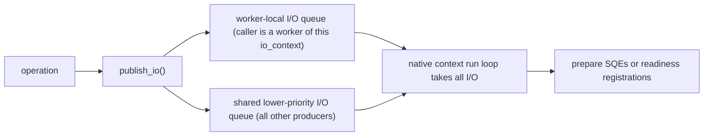
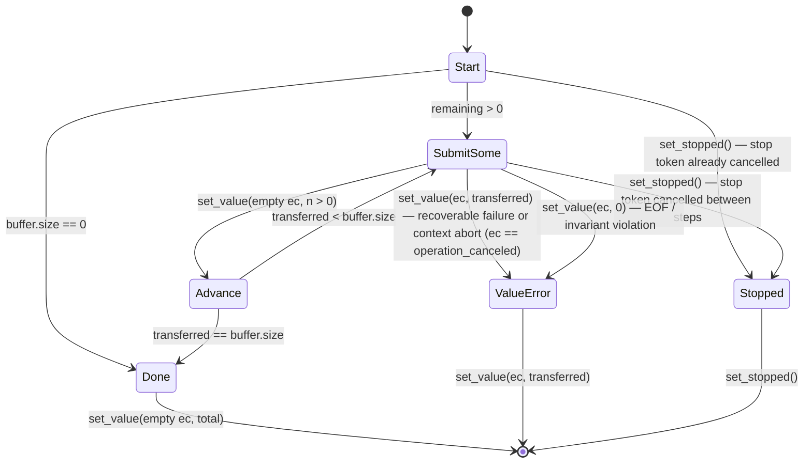
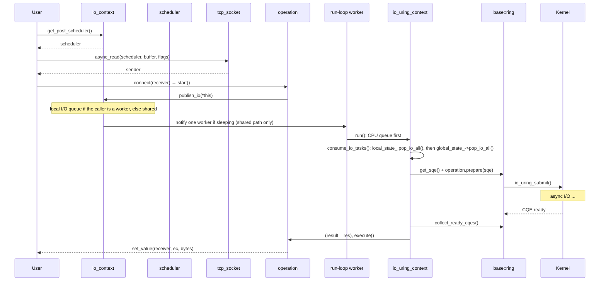

# Layer 3: `bnio::io_context` — High-Level Async I/O Context

Namespace `bnio`. Public umbrella `include/bnio/io_context.h` exposes one
platform-neutral class definition. `detail::native_context` aliases the
configured `io_uring_context` or `kqueue_context`; the shared runtime state,
worker ownership, timers, and source implementation live under
`detail/posix/io_context/` and `src/posix/io_context*.cpp`.

`io_context` is the event-loop owner and scheduler factory:

1. **Event loop host** — `run()` drives the selected io_uring or kqueue loop.
   Each thread calling `run()` creates a native context directly.
2. **Scheduler factory** — produces dispatch and post schedulers.
3. **Passive I/O backend** — publishes scheduler I/O to the running worker's
   own queue or, for every other producer, to the shared queue that a worker
   drains on its owning native-context thread.

The public class is intentionally a coordinator. It owns a small set of
cohesive `detail` state objects rather than defining all internal data inline:

| State / Detail Type | Header | Responsibility |
|---------------------|--------|----------------|
| `detail::native_context` and related aliases | `detail/posix/io_context/native_context.h` | Select the native context, options, operation bases, and shared task state. |
| platform task queue state | `async_io/{linux,bsd}/.../operation_base.h` | Shared CPU/I/O queues, passive-timer callback, awake/running worker counts, suspend worker-state list, submit lock, and worker-group stopping state (`life_state`). |
| `detail::timer_state_data` | `detail/posix/io_context/timer_types.h` | Intrusive timer heap/list and the non-blocking passive-timer callback state. |

The aggregate `detail/posix/io_context/native_io.h` is included after the complete
`io_context` declaration, so templates can call private context hooks without
splitting a class definition across files. It owns the shared forwarding,
timer-wait, and write-all templates, then selects only the backend request
factories under `detail/{linux,bsd}/io_context_native_io/`. Those factories
intentionally retain the distinct readiness versus completion semantics of the
two native backends.

### Passive I/O Publication



There are two publication paths, mirroring `publish_cpu()`. When the caller is
a worker of this `io_context` — `current_worker_native_ != nullptr` and its
`get_global_state() == &global_state_` — `publish_io()` posts straight to that
worker's local I/O queue: no lock, no atomic, and no wakeup, because the
publisher is the thread that drains the queue, and the operation stays on the
worker that owns the connection. Any other producer publishes to the shared I/O
queue and wakes one sleeping worker when the shared awake count indicates that
a worker is sleeping.

The bound-state check is required, not redundant: under a nested `run()` an
outer worker's handler may publish to a different context while
`current_worker_native_` still points at the OUTER worker's native context, and
the inner run loop never drains the outer worker's local queue. The check
routes that publication to the shared queue instead of stranding it.

Workers give the CPU queue priority, then consume I/O: the local I/O queue
first, the shared queue only when the local one is empty, taking the complete
list. Busy workloads naturally form larger kernel submission batches; idle
workloads reach the same drain during the pre-sleep recheck. No count,
threshold, or explicit flush is involved.

Layer 3 does not implement native submission. It wraps platform request objects
in high-level senders, publishes CPU or I/O work through the two paths above,
and lets whichever `run()` worker takes the work own the native preparation.
On BSD, each socket request first attempts its
nonblocking call and registers the matching kqueue filter only when it would
block. The request repeats the call after readiness. On Linux, immediate
attempts and SQE preparation likewise remain platform-native implementation
details.

BSD regular-file requests use a documented blocking-at-start fallback:
`start()` performs one positioned `pread()` or `pwrite()`, then posts the
receiver completion through the shared CPU queue. Thus data transfer is
finished when `start()` returns, but no receiver is called inline. This keeps
the public sender interface aligned with Linux without pretending that kqueue
provides asynchronous regular-file kernel work.

### Configuration

```cpp
using platform_io_context_options =
    /* io_uring_context_options or kqueue_context_options */;

struct io_context_options {
    std::uint32_t concurrency_hint = 1;
    bool enable_immediate_io = true;
    platform_io_context_options platform{};
};
```

`concurrency_hint` is advisory; it does not reserve workers or create a native
context. Every call to `run()` constructs one native context, attaches the
shared group state, and inserts its worker at the head of the worker list.
This preserves **one thread, one uring/kqueue** without a construction-time
primary context. Work may be started before `run()` because it first enters the
shared queues.

`enable_immediate_io` (default `true`) selects the eager immediate-completion
mode (see "Eager Immediate-Completion Toggle" below). It is read once at
`io_context` construction and is immutable afterwards.

When single-issuer mode is available, each lazily created Linux ring is
initially disabled. The same thread that calls its `run()` enables the ring
before preparing or submitting SQEs, becoming that ring's designated issuer.

High-level CPU work follows the same two paths as I/O: `publish_cpu()` posts to
the running worker's own CPU queue when the caller is a worker of this context
and to the shared CPU queue otherwise. Wakeup targets one sleeping worker
through its per-worker wake channel (`wake_one_sleeping`), falling back to the
shared broadcast channel when nobody is suspended. I/O uses the worker-local
I/O queue when the caller is a worker of this context and the lower-priority
shared I/O queue otherwise. The worker that removes an I/O batch owns all SQ
preparation and submission for that batch, so high-level queue code does not
need native ring synchronization. Timer bookkeeping remains on the high-level
context, but native workers consume its deadline passively
while choosing their blocking timeout. Timer-ready completions bypass the
shared CPU queue: the worker that performs the timer check links them directly
into its local CPU queue. No reusable timer SQE or timer-update request
exists. Worker scheduling (suspend-list sleep/wake, directed wakeup) is
documented in
[`worker-scheduling.md`](worker-scheduling.md).

The shared state is owned by `io_context`, not by any native context. Worker
registration calls `set_global_state()` before publishing the new worker at the
list head. `run()` uses that state for CPU work, I/O work, the passive timer
callback, the awake-worker count, and the group `life_state` flag (0=running, 1=stopping). A standalone
native context must also receive externally owned state before `run()`; no
hidden shared-state fallback is allocated.

`io_context::stop()` atomically transitions the shared `life_state` from 0
(running) to 1 (stopping) via CAS before calling `stop_internal()`, which
aborts pending timer waits and wakes every native worker via the shared
wake channel. Worker registration and the `run()` path both check
`life_state` before and after publishing a new slot, so a worker that races
with the stop transition cannot enter a new idle run loop.

Before a worker blocks, it publishes sleeping in two stages: first its local
waiting flag, then a decrement of the shared awake-worker count. It then
rechecks completions, CPU work, I/O work, and the passive timer heap. The
timer check is guarded by an atomic admission flag so only one worker attempts
the timer mutex at a time. Finding any work reopens the worker and starts
another loop pass. Otherwise it blocks until native I/O, an explicit wakeup,
or the timer heap's next deadline. This handshake replaces both the former
queued-I/O flush timer and active timer submission.

### Sender Factories

Streams expose the high-level async I/O factories. Schedulers expose the
lowest-layer factories for socket views, file descriptors, polling, DNS, and
timers. Each factory returns a sender. Connecting a sender to a receiver and
calling `start()` begins the asynchronous I/O.

#### Stream Level

The `set_value` column lists only the success payload. Every sender's actual
signature is `set_value(std::error_code, <payload>)` — the leading `ec` is
empty on success and carries a recoverable error or `operation_canceled`
otherwise. See the note below the Scheduler Level table for the full contract.

| Factory | Owner | `set_value` (success payload) |
|---------|-------|-------------------------------|
| `socket.async_read(scheduler, buffer, flags)` | `tcp_socket` | `size_t` total bytes read until buffer full or EOF |
| `socket.async_read_some(scheduler, buffer, flags)` | `tcp_socket` | `size_t` bytes read by one operation |
| `socket.async_write(scheduler, buffer, flags)` | `tcp_socket` | `size_t` total bytes written |
| `socket.async_write_some(scheduler, buffer, flags)` | `tcp_socket` | `size_t` bytes written by one operation |
| `acceptor.async_accept(scheduler, flags)` | `tcp_acceptor` | `tcp_socket` new connection |
| `socket.async_connect(scheduler, endpoint)` | `tcp_socket` | `()` |
| `socket.async_send_to(scheduler, buffer, endpoint, flags)` | `udp::socket` | one datagram byte count |
| `socket.async_receive_from(scheduler, buffer, endpoint, flags)` | `udp::socket` | one datagram byte count |
| `socket.async_send(scheduler, buffer, flags)` | connected `udp::socket` | one datagram byte count |
| `socket.async_receive(scheduler, buffer, flags)` | connected `udp::socket` | one datagram byte count |
| `stream.async_handshake(scheduler, type)` | `ssl_stream` | `()` |
| `stream.async_read(scheduler, buffer, flags)` | `ssl_stream` | `size_t` plaintext bytes read by one operation |
| `stream.async_read_some(scheduler, buffer, flags)` | `ssl_stream` | `size_t` plaintext bytes read by one operation |
| `stream.async_write(scheduler, buffer, flags)` | `ssl_stream` | `size_t` total plaintext bytes written |
| `stream.async_write_some(scheduler, buffer, flags)` | `ssl_stream` | `size_t` plaintext bytes accepted by one SSL write step |
| `stream.async_shutdown(scheduler)` | `ssl_stream` | `()` |

#### Scheduler Level

The `set_value` column lists only the success payload. The actual signature is
`set_value(std::error_code, <payload>)`.

| Factory | Lowest-Layer Parameter | `set_value` (success payload) |
|---------|------------------------|-------------------------------|
| `scheduler.async_read(view, buffer, flags)` | `stream_socket_view` | `size_t` total bytes read until buffer full or EOF |
| `scheduler.async_read_some(view, buffer, flags)` | `stream_socket_view` | `size_t` bytes read by one operation |
| `scheduler.async_write(view, buffer, flags)` | `stream_socket_view` | `size_t` total bytes written |
| `scheduler.async_write_some(view, buffer, flags)` | `stream_socket_view` | `size_t` bytes written by one operation |
| `scheduler.async_accept(view, flags)` | `stream_socket_view` | native fd |
| `scheduler.async_connect(view, endpoint)` | `stream_socket_view` | `()` |
| `scheduler.async_send(view, buffer, flags)` | `datagram_socket_view` | one datagram byte count |
| `scheduler.async_receive(view, buffer, flags)` | `datagram_socket_view` | one datagram byte count |
| `scheduler.async_send_to(view, buffer, endpoint, flags)` | `datagram_socket_view` | one datagram byte count |
| `scheduler.async_receive_from(view, buffer, endpoint, flags)` | `datagram_socket_view` | one datagram byte count |
| `scheduler.async_read(descriptor, buffer, offset)` | `descriptor_view` | `size_t` total bytes read until buffer full or EOF |
| `scheduler.async_read_some(descriptor, buffer, offset)` | `descriptor_view` | `size_t` bytes read by one operation |
| `scheduler.async_write(descriptor, buffer, offset)` | `descriptor_view` | `size_t` total bytes written |
| `scheduler.async_write_some(descriptor, buffer, offset)` | `descriptor_view` | `size_t` bytes written by one operation |
| `scheduler.async_poll(descriptor, mask)` | `descriptor_view` | `unsigned` ready-event mask |

All senders complete with `set_value(std::error_code, ...)` as the universal
result exit: the leading `ec` distinguishes success (`ec == {}`), recoverable
failure (`ec == <errno-derived>`), and every non-token cancellation
(`ec == operation_canceled`): `io_context::stop()` aborting inflight I/O or
not-yet-executed queued work, `steady_timer` object-API cancellation, and
kernel-level `ECANCELED`. `set_stopped()` is reserved exclusively for
cooperative cancellation: it is emitted if and only if the operation
observed, at `start()` or at the delivery point of queued work, that the stop
token visible in its receiver environment is cancelled — including tokens
forwarded or injected by composite sender algorithms. When the stop token is
cancelled and the context is stopping at the same time, the token wins and
the operation completes with `set_stopped()`. Already-completed results are
delivered unchanged by a stop. Write-all/read-all senders report the bytes
transferred so far through the `set_value(operation_canceled, ...)` payload;
`set_stopped()` carries no payload. The bnio sender/receiver contract uses
only these two completion channels; `set_error` is not part of it — no bnio
`completion_signatures` include it, and no bnio receiver implements it.

#### Completion Arbitration Design

The contract above is implemented with one arbitration point per
operation; the abort machinery itself is untouched.

- **Arbitration in `execute()`, aborts unchanged.** Every operation's
  `execute()` has a `stopped` branch, and that branch arbitrates: it
  queries the stop token in the receiver environment — cancelled delivers
  `set_stopped()`, otherwise it delivers
  `set_value(operation_canceled, ...)` with the operation's cancellation
  payload. The `value`/`value_with_ec` branches never consult the token,
  so real results and kernel-level `ECANCELED` are delivered unchanged.
  `complete_submit_stopped()` in both backends still only marks a
  completion as stopped (the stop channel); all abort paths
  (`abort_inflight_io()`, `drain_io_list_complete_stopped()`, publish
  rejection) are unchanged, keeping the risk surface minimal. On io_uring,
  a teardown guard at the top of `consume_io_tasks()` routes I/O consumed
  in the stopping/closing state through the stop channel instead of
  preparing SQEs the dying ring could no longer submit.
- **`start()` pre-checks flipped to the stop channel.** Operations that
  pre-checked the token in `start()` and used to deliver
  `value(operation_canceled)` now mark the stopped channel, so the same
  `execute()` arbitration delivers `set_stopped()` — at that point the
  token necessarily wins. Write-all does this inline
  (`detail/posix/io_context/write_all.h:247`).
- **Schedule observes once, in order.** The schedule sender's completion
  arbitrates token → `context_->is_stopped()` → `set_value({})` at its
  single observation point (`detail/posix/io_context/class.h:176`), so
  "queued CPU work drained at stop delivers
  `set_value(operation_canceled)`" and "the token wins the race" hold
  together at one point.
- **Timers stage the channel; `execute()` maps it.** The timer-wait
  `start()` token pre-check stages `timer_completion_kind::stopped`
  (`detail/posix/io_context/timer_wait.h:24`); `abort_pending_timer_waits()`
  on context stop and the timer object API stage `::canceled`. `execute()`
  maps stopped → `set_stopped()` and canceled →
  `set_value(operation_canceled)`. Timer aborts do not re-check the token:
  the kind is fixed when staged on the stopping thread.
- **Composite layers simplified.** Under the new contract a `set_stopped()`
  arriving at a composed receiver can only originate from a token, so
  write-all's repeat receiver forwards it unconditionally
  (`detail/posix/io_context/write_all.h:216`) and the old
  token-vs-context double branch and `complete_canceled` are gone; the SSL
  read/write handlers do the same
  (`detail/ssl/async_operations/read_write/operation.h:58`,
  `step.h:97`). The SSL state machine's post receiver was also fixed to
  override a stale staged completion with `complete_stopped()` before
  delivering the terminal call
  (`detail/ssl/async_operations/state_machine.h:131`) — otherwise a token
  stop delivered by the schedule could be swallowed by an older pending
  value; the `set_value(ec)` overwrite for context-stop
  `value(operation_canceled)` delivery is retained
  (`detail/ssl/async_operations/state_machine.h:118`).
- **Resolve is three-stage with a source-incompatible signature.** The
  posix resolve `execute()` checks the token (`set_stopped()`), then
  `context_->is_stopped()` (`set_value(operation_canceled, 0)` with DNS
  skipped — the not-yet-executed queued-work rule), then runs the resolver
  and delivers the real result
  (`detail/linux/io_context_native_io/common.h:323`,
  `detail/bsd/io_context_native_io/common.h:359`). Resolve sender
  signatures gained `set_stopped_t()`. The async_io-layer resolve mirrors
  the token arbitration and signature change but does not check context
  stop — that layer does not observe `life_state` (see
  [`async-io-layer.md`](async-io-layer.md)).

#### Eager Immediate-Completion Toggle

The eager switch is a runtime `io_context_options` field:
`enable_immediate_io` (default `true`, immutable after construction; readable
through `io_context::enable_immediate_io()`). Eager (default) issues one
non-blocking syscall at `start()` and completes immediately unless it would
block; non-eager skips the probe: BSD calls `perform_io()` and parks on a
kqueue filter on EAGAIN, Linux submits the SQE directly. Results are identical
in both modes — regular files never wait on kqueue readiness (EVFILT_READ on a
regular file never fires), and non-eager connect still issues `::connect()`,
ruling out false success. Linux accept/connect had no immediate attempt, so the
modes are equivalent there. The switch is stored once at construction and read
per operation; the scheduler/context factories no longer take a template
parameter, and the read/write-all state honors it via the same runtime flag.

### Internal Header Layout

The shared `io_context` layer keeps one class declaration and one source
implementation:

| Header | Contents |
|--------|----------|
| `io_context.h` | Public `io_context` umbrella. |
| `detail/posix/io_context/class.h` | `io_context`, schedulers, operation base, and private hooks. |
| `detail/posix/io_context/native_context.h` | Backend-selected native type aliases. |
| `detail/posix/io_context/options.h` | `io_context_options` and the selected native context options. |
| `detail/posix/io_context/{timer_types,steady_timer}.h` | Timer slots, queues, state, and public `steady_timer`. |
| `detail/posix/io_context/native_io.h` | Shared scheduler/context forwarding functions; selects backend request factories. |
| `detail/posix/io_context/{timer_wait,write_all}.h` | Shared timer wait and composed full-write sender templates. |
| `detail/{linux,bsd}/io_context_native_io/` | Backend-specific request adapters, factories, and (on Linux) SQE models. |
| `src/posix/io_context{,_queue,_timer,_timer_state}.cpp` | Shared lifecycle, queue, timer, and timer-state implementations. |

The request adapters are deliberately not macro-normalized: kqueue owns a
readiness/retry step while io_uring owns SQE preparation and CQE completion.
Detail headers are installable because public inline templates reference them.
User code should normally include `bnio/io_context.h`, not the detail headers
directly.

### Read/Write Semantic Split

The I/O API intentionally separates a native-attempt operation from a composed
full-write operation:

- `async_read()` and `async_read_some()` both mean "one read attempt". They
  complete after one bounded kernel receive/read or one SSL plaintext read step.
  Callers that need an exact byte count build their own parser/state loop.
- `async_write_some()` means "one write attempt". It preserves native short
  write behavior and reports the bytes accepted by that attempt.
- `async_write()` means "write the whole supplied buffer". It composes
  `async_write_some()` in a loop and reports the total bytes written.

The split exists because io_uring SQEs carry a kernel-sized length field while
public buffers are `std::size_t`. Every one-attempt operation bounds the native
request length before preparing the SQE. Write-all operations then repeat those
bounded attempts until the public buffer is exhausted.

#### Write-All as `state + repeat_until`

Write-all is implemented as a sender adaptor, not as a special io_uring
operation. The operation owns a small state object plus a `repeat_until`
operation. Each repeat iteration creates a fresh child sender for the current
slice:



The state contains:

| Field | Purpose |
|-------|---------|
| scheduler/context pointer | Creates each next child sender against the same provider. |
| sink handle | `stream_socket_view` or `descriptor_view`. |
| buffer | Original non-owning `const_buffer`; caller storage must outlive the composed operation. |
| flags or offset | Socket flags, or descriptor starting offset. |
| transferred | Number of bytes successfully written so far. |
| done | Predicate observed by `repeat_until` after each child completion. |

For descriptor writes, each child uses `offset + transferred`, so retries write
the next file range. For socket writes, each child advances the buffer pointer
by `transferred`. A child result of zero before completion is treated as an
error to avoid an infinite repeat loop.

This design keeps each native I/O operation simple and single-purpose while
making full-write behavior explicit, testable, and reusable. Every child
attempt uses `async_write_some()` and enters the same passive I/O path.

#### SSL Use of the Same Pattern

`ssl_stream` already drives OpenSSL through a state machine. The transport side
now always uses the lower layer's `async_read_some*` and `async_write_some*`
because BIO flush/refill operations need native-attempt semantics. Plaintext
`ssl_stream::async_write()` uses the same repeat idea at the SSL layer: it
tracks plaintext bytes accepted by `SSL_write`, flushes encrypted BIO output,
and repeats until the whole plaintext buffer is accepted and flushed.

`ssl_stream::async_write_some()` is the escape hatch for callers that want one
SSL write step and their own retry policy. `ssl_stream::async_read()` remains a
read-some operation because TLS records and application protocol frames do not
map cleanly to a caller's buffer size.

The SSL state machine delivers its final completion through a schedule handoff
(`post_receiver`). The priority between what that handoff observes and what
the state machine already staged is fixed:

1. A receiver stop token that is cancelled wins over everything: the handoff
   delivers `set_stopped()` even when a completion is staged (`set_stopped()`
   overrides the staged result).
2. A staged completion (value or error the state machine produced: a TLS
   failure, an orderly close, transferred bytes) is delivered unchanged. The
   schedule's own abort result (`value(operation_canceled)` when the context
   stopped before the handoff ran) is dropped — a staged result is never
   overwritten by a fabricated cancel, matching the usage contract that
   already-completed results are delivered unchanged.

This ordering works because every `submit_post()` call site stages a
completion before submitting, so the post receiver always finds a staged
result.

### Operation Flow Through Layers



### Sender/Receiver Model & CPOs

`bnio` uses `bexec`'s sender/receiver model. Customization Point Objects
(CPOs) enable generic code to call async operations on any provider:

```cpp
// Stream call:
auto scheduler = ctx.get_post_scheduler();
auto s = socket.async_read(scheduler, buffer, 0);

// Lowest-layer call:
auto low = scheduler.async_read(socket.view(), buffer, 0);

// Through CPO (generic):
auto s = bnio::async_read(scheduler, socket, buffer);
```

| CPO | Invokes | Header |
|-----|---------|--------|
| `bnio::async_read(provider, stream, buf)` | `stream.async_read(provider, buf)` or lowest-layer fallback | `io_context_cpo.h` |
| `bnio::async_read_some(provider, stream, buf)` | `stream.async_read_some(provider, buf)` or lowest-layer fallback | `io_context_cpo.h` |
| `bnio::async_write(provider, stream, buf)` | `stream.async_write(provider, buf)` or lowest-layer fallback | `io_context_cpo.h` |
| `bnio::async_write_some(provider, stream, buf)` | `stream.async_write_some(provider, buf)` or lowest-layer fallback | `io_context_cpo.h` |
| `bnio::async_accept` | `acceptor.async_accept(provider)` or lowest-layer fallback | `io_context_cpo.h` |
| `bnio::async_connect` | `stream.async_connect(provider, ep)` or lowest-layer fallback | `io_context_cpo.h` |
| `bnio::async_read(provider, descriptor, buf, offset)` | `provider.async_read(descriptor, buf, offset)` | `io_context_cpo.h` |
| `bnio::async_read_some(provider, descriptor, buf, offset)` | `provider.async_read_some(descriptor, buf, offset)` | `io_context_cpo.h` |
| `bnio::async_write(provider, descriptor, buf, offset)` | `provider.async_write(descriptor, buf, offset)` | `io_context_cpo.h` |
| `bnio::async_write_some(provider, descriptor, buf, offset)` | `provider.async_write_some(descriptor, buf, offset)` | `io_context_cpo.h` |
| `bnio::async_poll` | `provider.async_poll(descriptor, mask)` | `io_context_cpo.h` |
| `bnio::async_handshake` | `stream.async_handshake(provider, type)` | `ssl.h` |
| `bnio::async_shutdown` | `stream.async_shutdown(provider)` | `ssl.h` |

Provider concepts:

```cpp
template <class Provider, class Source, class Buffer>
concept reads_bytes =
    requires(Provider& p, Source& s, Buffer&& b) {
        { async_read(p, s, std::forward<Buffer>(b)) } -> bexec::sender;
    };

template <class Provider, class Sink, class Buffer>
concept writes_bytes = /* ... */;

template <class Provider, class Acceptor>
concept accepts_connections = /* ... */;

// Descriptor I/O uses the same reads_bytes/writes_bytes concepts with
// async_io::descriptor_view as the source/sink type.
```

---
