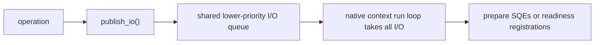
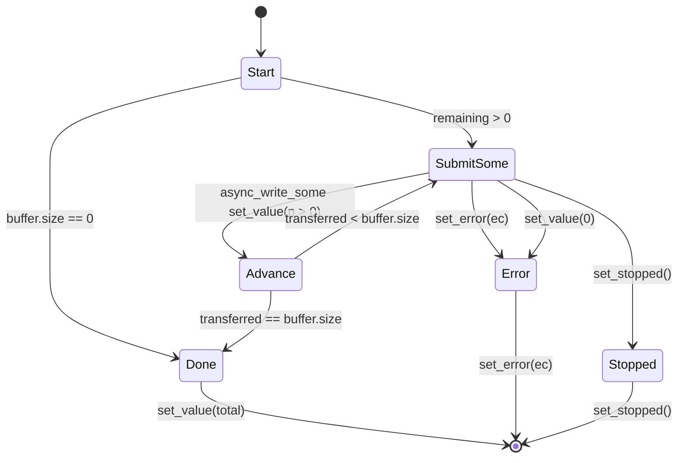
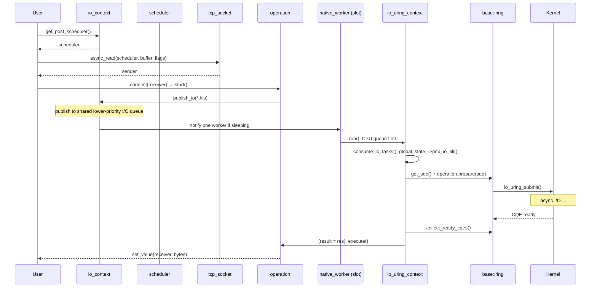

# Layer 3: `bupp::io_context` — High-Level Async I/O Context

Namespace `bupp`. Public umbrella `include/bupp/io_context.h` selects
`include/bupp/linux/io_context.h` or `include/bupp/bsd/io_context.h`, with
matching detail headers under the platform directory.

`io_context` is the event-loop owner and scheduler factory:

1. **Event loop host** — `run()` drives the selected io_uring or kqueue loop.
   Each thread calling `run()` claims a native worker slot with its own native
   context.
2. **Scheduler factory** — produces dispatch and post schedulers.
3. **Passive I/O backend** — publishes scheduler I/O to a shared queue that a
   worker drains on its owning native-context thread.

The public class is intentionally a coordinator. It owns a small set of
cohesive `detail` state objects rather than defining all internal data inline:

| State / Detail Type | Header | Responsibility |
|---------------------|--------|----------------|
| `detail::native_context_state` | `{linux,bsd}/detail/io_context_state.h` | Primary native context plus platform options. |
| `detail::native_worker_state` | `{linux,bsd}/detail/io_context_state.h` | Worker linked list, active worker count, and round-robin cursor. |
| `detail::native_worker` | `{linux,bsd}/detail/io_context_state/native_worker.h` | Per-run-thread native context slot. |
| platform task queue state | `async_io/{linux,bsd}/.../operation_base.h` | Shared CPU/I/O queues, awake-worker count, and worker-group closing state. |
| `detail::timer_state_data` | `{linux,bsd}/detail/io_context_timer_types.h` | Timer map, heap, reusable timer-operation states, and timeout state machine. |

Template implementation types are grouped by operation family under the
platform's `detail/io_context_native_io/`. The aggregate detail header is
included after the complete `io_context` declaration, so templates can call
private context hooks without splitting a class definition across files.

### Passive I/O Publication



There is one publication policy. Producers publish I/O and wake a worker when
the shared awake count indicates that a worker is sleeping. Workers give the
CPU queue priority, then atomically take the complete I/O list. Busy workloads
naturally form larger kernel submission batches; idle workloads reach the same
drain during the pre-sleep recheck. No count, threshold, explicit flush, or
direct variant is involved.

Layer 3 does not issue native I/O calls. It converts high-level buffers and
owners to layer-2 views, then returns the platform-native sender. On BSD, each
layer-2 socket request first attempts its nonblocking call and registers the
matching kqueue filter only when it would block. The request repeats the call
after readiness. On Linux, immediate attempts and SQE preparation likewise
remain platform-native implementation details.

BSD regular-file requests use a documented blocking-at-start fallback:
`start()` performs one positioned `pread()` or `pwrite()`, then posts the
receiver completion through the selected kqueue context. Thus data transfer is
finished when `start()` returns, but no receiver is called inline. This keeps
the public sender interface aligned with Linux without pretending that kqueue
provides asynchronous regular-file kernel work.

### Configuration

```cpp
struct linux_io_context_options {
    async_io::linux_native::io_uring_context_options uring{};
};

struct io_context_options {
    std::uint32_t concurrency_hint = 1;
    platform_io_context_options platform{};
};
```

On Linux, `concurrency_hint` reserves native run-loop slots. Each slot holds
its own `io_uring_context`. When `concurrency_hint > 1` and multiple threads
call `run()`, each thread claims a distinct slot with its own ring — hence
**one thread, one uring**. Slot 0 always hosts the construction-time primary
context, so existing code can start work before `run()`.

High-level `post` work is published to the shared CPU queue. Wakeup scans the
worker slots and writes one waiting worker's eventfd. I/O is published to the
lower-priority shared I/O queue. The worker that removes an I/O batch owns all
SQ preparation and submission for that batch, so the high-level queue code does
not need native ring synchronization. Timer bookkeeping remains on the primary
native context (slot 0). Its timeout and timeout-update requests use the
primary run loop's local passive I/O chain so both requests remain on the same
ring; they do not expose or call an active submission API.

The shared state is owned by `io_context`, not by any native
`io_uring_context`. Construction calls `set_global_state()` on the primary
native context, and each later worker receives the same pointer before it can
run. `run()` follows `global_state_` to obtain CPU work, I/O work, the
awake-worker count, and the group closing flag. A standalone native context
leaves the pointer null and uses only its local, non-atomic task queues; no
hidden shared-state fallback is allocated.

`io_context::stop()` sets the shared `closing` flag before scanning and waking
native workers. Worker registration checks the same flag both before and after
publishing a new slot, so a worker that races with the stop scan cannot enter a
new idle run loop.

Before a worker blocks, it publishes sleeping in two stages: first its local
waiting flag, then a decrement of the shared awake-worker count. It then
rechecks CQEs and the CPU queue and takes all published I/O. Finding any work
reopens the worker and starts another loop pass. Otherwise a producer that
finds the shared awake count below the worker count writes one waiting worker's
eventfd. Only a still-empty worker proceeds to eventfd wait. This handshake
replaces both the former queued-I/O flush timer and queue-length threshold.

### Sender Factories

Streams expose the high-level async I/O factories. Schedulers expose the
lowest-layer factories for socket views, file descriptors, polling, DNS, and
timers. Each factory returns a sender. Connecting a sender to a receiver and
calling `start()` begins the asynchronous I/O.

#### Stream Level

| Factory | Owner | `set_value` |
|---------|-------|-------------|
| `socket.async_read(scheduler, buffer, flags)` | `tcp_socket` | `size_t` bytes read by one operation |
| `socket.async_read_some(scheduler, buffer, flags)` | `tcp_socket` | `size_t` bytes read by one operation |
| `socket.async_write(scheduler, buffer, flags)` | `tcp_socket` | `size_t` total bytes written |
| `socket.async_write_some(scheduler, buffer, flags)` | `tcp_socket` | `size_t` bytes written by one operation |
| `acceptor.async_accept(scheduler, flags)` | `tcp_acceptor` | `tcp_socket` new connection |
| `socket.async_connect(scheduler, endpoint)` | `tcp_socket` | `()` |
| `socket.async_send_to(scheduler, buffer, endpoint, flags)` | `udp::socket` | one datagram byte count |
| `socket.async_receive_from(scheduler, buffer, endpoint, flags)` | `udp::socket` | one datagram byte count |
| `socket.async_send(scheduler, buffer, flags)` | connected `udp::socket` | one datagram byte count |
| `socket.async_receive(scheduler, buffer, flags)` | connected `udp::socket` | one datagram byte count |
| `stream.async_handshake(scheduler, type)` | `ssl_stream` | `()` |
| `stream.async_read(scheduler, buffer, flags)` | `ssl_stream` | `size_t` plaintext bytes read by one operation |
| `stream.async_read_some(scheduler, buffer, flags)` | `ssl_stream` | `size_t` plaintext bytes read by one operation |
| `stream.async_write(scheduler, buffer, flags)` | `ssl_stream` | `size_t` total plaintext bytes written |
| `stream.async_write_some(scheduler, buffer, flags)` | `ssl_stream` | `size_t` plaintext bytes accepted by one SSL write step |
| `stream.async_shutdown(scheduler)` | `ssl_stream` | `()` |

#### Scheduler Level

| Factory | Lowest-Layer Parameter | `set_value` |
|---------|------------------------|-------------|
| `scheduler.async_read(view, buffer, flags)` | `stream_socket_view` | `size_t` bytes read by one operation |
| `scheduler.async_read_some(view, buffer, flags)` | `stream_socket_view` | `size_t` bytes read by one operation |
| `scheduler.async_write(view, buffer, flags)` | `stream_socket_view` | `size_t` total bytes written |
| `scheduler.async_write_some(view, buffer, flags)` | `stream_socket_view` | `size_t` bytes written by one operation |
| `scheduler.async_accept(view, flags)` | `stream_socket_view` | native fd |
| `scheduler.async_connect(view, endpoint)` | `stream_socket_view` | `()` |
| `scheduler.async_send(view, buffer, flags)` | `datagram_socket_view` | one datagram byte count |
| `scheduler.async_receive(view, buffer, flags)` | `datagram_socket_view` | one datagram byte count |
| `scheduler.async_send_to(view, buffer, endpoint, flags)` | `datagram_socket_view` | one datagram byte count |
| `scheduler.async_receive_from(view, buffer, endpoint, flags)` | `datagram_socket_view` | one datagram byte count |
| `scheduler.async_read(descriptor, buffer, offset)` | `descriptor_view` | `size_t` bytes read by one operation |
| `scheduler.async_read_some(descriptor, buffer, offset)` | `descriptor_view` | `size_t` bytes read by one operation |
| `scheduler.async_write(descriptor, buffer, offset)` | `descriptor_view` | `size_t` total bytes written |
| `scheduler.async_write_some(descriptor, buffer, offset)` | `descriptor_view` | `size_t` bytes written by one operation |
| `scheduler.async_poll(descriptor, mask)` | `descriptor_view` | `unsigned` ready-event mask |

All senders also complete with `set_error(std::error_code)` or `set_stopped()`.

### Internal Header Layout

Each platform `io_context` layer uses the same detail-header layout to keep
operation families separate while preserving a single public class declaration:

| Header | Contents |
|--------|----------|
| `linux/io_context.h` | `io_context`, scheduler handles, operation base, public and private member declarations. |
| `linux/detail/io_context_state.h` | Non-template grouped runtime state: native context/options and worker-list state. |
| `linux/detail/io_context_state/native_worker.h` | Complete `detail::native_worker` definition; included after `io_context` is complete. |
| `linux/detail/io_context_timer_types.h` | Timer slots, reusable timer operations, timer heap items, and `timer_state_data`. |
| `linux/detail/io_context_native_io/common.h` | Error/stop helpers plus generic `native_io_operation` and `native_io_sender` templates. |
| `linux/detail/io_context_native_io/file.h` | Descriptor read/write operation models. |
| `linux/detail/io_context_native_io/socket.h` | Stream and datagram read/write/send/receive/accept/connect operation models. |
| `linux/detail/io_context_native_io/poll.h` | Poll operation model. |
| `linux/detail/io_context_native_io/timer_wait.h` | Timer wait sender and operation templates. |
| `linux/detail/io_context_native_io/write_all.h` | Write-all state, step sender, and composed operation templates. |
| `linux/detail/io_context_native_io.h` | Aggregates the native-I/O detail headers and defines inline scheduler/context forwarding functions. |

BSD keeps only `common.h`, `timer_wait.h`, and `write_all.h` in the layer-3
detail directory. Its native file, socket, poll, and DNS requests live under
`async_io/bsd/kqueue_operations/`; the high-level forwarding functions select
and compose those layer-2 senders. Detail headers are installable because
public inline templates reference them. User code should normally include
`bupp/io_context.h`, not the detail headers directly.

### Read/Write Semantic Split

The I/O API intentionally separates a native-attempt operation from a composed
full-write operation:

- `async_read()` and `async_read_some()` both mean "one read attempt". They
  complete after one bounded kernel receive/read or one SSL plaintext read step.
  Callers that need an exact byte count build their own parser/state loop.
- `async_write_some()` means "one write attempt". It preserves native short
  write behavior and reports the bytes accepted by that attempt.
- `async_write()` means "write the whole supplied buffer". It composes
  `async_write_some()` in a loop and reports the total bytes written.

The split exists because io_uring SQEs carry a kernel-sized length field while
public buffers are `std::size_t`. Every one-attempt operation bounds the native
request length before preparing the SQE. Write-all operations then repeat those
bounded attempts until the public buffer is exhausted.

#### Write-All as `state + repeat_until`

Write-all is implemented as a sender adaptor, not as a special io_uring
operation. The operation owns a small state object plus a `repeat_until`
operation. Each repeat iteration creates a fresh child sender for the current
slice:



The state contains:

| Field | Purpose |
|-------|---------|
| scheduler/context pointer | Creates each next child sender against the same provider. |
| sink handle | `stream_socket_view` or `descriptor_view`. |
| buffer | Original non-owning `const_buffer`; caller storage must outlive the composed operation. |
| flags or offset | Socket flags, or descriptor starting offset. |
| transferred | Number of bytes successfully written so far. |
| done | Predicate observed by `repeat_until` after each child completion. |

For descriptor writes, each child uses `offset + transferred`, so retries write
the next file range. For socket writes, each child advances the buffer pointer
by `transferred`. A child result of zero before completion is treated as an
error to avoid an infinite repeat loop.

This design keeps each native I/O operation simple and single-purpose while
making full-write behavior explicit, testable, and reusable. Every child
attempt uses `async_write_some()` and enters the same passive I/O path.

#### SSL Use of the Same Pattern

`ssl_stream` already drives OpenSSL through a state machine. The transport side
now always uses the lower layer's `async_read_some*` and `async_write_some*`
because BIO flush/refill operations need native-attempt semantics. Plaintext
`ssl_stream::async_write()` uses the same repeat idea at the SSL layer: it
tracks plaintext bytes accepted by `SSL_write`, flushes encrypted BIO output,
and repeats until the whole plaintext buffer is accepted and flushed.

`ssl_stream::async_write_some()` is the escape hatch for callers that want one
SSL write step and their own retry policy. `ssl_stream::async_read()` remains a
read-some operation because TLS records and application protocol frames do not
map cleanly to a caller's buffer size.

### Operation Flow Through Layers



### Sender/Receiver Model & CPOs

`bupp` uses `bexec`'s sender/receiver model. Customization Point Objects
(CPOs) enable generic code to call async operations on any provider:

```cpp
// Stream call:
auto scheduler = ctx.get_post_scheduler();
auto s = socket.async_read(scheduler, buffer, 0);

// Lowest-layer call:
auto low = scheduler.async_read(socket.view(), buffer, 0);

// Through CPO (generic):
auto s = bupp::async_read(scheduler, socket, buffer);
```

| CPO | Invokes | Header |
|-----|---------|--------|
| `bupp::async_read(provider, stream, buf)` | `stream.async_read(provider, buf)` or lowest-layer fallback | `io_context_cpo.h` |
| `bupp::async_read_some(provider, stream, buf)` | `stream.async_read_some(provider, buf)` or lowest-layer fallback | `io_context_cpo.h` |
| `bupp::async_write(provider, stream, buf)` | `stream.async_write(provider, buf)` or lowest-layer fallback | `io_context_cpo.h` |
| `bupp::async_write_some(provider, stream, buf)` | `stream.async_write_some(provider, buf)` or lowest-layer fallback | `io_context_cpo.h` |
| `bupp::async_accept` | `acceptor.async_accept(provider)` or lowest-layer fallback | `io_context_cpo.h` |
| `bupp::async_connect` | `stream.async_connect(provider, ep)` or lowest-layer fallback | `io_context_cpo.h` |
| `bupp::async_read(provider, descriptor, buf, offset)` | `provider.async_read(descriptor, buf, offset)` | `io_context_cpo.h` |
| `bupp::async_read_some(provider, descriptor, buf, offset)` | `provider.async_read_some(descriptor, buf, offset)` | `io_context_cpo.h` |
| `bupp::async_write(provider, descriptor, buf, offset)` | `provider.async_write(descriptor, buf, offset)` | `io_context_cpo.h` |
| `bupp::async_write_some(provider, descriptor, buf, offset)` | `provider.async_write_some(descriptor, buf, offset)` | `io_context_cpo.h` |
| `bupp::async_poll` | `provider.async_poll(descriptor, mask)` | `io_context_cpo.h` |
| `bupp::async_handshake` | `stream.async_handshake(provider, type)` | `ssl.h` |
| `bupp::async_shutdown` | `stream.async_shutdown(provider)` | `ssl.h` |

Provider concepts:

```cpp
template <class Provider, class Source, class Buffer>
concept reads_bytes =
    requires(Provider& p, Source& s, Buffer&& b) {
        { async_read(p, s, std::forward<Buffer>(b)) } -> bexec::sender;
    };

template <class Provider, class Sink, class Buffer>
concept writes_bytes = /* ... */;

template <class Provider, class Acceptor>
concept accepts_connections = /* ... */;

// Descriptor I/O uses the same reads_bytes/writes_bytes concepts with
// async_io::descriptor_view as the source/sink type.
```

---
