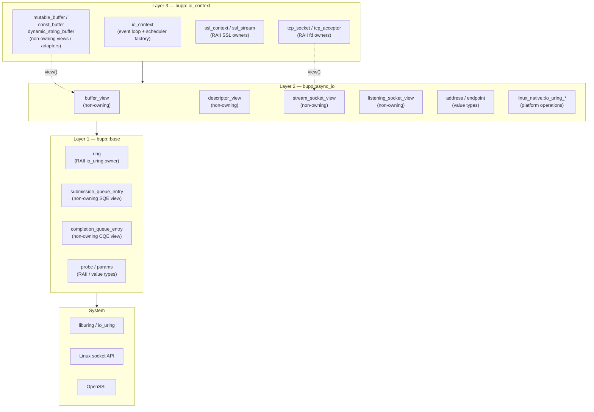
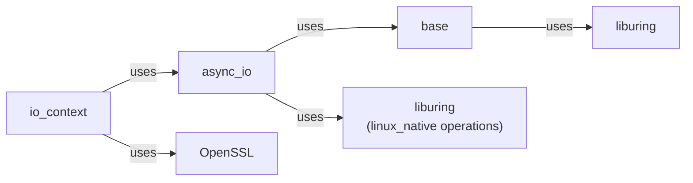

# Layer Overview

## The Ownership Dimension

Each layer is further characterized by whether its types **own** resources or
are **non-owning references**:

| Layer | Non-owning Views | RAII Owners |
|-------|-----------------|-------------|
| Layer 1 (`base`) | `submission_queue_entry`, `completion_queue_entry` | `ring`, `probe` |
| Layer 2 (`async_io`) | `buffer_view`, `descriptor_view`, `stream_socket_view`, `listening_socket_view` | *(none — by design)* |
| Layer 3 (`io_context`) | `mutable_buffer`, `const_buffer`, `dynamic_string_buffer` | `tcp_socket`, `tcp_acceptor`, `ssl_context`, `ssl_stream`, `io_context` |

**Key invariant:** Layer 2 (`bupp::async_io`) deliberately contains **no RAII
owners**. Every type is either a non-owning view or a pure value type. This
keeps the layer reusable by any higher-level framework without hidden ownership
coupling.

## Layer Dependency Graph

## Platform Native Backends

The current implementation is Linux-only and uses `io_uring`. The planned
macOS/BSD port keeps the same three-layer model but adds a `kqueue` backend
instead of treating `io_uring` as the permanent shape of every platform.

See [`kqueue-roadmap.md`](../kqueue-roadmap.md) for the macOS/BSD technical route.

---
