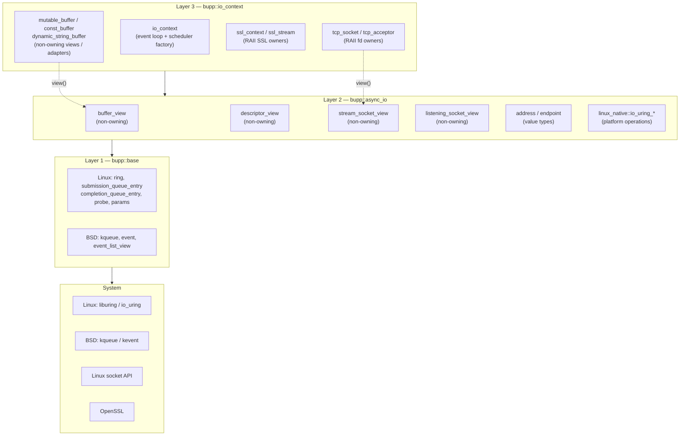
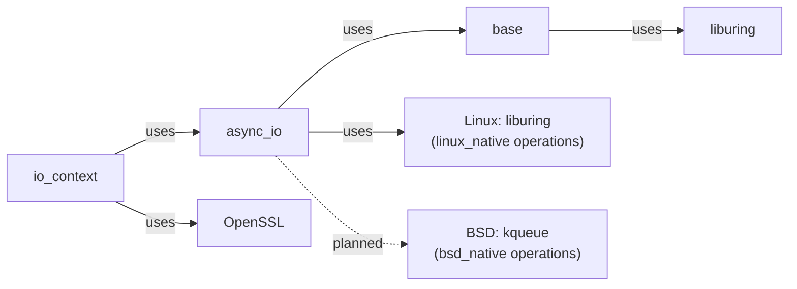

# Layer Overview

## The Ownership Dimension

Each layer is further characterized by whether its types **own** resources or
are **non-owning references**:

| Layer | Non-owning Views | RAII Owners |
|-------|-----------------|-------------|
| Layer 1 (`base`) | `submission_queue_entry`, `completion_queue_entry`, `event`, `event_list_view` | `ring`, `probe`, `kqueue` |
| Layer 2 (`async_io`) | `buffer_view`, `descriptor_view`, `stream_socket_view`, `listening_socket_view` | `linux_native::io_uring_context` |
| Layer 3 (`io_context`) | `mutable_buffer`, `const_buffer`, `dynamic_string_buffer` | `tcp_socket`, `tcp_acceptor`, `ssl_context`, `ssl_stream`, `io_context` |

**Key invariant:** Layer 2 (`bupp::async_io`) vocabulary types are deliberately
non-owning views or pure value types. The `linux_native::io_uring_context` is
the exception — it is the platform-level RAII event-loop owner, one per run-loop
thread. It lives inside `io_context`'s native worker slots.

## Layer Dependency Graph

## Platform Native Backends

The primary implementation is Linux with `io_uring`. The library uses a
**one-thread-one-uring** model: each thread calling `io_context::run()` owns its
own `io_uring_context` instance, allocated from a pool sized by
`concurrency_hint`. High-level `post` work is distributed round-robin across
native slots; per-connection I/O stays ring-local after handoff.

BSD kqueue **base wrappers** (`base::kqueue`, `base::event`,
`base::event_list_view`) are already implemented. The full `kqueue_context`
backend and high-level `io_context` integration remain in progress.

See [`kqueue-roadmap.md`](../kqueue-roadmap.md) for the macOS/BSD technical route.

---
