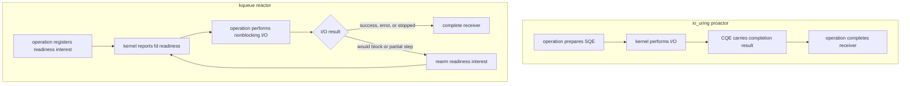

# kqueue Portability Roadmap

This document describes the planned macOS and BSD port. The first target is
Darwin/macOS. FreeBSD should then be a small follow-up because both targets can
share the same `kqueue` backend with only minor platform probes and build-system
differences.

The existing Linux implementation is built around `io_uring`, which is a
proactor-style interface: the kernel performs the requested I/O and later
returns a completion. `kqueue` is a reactor-style interface: the kernel reports
that an fd is ready, and bupp must then perform the actual `accept`, `connect`,
`read`, `write`, or `poll` step before completing the sender.

## Goals

- Preserve the public high-level sender APIs where practical.
- Keep the current three-layer model:
  - `base`: thin native API wrappers.
  - `async_io`: non-owning views, value types, and platform-native operation
    contexts.
  - `io_context`: public runtime, schedulers, batching policy, timers, TCP, and
    TLS integration.
- Make Darwin/macOS work first, then adjust FreeBSD in a small number of
  follow-up commits.
- Avoid forcing Linux-specific names into cross-platform APIs.
- Keep platform-native code isolated under platform directories.

## Non-Goals

- Do not emulate `io_uring` at the base layer.
- Do not add executors, coroutines, or sender abstractions to `base`.
- Do not require `async_io` vocabulary types to own descriptors or buffers.
- Do not describe regular-file I/O through `kqueue` as asynchronous kernel
  work. The supported fallback performs positioned I/O in `start()` and posts
  only the completion.

## Platform Shape

The platform split should evolve from the current Linux-only shape into this:

| Layer | Linux | macOS / BSD |
|-------|-------|-------------|
| `base` | `include/bupp/base/linux/`, `src/base/linux/` ✅ | `include/bupp/base/bsd/`, `src/base/bsd/` ✅ |
| `async_io` native backend | `async_io::linux_native::io_uring_context` ✅ | `async_io::bsd_native::kqueue_context` ✅ |
| high-level runtime | `include/bupp/linux/io_context.h`, `src/linux/` ✅ | `include/bupp/bsd/io_context.h`, `src/bsd/` ✅ |
| system macros | `BUPP_SYSTEM_LINUX` ✅ | `BUPP_SYSTEM_DARWIN`, `BUPP_SYSTEM_FREEBSD`, `BUPP_SYSTEM_BSD` ✅ |

The public umbrella headers should eventually select the platform runtime
through `include/bupp/config/system.h`, while platform-native headers remain
available for users that explicitly opt into a backend.

## Reactor vs. Proactor Mapping

`io_uring` reports completed work. `kqueue` reports readiness, so bupp must run
the nonblocking I/O attempt between the readiness event and the sender
completion.



The important difference is the extra nonblocking I/O step after readiness is
reported. A readiness event is not a completion by itself.

## Open Decision: Who Performs I/O?

The port can start before this decision is permanently settled as long as the
boundary is explicit. There are three viable shapes:

| Option | Description | Pros | Cons |
|--------|-------------|------|------|
| Operation-owned I/O | Each operation handles readiness and performs its own syscall in an `on_ready()` / `try_complete()` hook. | Keeps protocol-specific logic close to the receiver completion path; maps well to accept/connect/read/write differences. | More code in each operation type. |
| Context-owned I/O | `kqueue_context` interprets events and performs syscall-specific work before calling operation completion. | Centralizes native dispatch. | Pushes socket/file semantics into the context and makes the context less generic. |
| Hybrid | `kqueue_context` owns readiness registration and dispatch; operations own actual I/O attempts. | Keeps the event loop generic while isolating reactor-specific I/O logic behind a stable hook. | Requires a small operation interface beyond the current io_uring operation base. |

Recommended initial direction: use the hybrid shape. `kqueue_context` should not
know how to accept, read, write, or finish a connect. It should know how to
register interests, wait for events, wake itself, and dispatch an event to the
operation associated with `udata`. Each operation then performs the nonblocking
syscall and chooses one of:

- complete with `set_value`;
- complete with `set_error`;
- complete with `set_stopped`;
- rearm and wait again after `EAGAIN` / `EWOULDBLOCK` or a partial step.

This keeps the unresolved "who is responsible for I/O" question localized to
the operation/context interface. If the final design moves more work into the
context, only that interface should need to change.

The implemented first-stage boundary keeps readiness preparation in
`kqueue_helper` and performs simple buffer-based `read(2)` / `write(2)` calls
inside `kqueue_context`. Operations expose non-owning storage through a
by-value `buffer_view get_data()` hook; non-buffered operations return an empty
view. This preserves the buffer capacity at the syscall site without adding
allocation or ownership. Specialized socket operations can still use the
hybrid hook described above when their syscall state does not fit a single
`buffer_view`.

Descriptor, task, and filter state is built in a run-loop-local preparation
record and retained only in the fixed-capacity active-registration table owned
by `kqueue_context`; it is not stored in `kqueue_operation_base`. One native
one-shot registration is armed per descriptor/filter pair. Additional waiters
are retained in FIFO order and the next waiter is armed when the current one is
dispatched, so a later `EV_ADD` never replaces an earlier operation.

## Base Layer Work

The `base` layer should be a thin C API to C++ object mapping for `kqueue` and
`kevent`, similar in spirit to the current `liburing` wrappers.

Planned types:

| Type | Ownership | Role |
|------|-----------|------|
| `base::kqueue` | RAII owner | Owns the native kqueue fd. |
| `base::event` | value/view-like wrapper | Wraps `struct kevent` construction and field access. |
| `base::event_list_view` | non-owning view | Optional helper over caller-owned `kevent` arrays. |

Expected `kqueue` wrapper shape:

```cpp
class kqueue {
public:
    kqueue() noexcept;
    ~kqueue() noexcept;

    kqueue(const kqueue&) = delete;
    kqueue& operator=(const kqueue&) = delete;
    kqueue(kqueue&& other) noexcept;
    kqueue& operator=(kqueue&& other) noexcept;

    int open() noexcept;
    void close() noexcept;
    [[nodiscard]] bool is_open() const noexcept;
    [[nodiscard]] int native_fd() const noexcept;

    int control(const event* changelist, int nchanges,
                event* eventlist, int nevents,
                const timespec* timeout) noexcept;
};
```

Base-layer rules:

- Return non-negative values on success and negative `errno` values on failure,
  matching the rest of bupp's base-layer style instead of exposing `errno`
  directly.
- Do not own user fds, buffers, socket addresses, or event arrays.
- Do not expose sender/receiver concepts.
- Keep wrappers close to `kqueue(2)` and `kevent(2)`.
- Put Darwin/FreeBSD feature differences behind small compile-time branches
  only when needed.

Likely base tests:

- header self-containment for `base/bsd` headers;
- open/close/move behavior;
- `EVFILT_USER` wakeup round trip;
- pipe read readiness round trip;
- timeout behavior with an empty event list where supported.

## async_io Work

`async_io` already owns platform-neutral views such as `buffer_view`,
`descriptor_view`, `stream_socket_view`, and `datagram_socket_view`. Those
should remain shared. The macOS/BSD work belongs in a new native backend:

```text
include/bupp/async_io/bsd/
src/async_io/bsd/
```

Planned native objects:

| Object | Role |
|--------|------|
| `bsd_native::kqueue_context` | Owns `base::kqueue`, local queues, active registrations, event buffers, and run-loop state. |
| `bsd_native::kqueue_operation_base` | Intrusive CPU/completion operation base with terminal `execute()` behavior. |
| `bsd_native::kqueue_io_operation_base` | Passive I/O operation base with a separate MPSC link and run-loop preparation contract. |
| `bsd_native::kqueue_task_queue_state` | Externally owned shared CPU/I/O queues plus worker wake/closing state. |
| `bsd_native::*_operation` | Read, write, accept, connect, poll, timer/wakeup, and post operations. |

The context needs these responsibilities:

- own and close the kqueue descriptor;
- register and unregister readiness interests;
- store `udata` pointers to operation objects;
- wake the run loop for `post()` and `stop()`;
- dispatch readiness events to operations;
- provide `run()`, `stop()`, `is_open()`, and `is_in_context()`;
- passively consume published I/O without exposing direct registration APIs;
- convert platform errors to `std::error_code` at operation completion.

Operations need these responsibilities:

- keep user buffers, descriptors, addresses, and receivers non-owning according
  to existing lifetime rules;
- set socket descriptors to nonblocking mode before reactor-style operations;
- perform exactly one bounded native I/O attempt when readiness is reported;
- complete immediately when a syscall succeeds or fails with a terminal error;
- rearm when readiness was insufficient;
- preserve existing `async_read_some`, `async_write_some`, and write-all
  semantics.

### Passive Publication Model

The kqueue backend follows the same publication boundary as the io_uring
backend. CPU completions derive from `kqueue_operation_base`; readiness work
derives from `kqueue_io_operation_base`. Starting an I/O operation only calls
`publish_io()`. It never invokes `kevent()` and never mutates the active
registration table on the producer thread.

A standalone context uses non-atomic local CPU and I/O queues. A worker group
supplies a `kqueue_task_queue_state`, whose CPU and I/O heads are independent
MPSC stacks. The run loop drains CPU work first, atomically takes all published
I/O, restores producer order, calls each operation's `prepare(kqueue_helper&)`,
and registers the resulting filters. There is no public `prepare()`,
`submit()`, or `submit_batch()` interface and no submission mutex.

Before blocking in `kevent()`, a worker publishes its waiting state and repeats
the event/CPU/I/O checks. A producer only triggers the context's `EVFILT_USER`
wakeup after observing that waiting state. This closes the lost-wakeup window
without an active submission timer and lets concurrent publication form
natural batches.

### Socket Operations

Layer-2 kqueue request objects map readiness filters to nonblocking syscalls;
layer 3 only selects and composes those senders:

| Operation | Readiness | I/O step after event |
|-----------|-----------|----------------------|
| `async_accept` | `EVFILT_READ` on listening socket | `accept` / `accept4` where available |
| `async_connect` | `EVFILT_WRITE` on connecting socket | check `SO_ERROR` |
| `async_read_some` | `EVFILT_READ` | `recv` |
| `async_write_some` | `EVFILT_WRITE` | `send` |
| `async_poll` | requested filter(s) | report ready mask |

`EV_EOF` and filter-specific flags must be interpreted carefully. EOF on a
read side can be a clean zero-byte read, while connect failures should surface
through `SO_ERROR`.

### Descriptor I/O

`io_uring` can perform file I/O as true asynchronous kernel work. `kqueue`
cannot provide that guarantee for regular files. BSD therefore uses an
explicit blocking-at-start fallback: the layer-2 operation calls positioned
`pread()` or `pwrite()` from `start()`, stores the result, and posts itself to
the context. The receiver is invoked by `run()`, never inline from `start()`.
This supports the same sender surface while making the blocking point precise;
applications must not call `start()` for potentially slow files on a latency
sensitive thread.

### Timers And Wakeups

The high-level timer design stays shared: `io_context` owns the timer heap and
posts user operations only when expiry or cancellation is known. The BSD
native backend represents the heap root with one reusable, one-shot
`EVFILT_TIMER` registration. If the root changes, the passive timeout-update
operation re-arms that same registration. Both operations enter the owning
kqueue context through `publish_io()` and are prepared by its run loop; timer
code never calls `kevent()` directly and never submits work actively to a
worker thread.

`EVFILT_USER` remains the cross-thread wakeup mechanism for newly published
CPU/I/O work and stop requests. Timer heap ownership stays in high-level
`io_context`, not in `base` or `kqueue_context`.

## High-Level io_context Work

Although this roadmap focuses on `base` and `async_io`, the public port finishes
only when `bupp::io_context` can select the BSD backend.

Expected work:

- add `include/bupp/bsd/io_context.h` and `src/bsd/io_context.cpp`;
- introduce `bsd_io_context_options`;
- make `platform_io_context_options` select Linux or BSD options from
  `config/system.h`;
- reuse the existing scheduler factory, passive I/O queue policy, timer heap,
  TCP owner types, SSL stream integration, and CPO surface;
- keep Linux names out of cross-platform public headers.

The BSD backend keeps one passive publication path: collect ready-to-register
operations in the shared I/O queue and wake a sleeping loop when needed. The
semantic split remains at the operation level: `async_write_some` is one native
attempt, while `async_write` is the composed write-all loop.

## Build And Test Plan

### Phase 1: Documentation And Platform Detection ✅

- [x] Add the roadmap.
- [x] Extend `config/system.h` with FreeBSD and a shared BSD-family macro
  (`BUPP_SYSTEM_DARWIN`, `BUPP_SYSTEM_FREEBSD`, `BUPP_SYSTEM_BSD`).
- [x] Teach CMake to compile platform sources conditionally.

### Phase 2: BSD Base Wrappers ✅

- [x] Add `base::kqueue`, `base::event`, and `base::event_list_view` in
  `include/bupp/base/bsd/` and `src/base/bsd/`.
- [x] Add unit tests for open/close and header self-containment in
  `tests/base/bsd/`.
- [x] Keep this phase independent from senders and high-level runtime code.

### Phase 3: Native kqueue Context ✅

- [x] Add `bsd_native::kqueue_context`.
- [x] Implement passive CPU/I/O queues, waiting-aware wakeup, stop handling,
  event wait, and operation dispatch.
- [x] Add context-level tests using posted operations, `EVFILT_USER`, poll, and
  operation-owned buffer I/O.

### Phase 4: Socket Readiness Operations ✅

- [x] Implement descriptor read, write, and poll readiness operations.
- [x] Implement nonblocking accept, connect, read_some, write_some, datagram,
  and poll operations.
- [x] Queue concurrent waiters for the same descriptor/filter without replacing
  an active registration.
- [x] Add tests mirroring existing Linux socket tests where possible.
- [x] Validate EOF, cancellation, blocked-write, and `EWOULDBLOCK` rearm paths.

### Phase 5: High-Level Runtime Integration ✅

- [x] Wire `bupp::io_context` to the BSD native backend.
- [x] Reuse the public scheduler/CPO surface, TCP/TLS owners, DNS vocabulary,
  timer heap, and write-all composition.
- [x] Implement the passive kernel deadline with `EVFILT_TIMER`.
- [x] Build the existing `io_context`, TCP, SSL, mini_curl, and raw echo
  tests/examples on macOS.

### Phase 6: FreeBSD Follow-Up

- Add or adjust platform detection for FreeBSD.
- Resolve small syscall and flag differences.
- Run the same BSD backend tests on FreeBSD.
- Document any remaining Darwin/FreeBSD behavior differences.

## Main Risks

- Readiness is not completion. Every operation must handle spurious readiness,
  short I/O, and `EAGAIN` / `EWOULDBLOCK`.
- Cancellation must unregister interests without racing a readiness event that
  already carried the operation pointer.
- One fd can have multiple logical operations; the backend needs clear rules for
  one read-side and one write-side waiter, or an explicit queueing model.
- Connect completion must use `getsockopt(SO_ERROR)`.
- EOF semantics differ by filter and operation type.
- Regular-file descriptor operations cannot be treated as equivalent to
  `io_uring` file I/O.
- macOS and FreeBSD share `kqueue`, but not every flag or edge case is identical.

## Acceptance Criteria

The macOS port is considered usable when:

- the library configures and builds without `liburing`;
- `base/bsd` tests pass;
- async post, stop, timer, poll, TCP accept/connect/read/write, DNS, and TLS
  tests pass;
- `mini_curl` works for HTTP and HTTPS;
- `raw_echo` works with multiple concurrent clients;
- unsupported descriptor/file-I/O behavior is explicitly documented rather than
  silently blocking the event loop.
