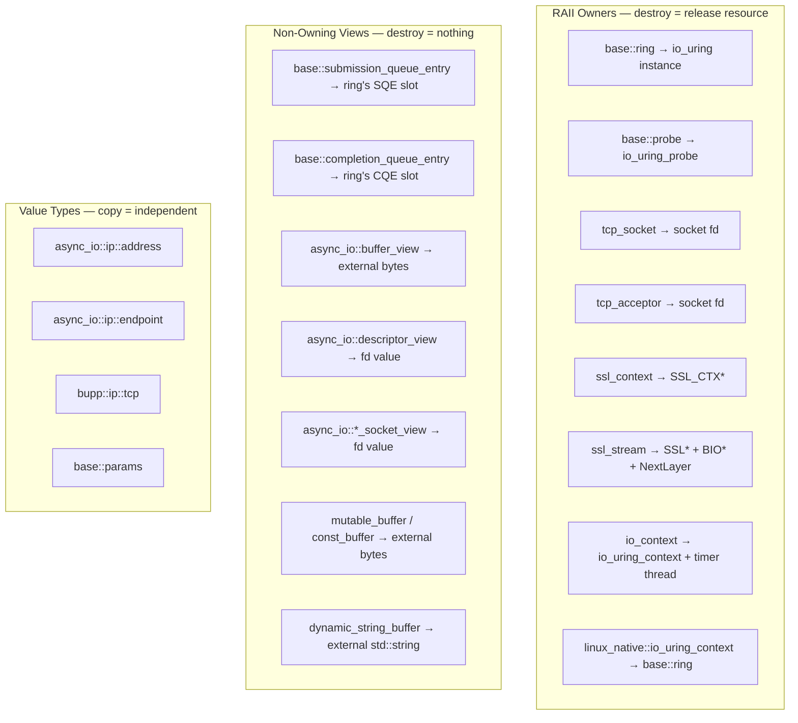
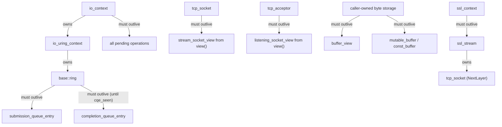

# Lifecycle & Ownership

**The most critical concept in bupp.** Every type falls into one of three
categories: RAII owner, non-owning view, or pure value type. Misunderstanding
which is which leads to use-after-free, double-close, or dangling file
descriptors.

See [`architecture.md`](architecture.md) for the overall three-layer design.

## Classification



## Lifecycle Dependency Graph

Arrows mean "must outlive":



## Rules

### Rule 1: `ring` must outlive all SQE and CQE wrappers

SQE and CQE objects contain raw pointers into the ring's internal queues. Once
the ring is destroyed, those pointers dangle.

```cpp
// WRONG — sqe dangles after ring is destroyed
bupp::base::submission_queue_entry get_sqe() {
    bupp::base::ring ring;
    ring.queue_init(8);
    return ring.get_sqe();   // points into ring; ring dies here
}

// RIGHT — ring outlives all SQE/CQE use
void ok() {
    bupp::base::ring ring;
    ring.queue_init(8);
    auto sqe = ring.get_sqe();
    // ... use sqe, submit, wait for cqe ...
}   // ring destroyed after all uses complete
```

### Rule 2: Buffers must outlive the async operation that uses them

`mutable_buffer`, `const_buffer`, and `buffer_view` hold raw pointers. The
pointed-to storage must remain valid until the I/O operation completes.

```cpp
// WRONG — stack buffer dies before operation completes
void bad(bupp::io_context& ctx, bupp::tcp_socket& sock) {
    std::string msg = "hello";
    auto sender = ctx.async_send(sock, bupp::buffer(msg), 0);
    // msg goes out of scope; the send reads freed memory
}

// RIGHT — keep buffer alive until completion
void good(bupp::io_context& ctx, bupp::tcp_socket& sock) {
    auto msg = std::make_shared<std::string>("hello");
    auto sender = ctx.async_send(sock, bupp::buffer(*msg), 0);
    // receiver captures msg via shared_ptr — alive until completion
}
```

### Rule 3: `io_context` must outlive all operations submitted on it

Operations are stored on an intrusive linked list inside `io_context`.
Destroying the context with operations still pending is undefined behavior.

```cpp
// WRONG — ctx destroyed before operation completes
void bad() {
    bupp::io_context ctx;
    bupp::tcp_socket sock;
    sock.open(bupp::ip::tcp::v4());
    auto sender = ctx.async_receive(sock, some_buffer, 0);
    // ... connect, start ...
}   // ctx destroyed; operation in pending_io list dangles
```

### Rule 4: `view()` returns a non-owning reference — do not outlive the owner

`tcp_socket::view()`, `tcp_acceptor::view()`, and similar methods return
non-owning views holding the owner's fd value. The view is valid only as long
as the owner exists.

```cpp
// RIGHT — owner → view → API
bupp::tcp_socket sock;                        // owner
sock.open(bupp::ip::tcp::v4());
ctx.async_receive(sock, buffer, 0);           // implicit view() — sock outlives op

// Also right — explicit view, same lifetime
auto view = sock.view();                      // non-owning
ctx.async_receive(view, buffer, 0);           // fine: sock still alive
```

### Rule 5: Read CQE fields before `cqe_seen()`, not after

`cqe_seen()` marks the CQE slot as consumed. The kernel may reuse that slot
immediately. Always read all needed fields first.

```cpp
bupp::base::completion_queue_entry cqe;
ring.wait_cqe(cqe);

int res = cqe.res();                // ✓ read first
uint64_t data = cqe.get_data64();   // ✓ read first
ring.cqe_seen(cqe);                 // ✓ mark seen last

// cqe.res() after cqe_seen() → undefined behavior
```

### Rule 6: `ssl_context` must outlive all `ssl_stream` objects created from it

`ssl_stream` creates an `SSL*` from the `SSL_CTX*` owned by `ssl_context`.
If the context is destroyed first, the stream's `SSL*` becomes a dangling
pointer.

```cpp
// WRONG — ssl_ctx dies, ssl_stream holds SSL* from that SSL_CTX*
bupp::ssl_stream<bupp::tcp_socket> make_stream() {
    bupp::ssl_context ctx;                     // local
    bupp::tcp_socket sock;
    sock.open(bupp::ip::tcp::v4());
    return bupp::ssl_stream(std::move(sock), ctx);
}   // ctx destroyed → SSL_CTX freed → returned stream's SSL* dangles

// RIGHT — ssl_context outlives ssl_stream
bupp::ssl_context ctx;                         // outer scope
bupp::tcp_socket sock;
sock.open(bupp::ip::tcp::v4());
bupp::ssl_stream stream(std::move(sock), ctx); // ctx outlives stream
```

## Operation Lifecycle

Operations use **intrusive linked lists** for queuing. This imposes hard
constraints:

- **Non-copyable, non-movable** — `operation_base` and all derived types
  disable copy and move. Moving would break the intrusive list pointers.
- **Heap-allocated and managed by the sender/receiver machinery** — users
  normally do not allocate or free operations directly.
- **Owned by `io_context` after `start()`** — the run loop drains and destroys
  completed operations.

```cpp
auto sender = ctx.async_receive(socket, buffer, 0);
auto op = std::move(sender).connect(my_receiver);
op.start();
// op is now owned by ctx; it will be destroyed after completion
```

### `operation_base` Inheritance Chain

```
async_io::linux_native::io_uring_operation_base   (intrusive node, result/flags)
    └── io_context::operation_base                (queued-I/O list link, prepare hooks)
        ├── detail::native_io_operation<Model,R>  (receive/send/accept/connect/wait)
        └── detail::ssl_completion_base           (SSL state machine base)
            └── detail::ssl_async_operation_base<D,NL,R>  (SSL handshake/recv/send/shutdown)
```

Both base classes disable copy and move because they are intrusive list nodes.

## Move-Only Types

The following types are **move-only** (copy deleted) because they own unique
resources:

| Type | Resource Owned |
|------|---------------|
| `base::ring` | `io_uring` instance |
| `base::probe` | `io_uring_probe` |
| `tcp_socket` | socket file descriptor |
| `tcp_acceptor` | socket file descriptor |
| `ssl_context` | `SSL_CTX*` |
| `ssl_stream<NextLayer>` | `SSL*` + `BIO*` + `NextLayer` |
| `io_context` | `io_uring_context` + timer thread |
| `io_uring_context` | `base::ring` |

```cpp
// These are all compile errors:
//   ring r2 = r1;
//   tcp_socket s2 = s1;
//   ssl_context c2 = c1;

// Move is allowed:
bupp::tcp_socket a;
a.open(bupp::ip::tcp::v4());
bupp::tcp_socket b = std::move(a);  // ok; a is now closed
```

## Quick Checklist

Before writing bupp code, verify:

- [ ] `ring` / `io_context` outlives all submitted operations.
- [ ] Every buffer outlives the I/O operation that uses it.
- [ ] All CQE fields are read **before** `cqe_seen()`.
- [ ] All SQE fields are set **before** `ring::submit()`.
- [ ] `ssl_context` outlives all `ssl_stream` objects created from it.
- [ ] Views from `view()` do not outlive their owner.
- [ ] Move-only types are moved, not copied.
