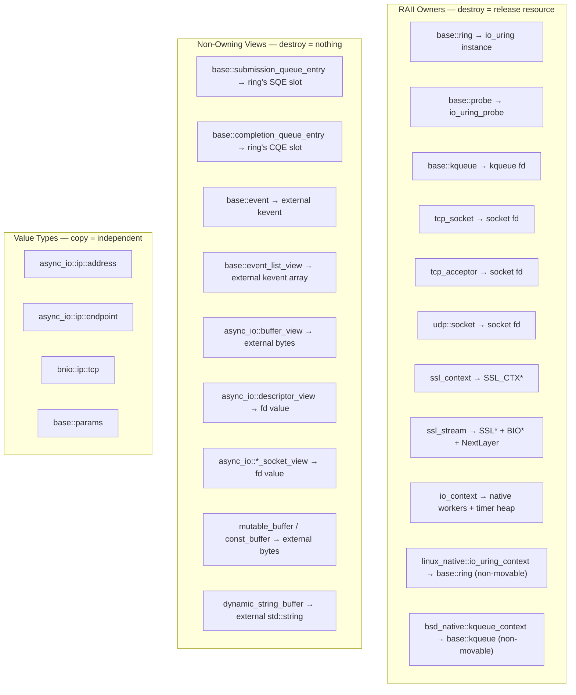
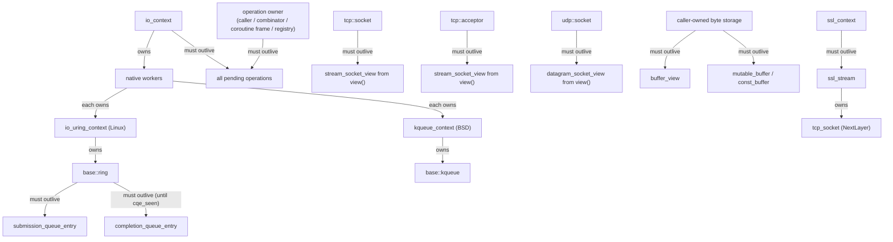
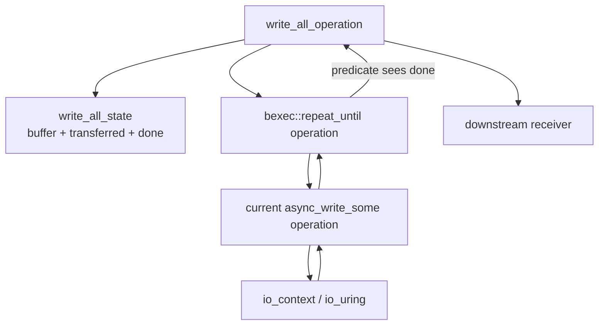

# Lifecycle & Ownership

**The most critical concept in bnio.** Every type falls into one of three
categories: RAII owner, non-owning view, or pure value type. Misunderstanding
which is which leads to use-after-free, double-close, or dangling file
descriptors.

See [`architecture.md`](architecture.md) for the overall three-layer design.

## Classification



## Lifecycle Dependency Graph

Arrows mean "must outlive":



## Rules

### Rule 1: `ring` must outlive all SQE and CQE wrappers

SQE and CQE objects contain raw pointers into the ring's internal queues. Once
the ring is destroyed, those pointers dangle.

```cpp
// WRONG — sqe dangles after ring is destroyed
bnio::base::submission_queue_entry get_sqe() {
    bnio::base::ring ring;
    ring.queue_init(8);
    return ring.get_sqe();   // points into ring; ring dies here
}

// RIGHT — ring outlives all SQE/CQE use
void ok() {
    bnio::base::ring ring;
    ring.queue_init(8);
    auto sqe = ring.get_sqe();
    // ... use sqe, submit, wait for cqe ...
}   // ring destroyed after all uses complete
```

### Rule 2: Buffers must outlive the async operation that uses them

`mutable_buffer`, `const_buffer`, and `buffer_view` hold raw pointers. The
pointed-to storage must remain valid until the I/O operation completes.
For `async_write()`, completion means the composed write-all operation has
finished every internal `async_write_some()` attempt. The buffer must therefore
outlive the full composed operation, not just the first native submission.

```cpp
// WRONG — stack buffer dies before operation completes
void bad(bnio::io_context& ctx, bnio::tcp_socket& sock) {
    auto scheduler = ctx.get_post_scheduler();
    std::string msg = "hello";
    auto sender = sock.async_write(scheduler, bnio::buffer(msg), 0);
    // msg goes out of scope; the write reads freed memory
}

// RIGHT — keep buffer alive until completion
void good(bnio::io_context& ctx, bnio::tcp_socket& sock) {
    auto scheduler = ctx.get_post_scheduler();
    auto msg = std::make_shared<std::string>("hello");
    auto sender = sock.async_write(scheduler, bnio::buffer(*msg), 0);
    // receiver captures msg via shared_ptr — alive until completion
}
```

### Rule 3: `io_context` and operation storage must both remain alive

Operations are borrowed by `io_context`: it stores operation addresses in
intrusive queues and in io_uring `user_data`, then calls `execute()` when work is
ready to complete. It does not own, move, or destroy operations. The operation's
external owner must keep the operation object alive until a terminal completion
has run, and `io_context` must also outlive all operations submitted on it.

```cpp
// WRONG — ctx destroyed before operation completes
void bad() {
    bnio::io_context ctx;
    auto scheduler = ctx.get_post_scheduler();
    bnio::tcp_socket sock;
    sock.open(bnio::ip::tcp::v4());
    auto sender = sock.async_read(scheduler, some_buffer, 0);
    // ... connect, start ...
}   // ctx destroyed; operation in pending_io list dangles
```

### Rule 4: `view()` returns a non-owning reference — do not outlive the owner

`tcp_socket::view()`, `tcp_acceptor::view()`, and similar methods return
non-owning views holding the owner's fd value. The view is valid only as long
as the owner exists.

```cpp
// RIGHT — high-level stream API keeps the owner explicit
bnio::tcp_socket sock;                        // owner
sock.open(bnio::ip::tcp::v4());
sock.async_read(scheduler, buffer, 0);     // sock outlives op

// Also right — explicit low-level view, same lifetime
auto view = sock.view();                      // non-owning
scheduler.async_read(view, buffer, 0);     // fine: sock still alive
```

### Rule 5: Read CQE fields before `cqe_seen()`, not after

`cqe_seen()` marks the CQE slot as consumed. The kernel may reuse that slot
immediately. Always read all needed fields first.

```cpp
bnio::base::completion_queue_entry cqe;
ring.wait_cqe(cqe);

int res = cqe.res();                // ✓ read first
uint64_t data = cqe.get_data64();   // ✓ read first
ring.cqe_seen(cqe);                 // ✓ mark seen last

// cqe.res() after cqe_seen() → undefined behavior
```

### Rule 6: `ssl_context` must outlive all `ssl_stream` objects created from it

`ssl_stream` creates an `SSL*` from the `SSL_CTX*` owned by `ssl_context`.
If the context is destroyed first, the stream's `SSL*` becomes a dangling
pointer.

```cpp
// WRONG — ssl_ctx dies, ssl_stream holds SSL* from that SSL_CTX*
bnio::ssl_stream<bnio::tcp_socket> make_stream() {
    bnio::ssl_context ctx;                     // local
    bnio::tcp_socket sock;
    sock.open(bnio::ip::tcp::v4());
    return bnio::ssl_stream(std::move(sock), ctx);
}   // ctx destroyed → SSL_CTX freed → returned stream's SSL* dangles

// RIGHT — ssl_context outlives ssl_stream
bnio::ssl_context ctx;                         // outer scope
bnio::tcp_socket sock;
sock.open(bnio::ip::tcp::v4());
bnio::ssl_stream stream(std::move(sock), ctx); // ctx outlives stream
```

## Operation Lifecycle

Operations use **intrusive linked lists** and native completion identifiers
(io_uring `user_data` on Linux, kqueue `udata` on BSD) for queuing. This
imposes hard constraints:

- **Non-copyable, non-movable** — `operation_base` and all derived types
  disable copy and move. Moving would break the intrusive list pointers.
- **Externally owned** — operation storage is supplied by the caller or by a
  higher-level lifetime container such as a sender adaptor, operation registry,
  coroutine frame, session object, or heap allocation.
- **Borrowed by `io_context` after `start()`** — the run loop observes the
  operation pointer, fills result fields, and calls `execute()`. Completion does
  not destroy the operation object.

```cpp
auto sender = socket.async_read(scheduler, buffer, 0);
auto op = std::move(sender).connect(my_receiver);
op.start();
// op must remain alive until the receiver gets set_value/set_stopped.
```

Composite senders such as write-all operations own additional nested state:

- A durable state object tracks the original buffer, the bytes transferred,
  and the done flag (random-access state additionally tracks the current
  offset; streaming state relies on the kernel file position).
- A `repeat_until` operation owns the loop machinery and predicate.
- Each loop iteration constructs one child `async_write_some*` operation for the
  current buffer slice.

The parent operation must outlive all of these nested objects. This is why the
write-all operation stores the state beside the `repeat_until` operation rather
than on the stack inside `start()`.



### `operation_base` Inheritance Chain

```
detail::native_operation_base                (intrusive node: next, result, flags, execute())
    = async_io::linux_native::io_uring_operation_base   (Linux)
    = async_io::bsd_native::kqueue_operation_base       (BSD)
    ├── detail::native_io_operation_base        (io_context::operation_base;
    │                                             inflight I/O list links + prepare/perform hooks)
    │     ├── detail::native_io_operation<Request,Receiver>  (read/write/accept/connect)
    │     └── detail::native_poll_operation<Receiver>        (descriptor polling)
    ├── detail::timer_operation_base            (timer completion posting)
    ├── detail::resolve_operation<Receiver>     (DNS resolution; submitted to the CPU queue)
    └── io_context::operation                   (CPU-queue work, e.g. posted schedulers)

Composite operations are not necessarily derived from `operation_base`
themselves. For example, the write-all sender owns a
`repeat_until` operation, and each repeat iteration owns a child
`native_io_operation` that is submitted to the native backend. SSL
read/write uses the same shape: it owns SSL state plus a
`repeat_until` loop whose children are transport read/write operations.
```

Both the Linux and BSD base classes disable copy and move because they are
intrusive list nodes. The `native_*` aliases in
`detail/posix/io_context/native_context.h` select the matching backend at build time,
so the shared `io_context` layer is written against a single platform-neutral
vocabulary.

## Move-Only and Non-Movable Types

The following types are **move-only** (copy deleted, move allowed) because they
own unique resources:

| Type | Resource Owned |
|------|---------------|
| `base::ring` | `io_uring` instance |
| `base::probe` | `io_uring_probe` |
| `base::kqueue` | kqueue fd |
| `tcp_socket` | socket file descriptor |
| `tcp_acceptor` | socket file descriptor |
| `ssl_context` | `SSL_CTX*` |
| `ssl_stream<NextLayer>` | `SSL*` + `BIO*` + `NextLayer` |

The following types are **non-movable** (both copy and move deleted) because
they own non-transferable runtime state:

| Type | Reason |
|------|--------|
| `io_context` | Owns native workers, timer heap, and mutexes. |
| `linux_native::io_uring_context` | Owns one ring, normalized options, and single-owner run-loop state. |
| `bsd_native::kqueue_context` | Owns one kqueue fd, normalized options, and single-owner run-loop state. |

```cpp
// These are all compile errors:
//   ring r2 = r1;           // copy deleted
//   tcp_socket s2 = s1;     // copy deleted
//   io_context c2 = c1;     // copy deleted
//   io_context c2 = std::move(c1);  // move deleted

// Move is allowed for move-only types:
bnio::tcp_socket a;
a.open(bnio::ip::tcp::v4());
bnio::tcp_socket b = std::move(a);  // ok; a is now closed
```

## Quick Checklist

Before writing bnio code, verify:

- [ ] `ring` / `io_context` outlives all submitted operations.
- [ ] Operation storage outlives each operation's terminal completion.
- [ ] Every buffer outlives the I/O operation that uses it.
- [ ] All CQE fields are read **before** `cqe_seen()`.
- [ ] All SQE fields are set **before** `ring::submit()`.
- [ ] `ssl_context` outlives all `ssl_stream` objects created from it.
- [ ] Views from `view()` do not outlive their owner.
- [ ] Move-only types are moved, not copied.

## Concurrent Shutdown: Submit-Path Locking

Concurrent shutdown — an external thread submitting while another thread
stops or destroys the context — is handled by one lock shared by the
submission and the shutdown paths.

### The submit lock

`global_state_.submit_lock` (a `std::mutex`) serializes the state-involving
parts of every submission with the shutdown / destruction state
transitions:

- `publish_cpu()` and `publish_io()` (their shared-queue path, taken whenever
  the caller is not a worker of this context) run
  **lock → check the shutdown state → enqueue → wake** inside the critical
  section. The critical section contains only state-involving work; the
  caller executes the operation afterwards.
- `begin_stop()` publishes the stopping state under the same lock;
  `~io_context()` publishes the terminal state and closes the wake channel
  under the same lock.
- Every wake-channel write — publish paths, timer paths, native
  `notify_one_waiter()` — is bound to the submit lock, so a close can never
  race a write.

`publish_cpu` / `publish_io` **assume the publish happens against a running
(non-stopped) context**; the in-lock check makes that assumption explicit
and atomic with the enqueue. When the context is already stopping they do
not enqueue (the queue may no longer be drained) and return `false`; the
caller then completes the operation inline, and the final channel of that
inline completion is decided by the operation's observation-point
arbitration (see "Stop-channel arbitration" below): a cancelled receiver
stop token delivers `set_stopped`, while a publish rejected by context stop
with no token race delivers `set_value(operation_canceled)`. This
closes both previously-documented shutdown races:

Only the shared-queue path can return `false`. A caller that is itself a
worker of this context publishes to its own local queue without the lock and
without the shutdown check, and always reports success: the publisher is the
thread that drains that queue, and native `finish()` keeps consuming and
aborting I/O until both queues stay empty, so such an operation is still
delivered — through the stop channel as `set_value(operation_canceled)`
when no stop token races, not stranded — even while the context is
stopping.

- an operation submitted after the last worker's final drain completes
  inline instead of stranding in a queue no worker ever drains again;
- an in-flight submission cannot touch the shared queue or the wake channel
  after the destructor begins tearing the context down.

`stop()` and `join()` share a single stopping thread, elected by the
`stop_requested_` CAS; that thread flips `life_state` under the submit
lock. The context remains single-shot: `run()` refuses to re-enter once
`life_state` is non-zero.

### Timer abort ordering

`begin_stop()` calls `abort_pending_timer_waits()` **before** publishing
`life_state = 1` under `submit_lock`.  This guarantees that when any worker
observes the stopping state and enters its final `finish()` drain, the
aborted timer operations are already staged on `timers_.ready`.  Without
this ordering a worker that is actively spinning (not sleeping in a syscall)
could observe `life_state == 1`, drain the still-empty `timers_.ready` in
`finish()`, and exit before the abort moves the operations — permanently
stranding them with no worker left to drain.

### Abnormal close delivers every completion

`queue_exit()` no longer discards pending work on either platform. It marks
the context finishing and runs the same abort-and-deliver path as
`finish()`: inflight and shared-queued I/O is aborted with `-ECANCELED`,
completed via the stop channel, and executed synchronously on the calling
thread before the native backend closes; with no stop token racing, each
completion is then delivered as `set_value(operation_canceled)`. On Linux
this is `io_uring_context`'s existing abort-and-deliver sequence; on BSD
`kqueue_context::queue_exit()` (`src/async_io/bsd/kqueue_context.cpp`) now
mirrors it — guarded by a not-already-finished precondition, it marks
finishing, aborts inflight I/O, drains local CPU tasks, and consumes I/O
tasks (re-aborting after each batch) until both queues stay empty. Within
the `queue_exit()` / `finish()` scope, therefore, a forced or abnormal
close reaches a terminal receiver call for every operation that was
published to the context — nothing is silently dropped, even when `run()`
never drained the queues. The same delivery guarantee covers fatal
run-loop errors, which route through the `finish_drain` phase (drain →
abort → deliver) instead of exiting the loop directly.

Two boundaries keep that statement scoped. First, it covers the teardown
paths above, not `~io_context()` itself: the destructor publishes the
terminal state and closes the wake channel without delivering any pending
completion — outstanding operations are dropped, which is the caller's
responsibility under Rule 3 (`io_context` and operation storage must both
remain alive until terminal completion). Second, the normal `stop()` path
has its own delivery guarantee, described next.

### stop() drains the shared queues

`stop()` (and `join()`, which shares the stop path) never abandons work
that was published before the stopping state was elected. After
`stop_internal()` waits for `running_workers` to reach zero, the stopping
thread performs one drain-and-deliver pass over the state no worker owns:

- the shared CPU queue (`pop_cpu_all()`), executing each operation inline
  — the delivery arbitration (stop token, then `is_stopped()`) reports
  `set_value(operation_canceled)` for queued work that never ran;
- the shared I/O queue (`pop_io_all()`), marking each operation stopped
  (`result = -ECANCELED`, `complete_submit_stopped()`) and executing it
  inline — no SQE or kevent is prepared or submitted during this drain;
- `timers_.ready`, where `abort_pending_timer_waits()` staged the aborted
  timer waits; with no worker left, the stopping thread delivers them
  inline as `set_value(operation_canceled)`.

The normal multi-worker stop is unaffected: the last worker's `finish()`
already drained everything, so this pass finds the queues empty and
returns immediately.

#### Why the stopping thread delivers inline

Once `running_workers` reaches zero the shared queues are ownerless:
their only consumers are workers (during the run loop and in `finish()`),
and a late `run()` increments `running_workers` before checking
`can_start_run()`, so it exits with `operation_canceled` without ever
touching a queue. Delivering from the stopping thread is therefore the
only available agent, and it mirrors the standing convention for
abnormal teardown (`queue_exit()` already runs receiver callbacks
synchronously on the calling thread). Reusing each operation's own
`execute()` keeps the arbitration single-pointed — the same token →
stop-channel logic that workers run decides the completion here, and the
I/O operations are only *marked* stopped (`result = -ECANCELED`,
`complete_submit_stopped()`) before `execute()`, so no SQE or kevent is
ever prepared during the drain.

Staging completions back into a queue is not an option: a queued
completion has a consumer only if a worker exists, which is exactly the
case the drain covers.

#### Concurrency argument

The drain never runs inside `submit_lock`. This is deliberate: receiver
callbacks may re-enter context state — `wake_one_if_all_workers_sleeping()`
takes `submit_lock`, `queue_timer_completion()` takes `timers_.mutex` —
and holding the lock across `execute()` would self-deadlock. Lock-free
operation is safe because exclusive access is already established:

1. **Publish vs. drain.** `begin_stop()` stores `life_state = 1` inside
   `submit_lock`, and the shared publish path checks the state and
   enqueues inside the same lock, atomically. Any publish whose critical
   section precedes the store has its operation enqueued and visible
   (mutex ordering provides the happens-before edge); any publish after
   the store is rejected and completes inline at its caller. The mutex
   rules out the "in the lock but not yet enqueued" interleaving — the
   drain and the store cannot overlap a publisher's critical section.
2. **No competing consumer.** The drain runs only after the
   `running_workers` spin, and the pre-increment in `run()` plus the
   in-lock state check mean a worker either fully participates (drains
   in `finish()` before releasing its slot) or never touches the queues.
3. **Stability.** With no producer and no competing consumer, one full
   pass over the three sources empties them; the loop-until-a-pass-is-
   empty shape is retained as a conservative guard, not because an
   unstable state is reachable.

`timers_.ready` is the one source with its own lock (`timers_.mutex`):
the drain holds it only for the pointer swap, then executes the taken
list, so a receiver callback that queries timer state cannot deadlock.

#### Why the destructor does not drain

`~io_context()` publishes the terminal state and closes the wake channel
without delivering completions. That remains a Rule 3 obligation: the
caller must keep the context and operation storage alive until terminal
completion, and `stop()` is the API that guarantees it.

### Stop-channel arbitration

The unified stop contract decouples the internal stopped marker from the
final receiver signal. `complete_submit_stopped()` — the pure virtual every
abort path calls
(`include/bnio/async_io/linux/io_uring_context_base/operation_base.h:240`,
`include/bnio/async_io/bsd/kqueue_context_base/operation_base.h:266`) —
only tags the completion as stopped; the abort machinery itself
(`abort_inflight_io()`, `drain_io_list_complete_stopped()`, publish
rejection) is unchanged. Arbitration lives at a single point, each
operation's `execute()`: the `stopped` branch queries the receiver's stop
token — a cancelled token wins and delivers `set_stopped()`, otherwise the
abort delivers `set_value(operation_canceled)` with the operation's payload
(e.g. zero bytes transferred). The `value` / `value_with_ec` branches never
query the token: real results and kernel `ECANCELED` are delivered
untouched. See the io_uring I/O operation
(`include/bnio/detail/linux/io_context_native_io/common.h:204`) and its
kqueue mirrors (`include/bnio/detail/bsd/io_context_native_io/common.h:131`
and `:288`). `start()` applies the same rule proactively: its token
pre-check no longer produces `value(operation_canceled)` directly but tags
the completion stopped and routes through the same arbitration
(`include/bnio/detail/linux/io_context_native_io/common.h:157`).

`schedule_sender::complete()` arbitrates in the order token →
`context_->is_stopped()` → `value({})`
(`include/bnio/detail/posix/io_context/class.h:176`), which makes both
"queued CPU work that never ran delivers `value(operation_canceled)`" and
"the token wins the race" hold at the single delivery point.
`resolve_operation::execute()` is three-way: token cancelled →
`set_stopped()`; context stopped → `set_value(operation_canceled, 0)` with
DNS skipped (queued work that never executed); otherwise run the resolver
and deliver the real result
(`include/bnio/detail/bsd/io_context_native_io/common.h:359`, Linux mirror
`include/bnio/detail/linux/io_context_native_io/common.h:303`). The
async_io-layer resolve senders arbitrate the token only and never observe
io_context stop (`include/bnio/async_io/bsd/kqueue_operations/resolve.h:89`,
Linux mirror `include/bnio/async_io/linux/io_uring_operations/resolve.h`),
matching the post-operation layering difference documented below.

Two teardown rules complete the picture. Both native consume loops gate on
`stop_requested() || closing_requested()` up front:
`io_uring_context::consume_io_tasks()`
(`src/async_io/linux/io_uring_context_io_tasks.cpp:59`) and
`kqueue_context::consume_io_tasks()`
(`src/async_io/bsd/kqueue_context_io_tasks.cpp:36`) route every I/O
operation consumed in that state straight through the stop channel
(`drain_io_list_complete_stopped()`) instead of preparing it. On io_uring
a submit failure on a dying ring (e.g. `EBADFD`) must not surface as a
generic error where the contract requires the cancellation channel; on
kqueue an `EV_ADD` during teardown would arm a new event filter and let
an operation published while `finish()` drains its queues run for real —
both platforms now refuse new I/O past the stop observation, which also
implements the not-yet-executed queued-work rule of `io_context::stop()`
uniformly. `kqueue_context::queue_exit()` keeps its alignment with the
io_uring abort-and-deliver pattern (see "Abnormal close delivers every
completion"): the guard drains the queues through the stop channel on the
first pass, and the surrounding `while (consume_io_tasks())` loop still
guarantees every operation published from an abort completion reaches a
terminal receiver call. Timer aborts do not arbitrate at all:
`abort_pending_timer_waits()` stages `timer_completion_kind::canceled` on
the stopping thread, the kind is fixed at staging time, and `execute()`
maps it directly to `set_value(operation_canceled)`
(`include/bnio/detail/posix/io_context/class.h:800`,
`include/bnio/detail/posix/io_context/timer_wait.h:40`; see
[`timer.md`](timer.md)).

One deliberate layering difference remains: the async_io-layer post
operations (`kqueue_post_operation` / `io_uring_post_operation`) keep
delivering `set_value({})` when a posted task is never executed because
the context stopped — the async_io layer does not observe io_context
lifecycle state, so a queued-but-unexecuted post is not reported as
`operation_canceled`.

### Why both consume loops refuse new I/O past the stop observation

Both native `consume_io_tasks()` implementations open with the same
guard (`stop_requested() || closing_requested()`) and route everything
they pop from the worker-local and shared I/O queues through
`drain_io_list_complete_stopped()` — marked stopped and pushed to the
CPU queue, never prepared.  Three properties justify making the two
platforms symmetric here instead of leaving kqueue on its historical
"register anyway, abort later" path:

1. **Liveness.**  `finish()` Phase 1 and Phase 3b break only when
   `run_cpu_batch()` *and* `consume_io_tasks()` both report no work.  A
   receiver that unconditionally republishes an immediately-ready I/O
   operation (a poll on a permanently readable descriptor, a self-pipe
   read) after every completion feeds the loop forever if the consume
   pass really registers the operation: `EV_ADD` succeeds against the
   still-open kqueue fd, the level-triggered filter fires at once, the
   completion runs the receiver, and the receiver republishes —
   `finish()` never returns and `stop()` spins in `stop_internal()`
   waiting for `running_workers` to drop.  With the guard, the same
   republish is consumed and cancelled instead: the receiver observes
   the stop channel (`set_value(operation_canceled)` for a token-less
   receiver, `set_stopped()` for a cancelled one), the chain ends, and
   the next pass finds both sources empty.  The convergence argument is
   the same one Phase 3b already makes for its nested-publish window —
   the guard changes the *delivery channel* of republished work, not
   the loop's drain-until-empty shape.

2. **One queued-work rule.**  `io_context::stop()` guarantees that work
   published before the stopping state was elected completes, and work
   that never ran reports `operation_canceled`.  With kqueue registering
   during teardown, which side of that rule an operation landed on
   depended on a scheduling race between the worker's consume pass and
   the stop publication; both platforms now decide by state alone.

3. **One error surface.**  A submit or registration failure during
   teardown (`EBADFD` on a dying ring, `EIO` from `EV_RECEIPT`) would
   report a generic errno where the contract requires the cancellation
   channel.  Refusing to prepare anything past the stop observation
   removes the failure mode instead of mapping its errors.

**State coverage.**  `stop_requested()` reads the native context's own
state and holds for `finishing` (set by the native `stop()`, and by
`queue_exit()` before its delivery pass) and `finished`.
`closing_requested()` reads the shared `life_state` and holds from the
moment `io_context::stop()` wins its election (`begin_stop()` publishes
`life_state = 1` under `submit_lock`) and once `~io_context()` begins.
Normal `io_context::stop()` therefore trips the guard through
`closing_requested()` even while the native context still reports
`running`; a native-only stop (no shared state, standalone context)
trips it through `stop_requested()`.

**Interaction with `queue_exit()`.**  `queue_exit()` stores
`finishing`, runs `abort_inflight_io()`, drains the CPU queue, and then
loops `while (consume_io_tasks()) { abort_inflight_io();
drain_local_cpu_tasks(); }` to close the nested-publish window: a
receiver completed by an abort may publish follow-up I/O, and that
follow-up must itself reach a terminal call.  The guard slots into this
loop without changing its guarantee: the first consume pass pops
everything queued and delivers it stopped, `drain_local_cpu_tasks()`
runs those completions, and any follow-up published from them is
consumed by the next pass — the loop exits only when a full pass finds
nothing, exactly as before.  What changes is the channel: follow-up
work that previously would have been registered against the closing
kqueue (and could itself complete with a real result, or die on an
`EV_RECEIPT` error) is now uniformly cancelled.  Every published
operation still reaches exactly one terminal receiver call, so the
no-lost-work contract documented in "Abnormal close delivers every
completion" holds; the
`finish_no_new_io_after_stop` regression
(`tests/integration/io_context/lifecycle/`) pins both the liveness
bound and the per-operation terminal-call accounting.

**Boundary — eager completion is best-effort.**  The guard governs the
I/O queues — operations are aborted *before* any syscall or registration
is attempted for them.  An operation whose request completes immediately
inside `start()` (a non-blocking read that finds data, eager mode) is a
CPU-queue citizen by construction and never passes through
`consume_io_tasks()`; like io_uring in the same configuration, bnio does
not intercept that path during teardown.  This is deliberate: the eager
probe is a plain syscall that never reaches the submission path, so it
neither registers kernel state that teardown would have to unwind nor
touches descriptor lifetime — resource release stays exactly where it
was without the probe.  Teardown is therefore **best-effort** for this
class of work: whatever the probe already did is real and is delivered
as-is, and no attempt is made to un-do it.  Checking whether a stop has
been requested — and keeping every object the operation touches alive —
remains the receiver's own responsibility.  A receiver that keeps
restarting eager-completing work past a stop-channel completion violates
the stop contract on both platforms alike; the poll-based regression
above deliberately avoids that path so the guard's contract stays the
pinned one.

### A failed native enter is reported through run()'s result

`io_context::run_native_loop()` can lose its native run loop before any
worker starts: `io_uring_context::enter_run()` fails when the ring
cannot be enabled or a wake poll cannot be armed. The failure precedes
every concurrency hazard — running_workers was already incremented but
no other thread can touch the fresh native context — so the context
simply records the negative errno in `enter_run_error_` (a plain int
owned by the run()-caller thread, reset by `queue_init()`) and
`run_native_loop()` reads it back after `ctx.run()` returns, surfacing
`std::error_code(-errno, std::generic_category())` as `run()`'s result.
A zero converts to the empty error_code a normal run returns.

The drain obligation is unchanged: `fail_enter_run()` still rolls the
run through `finish()` so everything already published reaches a
terminal receiver call before `run()` returns; the fix only closes the
reporting gap that made a never-started worker look like a successful
run (and left publish after the failed enter accepted work no one would
drain — the one exception to the stop/publish closed-loop argument).
The kqueue backend has no reachable enter failure past
`run_native_loop()`'s `is_open()` pre-check, so its
`enter_run_error()` is a documented constant zero that gives both
backends the same `run()` error surface
(`src/posix/io_context.cpp`, `include/bnio/detail/posix/io_context/native_context.h`).

### Native context single-owner guarantee

`io_uring_context` and `kqueue_context` are **single-owner, non-reentrant**
by design.  Each call to `io_context::run()` creates a fresh native context
instance; no two threads ever share the same native context in production
use.  Concurrent calls to `run()` on the same native context object are
**undefined behavior**.  The `run_state_.run_active` CAS in `enter_run()` exists to
make races easier to detect under debug assertions, not to make concurrent
calls correct.  Callers that bypass `io_context` and use the native
contexts directly must ensure at most one thread calls `run()` at a time.
Calling `run()` again after the single run loop has reached finished is
likewise not supported; a caller that races a completed run loop past its
lifetime is outside the contract.

### Performance overhead

Measured on macOS (Apple Silicon, 18 logical cores, kqueue) with the
internal schedule-throughput harness (report in `.artifacts/lock-bench/`):
1M empty `schedule()` tasks per run, 5 runs per cell, 1–128 concurrent
submitters, 1–2 workers, pre-allocated operation pools (no hot-path
allocation). Regression vs. the lock-free baseline (negative = faster):

| scheme | 1–8 submitters | 18 | 36–128 |
|--------|---------------:|---:|-------:|
| `std::mutex` (merged) | −1.2% | −1.0% | −2.2% |
| spin lock (rejected) | −63.5% | −14.7% | −6.3% |
| `std::shared_mutex` (rejected) | +42.0% | +60.5% | +97.5% |

`std::mutex` is throughput-neutral (≈ −6% … +5% per cell) and stable at
every concurrency level: serializing the tiny critical section removes the
cross-thread CAS contention on the shared queue head that the lock-free
path suffers from. The spin lock is dramatically faster at low contention
(1.5–2.5×) but unstable under oversubscription — a preempted holder stalls
every waiter, and the two measurement matrices disagreed by 20–40 points.
The rw lock collapses above ~18 submitters (its shared-mode reader count is
a single contended cacheline). The `std::mutex` scheme is the merged one.
