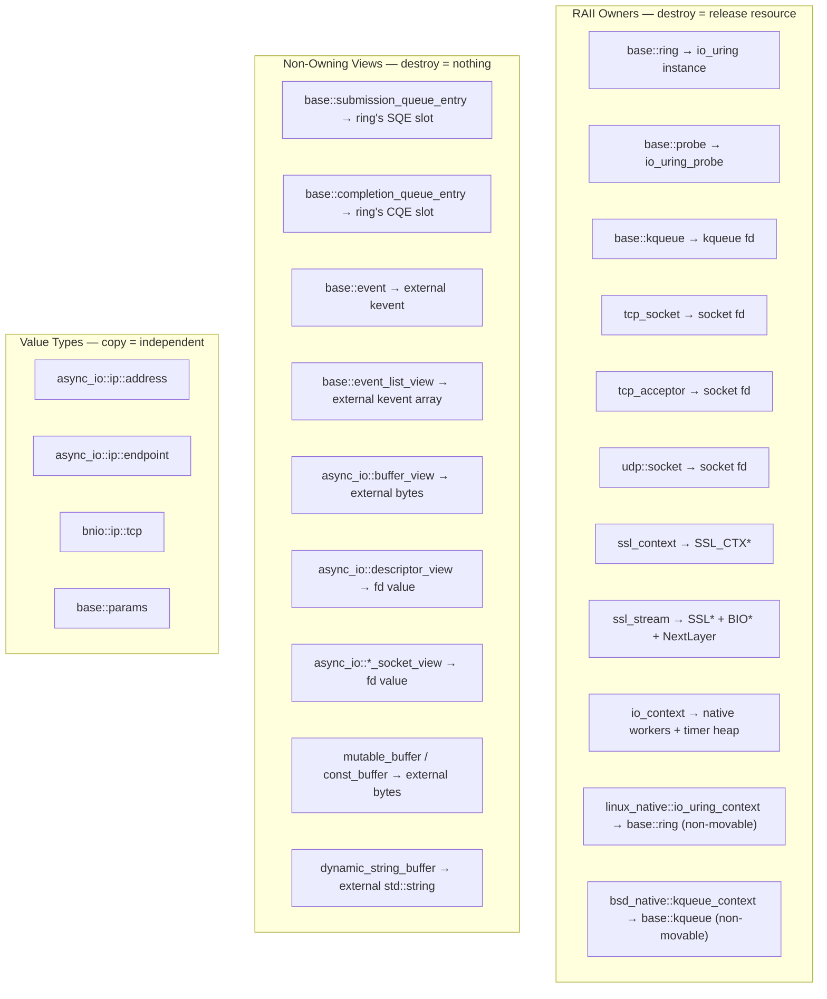
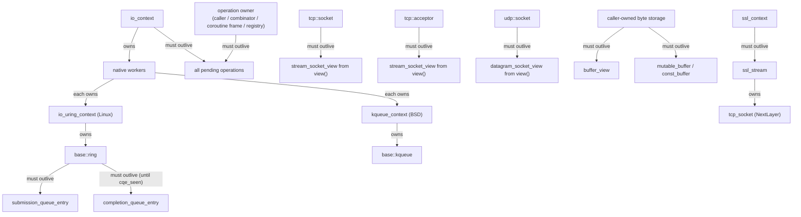
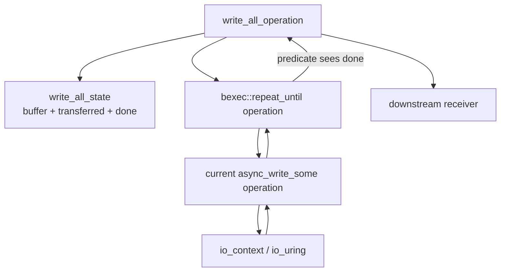

# Lifecycle & Ownership

**The most critical concept in bnio.** Every type falls into one of three
categories: RAII owner, non-owning view, or pure value type. Misunderstanding
which is which leads to use-after-free, double-close, or dangling file
descriptors.

See [`architecture.md`](architecture.md) for the overall three-layer design.

## Classification



## Lifecycle Dependency Graph

Arrows mean "must outlive":



## Rules

### Rule 1: `ring` must outlive all SQE and CQE wrappers

SQE and CQE objects contain raw pointers into the ring's internal queues. Once
the ring is destroyed, those pointers dangle.

```cpp
// WRONG — sqe dangles after ring is destroyed
bnio::base::submission_queue_entry get_sqe() {
    bnio::base::ring ring;
    ring.queue_init(8);
    return ring.get_sqe();   // points into ring; ring dies here
}

// RIGHT — ring outlives all SQE/CQE use
void ok() {
    bnio::base::ring ring;
    ring.queue_init(8);
    auto sqe = ring.get_sqe();
    // ... use sqe, submit, wait for cqe ...
}   // ring destroyed after all uses complete
```

### Rule 2: Buffers must outlive the async operation that uses them

`mutable_buffer`, `const_buffer`, and `buffer_view` hold raw pointers. The
pointed-to storage must remain valid until the I/O operation completes.
For `async_write()`, completion means the composed write-all operation has
finished every internal `async_write_some()` attempt. The buffer must therefore
outlive the full composed operation, not just the first native submission.

```cpp
// WRONG — stack buffer dies before operation completes
void bad(bnio::io_context& ctx, bnio::tcp_socket& sock) {
    auto scheduler = ctx.get_post_scheduler();
    std::string msg = "hello";
    auto sender = sock.async_write(scheduler, bnio::buffer(msg), 0);
    // msg goes out of scope; the write reads freed memory
}

// RIGHT — keep buffer alive until completion
void good(bnio::io_context& ctx, bnio::tcp_socket& sock) {
    auto scheduler = ctx.get_post_scheduler();
    auto msg = std::make_shared<std::string>("hello");
    auto sender = sock.async_write(scheduler, bnio::buffer(*msg), 0);
    // receiver captures msg via shared_ptr — alive until completion
}
```

### Rule 3: `io_context` and operation storage must both remain alive

Operations are borrowed by `io_context`: it stores operation addresses in
intrusive queues and in io_uring `user_data`, then calls `execute()` when work is
ready to complete. It does not own, move, or destroy operations. The operation's
external owner must keep the operation object alive until a terminal completion
has run, and `io_context` must also outlive all operations submitted on it.

```cpp
// WRONG — ctx destroyed before operation completes
void bad() {
    bnio::io_context ctx;
    auto scheduler = ctx.get_post_scheduler();
    bnio::tcp_socket sock;
    sock.open(bnio::ip::tcp::v4());
    auto sender = sock.async_read(scheduler, some_buffer, 0);
    // ... connect, start ...
}   // ctx destroyed; operation in pending_io list dangles
```

### Rule 4: `view()` returns a non-owning reference — do not outlive the owner

`tcp_socket::view()`, `tcp_acceptor::view()`, and similar methods return
non-owning views holding the owner's fd value. The view is valid only as long
as the owner exists.

```cpp
// RIGHT — high-level stream API keeps the owner explicit
bnio::tcp_socket sock;                        // owner
sock.open(bnio::ip::tcp::v4());
sock.async_read(scheduler, buffer, 0);     // sock outlives op

// Also right — explicit low-level view, same lifetime
auto view = sock.view();                      // non-owning
scheduler.async_read(view, buffer, 0);     // fine: sock still alive
```

### Rule 5: Read CQE fields before `cqe_seen()`, not after

`cqe_seen()` marks the CQE slot as consumed. The kernel may reuse that slot
immediately. Always read all needed fields first.

```cpp
bnio::base::completion_queue_entry cqe;
ring.wait_cqe(cqe);

int res = cqe.res();                // ✓ read first
uint64_t data = cqe.get_data64();   // ✓ read first
ring.cqe_seen(cqe);                 // ✓ mark seen last

// cqe.res() after cqe_seen() → undefined behavior
```

### Rule 6: `ssl_context` must outlive all `ssl_stream` objects created from it

`ssl_stream` creates an `SSL*` from the `SSL_CTX*` owned by `ssl_context`.
If the context is destroyed first, the stream's `SSL*` becomes a dangling
pointer.

```cpp
// WRONG — ssl_ctx dies, ssl_stream holds SSL* from that SSL_CTX*
bnio::ssl_stream<bnio::tcp_socket> make_stream() {
    bnio::ssl_context ctx;                     // local
    bnio::tcp_socket sock;
    sock.open(bnio::ip::tcp::v4());
    return bnio::ssl_stream(std::move(sock), ctx);
}   // ctx destroyed → SSL_CTX freed → returned stream's SSL* dangles

// RIGHT — ssl_context outlives ssl_stream
bnio::ssl_context ctx;                         // outer scope
bnio::tcp_socket sock;
sock.open(bnio::ip::tcp::v4());
bnio::ssl_stream stream(std::move(sock), ctx); // ctx outlives stream
```

## Operation Lifecycle

Operations use **intrusive linked lists** and native completion identifiers
(io_uring `user_data` on Linux, kqueue `udata` on BSD) for queuing. This
imposes hard constraints:

- **Non-copyable, non-movable** — `operation_base` and all derived types
  disable copy and move. Moving would break the intrusive list pointers.
- **Externally owned** — operation storage is supplied by the caller or by a
  higher-level lifetime container such as a sender adaptor, operation registry,
  coroutine frame, session object, or heap allocation.
- **Borrowed by `io_context` after `start()`** — the run loop observes the
  operation pointer, fills result fields, and calls `execute()`. Completion does
  not destroy the operation object.

```cpp
auto sender = socket.async_read(scheduler, buffer, 0);
auto op = std::move(sender).connect(my_receiver);
op.start();
// op must remain alive until the receiver gets set_value/set_stopped.
```

Composite senders such as write-all operations own additional nested state:

- A durable state object tracks the original buffer, current offset, bytes
  transferred, and done flag.
- A `repeat_until` operation owns the loop machinery and predicate.
- Each loop iteration constructs one child `async_write_some*` operation for the
  current buffer slice.

The parent operation must outlive all of these nested objects. This is why the
write-all operation stores the state beside the `repeat_until` operation rather
than on the stack inside `start()`.



### `operation_base` Inheritance Chain

```
detail::native_operation_base                (intrusive node: next, result, flags, execute())
    = async_io::linux_native::io_uring_operation_base   (Linux)
    = async_io::bsd_native::kqueue_operation_base       (BSD)
    ├── detail::native_io_operation_base        (io_context::operation_base;
    │                                             inflight I/O list links + prepare/perform hooks)
    │     ├── detail::native_io_operation<Request,Receiver>  (read/write/accept/connect)
    │     └── detail::native_poll_operation<Receiver>        (descriptor polling)
    ├── detail::timer_operation_base            (timer completion posting)
    ├── detail::resolve_operation<Receiver>     (DNS resolution; submitted to the CPU queue)
    └── io_context::operation                   (CPU-queue work, e.g. posted schedulers)

Composite operations are not necessarily derived from `operation_base`
themselves. For example, the write-all sender owns a
`repeat_until` operation, and each repeat iteration owns a child
`native_io_operation` that is submitted to the native backend. SSL
read/write uses the same shape: it owns SSL state plus a
`repeat_until` loop whose children are transport read/write operations.
```

Both the Linux and BSD base classes disable copy and move because they are
intrusive list nodes. The `native_*` aliases in
`detail/posix/io_context/native_context.h` select the matching backend at build time,
so the shared `io_context` layer is written against a single platform-neutral
vocabulary.

## Move-Only and Non-Movable Types

The following types are **move-only** (copy deleted, move allowed) because they
own unique resources:

| Type | Resource Owned |
|------|---------------|
| `base::ring` | `io_uring` instance |
| `base::probe` | `io_uring_probe` |
| `base::kqueue` | kqueue fd |
| `tcp_socket` | socket file descriptor |
| `tcp_acceptor` | socket file descriptor |
| `ssl_context` | `SSL_CTX*` |
| `ssl_stream<NextLayer>` | `SSL*` + `BIO*` + `NextLayer` |

The following types are **non-movable** (both copy and move deleted) because
they own non-transferable runtime state:

| Type | Reason |
|------|--------|
| `io_context` | Owns native workers, timer heap, and mutexes. |
| `linux_native::io_uring_context` | Owns one ring, normalized options, and single-owner run-loop state. |
| `bsd_native::kqueue_context` | Owns one kqueue fd, normalized options, and single-owner run-loop state. |

```cpp
// These are all compile errors:
//   ring r2 = r1;           // copy deleted
//   tcp_socket s2 = s1;     // copy deleted
//   io_context c2 = c1;     // copy deleted
//   io_context c2 = std::move(c1);  // move deleted

// Move is allowed for move-only types:
bnio::tcp_socket a;
a.open(bnio::ip::tcp::v4());
bnio::tcp_socket b = std::move(a);  // ok; a is now closed
```

## Quick Checklist

Before writing bnio code, verify:

- [ ] `ring` / `io_context` outlives all submitted operations.
- [ ] Operation storage outlives each operation's terminal completion.
- [ ] Every buffer outlives the I/O operation that uses it.
- [ ] All CQE fields are read **before** `cqe_seen()`.
- [ ] All SQE fields are set **before** `ring::submit()`.
- [ ] `ssl_context` outlives all `ssl_stream` objects created from it.
- [ ] Views from `view()` do not outlive their owner.
- [ ] Move-only types are moved, not copied.

## Concurrent Shutdown: Submit-Path Locking

Concurrent shutdown — an external thread submitting while another thread
stops or destroys the context — is handled by one lock shared by the
submission and the shutdown paths.

### The submit lock

`global_state_.submit_lock` (a `std::mutex`) serializes the state-involving
parts of every submission with the shutdown / destruction state
transitions:

- `publish_cpu()` and `publish_io()` (their shared-queue path, taken whenever
  the caller is not a worker of this context) run
  **lock → check the shutdown state → enqueue → wake** inside the critical
  section. The critical section contains only state-involving work; the
  caller executes the operation afterwards.
- `begin_stop()` publishes the stopping state under the same lock;
  `~io_context()` publishes the terminal state and closes the wake channel
  under the same lock.
- Every wake-channel write — publish paths, timer paths, native
  `notify_one_waiter()` — is bound to the submit lock, so a close can never
  race a write.

`publish_cpu` / `publish_io` **assume the publish happens against a running
(non-stopped) context**; the in-lock check makes that assumption explicit
and atomic with the enqueue. When the context is already stopping they do
not enqueue (the queue may no longer be drained) and return `false`; the
caller then completes the operation inline (e.g. `set_stopped`). This
closes both previously-documented shutdown races:

Only the shared-queue path can return `false`. A caller that is itself a
worker of this context publishes to its own local queue without the lock and
without the shutdown check, and always reports success: the publisher is the
thread that drains that queue, and native `finish()` keeps consuming and
aborting I/O until both queues stay empty, so such an operation is still
delivered — as a stop, not as a strand — even while the context is stopping.

- an operation submitted after the last worker's final drain completes
  inline instead of stranding in a queue no worker ever drains again;
- an in-flight submission cannot touch the shared queue or the wake channel
  after the destructor begins tearing the context down.

`stop()` and `join()` share a single stopping thread, elected by the
`stop_requested_` CAS; that thread flips `life_state` under the submit
lock. The context remains single-shot: `run()` refuses to re-enter once
`life_state` is non-zero.

### Timer abort ordering

`begin_stop()` calls `abort_pending_timer_waits()` **before** publishing
`life_state = 1` under `submit_lock`.  This guarantees that when any worker
observes the stopping state and enters its final `finish()` drain, the
aborted timer operations are already staged on `timers_.ready`.  Without
this ordering a worker that is actively spinning (not sleeping in a syscall)
could observe `life_state == 1`, drain the still-empty `timers_.ready` in
`finish()`, and exit before the abort moves the operations — permanently
stranding them with no worker left to drain.

### Abnormal close delivers every completion

`queue_exit()` no longer discards pending work. It marks the context
finishing and runs the same abort-and-deliver path as `finish()`: inflight
and shared-queued I/O is aborted with `-ECANCELED`, completed via
`set_stopped`, and executed synchronously on the calling thread before the
ring closes. Forced/abnormal close therefore reaches a terminal receiver
call for every operation that was published to the context — nothing is
silently dropped, even when `run()` never drained the queues. The same
delivery guarantee covers fatal run-loop errors, which route through the
`finish_drain` phase (drain → abort → deliver) instead of exiting the loop
directly.

### Native context single-owner guarantee

`io_uring_context` and `kqueue_context` are **single-owner, non-reentrant**
by design.  Each call to `io_context::run()` creates a fresh native context
instance; no two threads ever share the same native context in production
use.  Concurrent calls to `run()` on the same native context object are
**undefined behavior**.  The `run_state_.run_active` CAS in `enter_run()` exists to
make races easier to detect under debug assertions, not to make concurrent
calls correct.  Callers that bypass `io_context` and use the native
contexts directly must ensure at most one thread calls `run()` at a time.

### Performance overhead

Measured on macOS (Apple Silicon, 18 logical cores, kqueue) with the
internal schedule-throughput harness (report in `.artifacts/lock-bench/`):
1M empty `schedule()` tasks per run, 5 runs per cell, 1–128 concurrent
submitters, 1–2 workers, pre-allocated operation pools (no hot-path
allocation). Regression vs. the lock-free baseline (negative = faster):

| scheme | 1–8 submitters | 18 | 36–128 |
|--------|---------------:|---:|-------:|
| `std::mutex` (merged) | −1.2% | −1.0% | −2.2% |
| spin lock (rejected) | −63.5% | −14.7% | −6.3% |
| `std::shared_mutex` (rejected) | +42.0% | +60.5% | +97.5% |

`std::mutex` is throughput-neutral (≈ −6% … +5% per cell) and stable at
every concurrency level: serializing the tiny critical section removes the
cross-thread CAS contention on the shared queue head that the lock-free
path suffers from. The spin lock is dramatically faster at low contention
(1.5–2.5×) but unstable under oversubscription — a preempted holder stalls
every waiter, and the two measurement matrices disagreed by 20–40 points.
The rw lock collapses above ~18 submitters (its shared-mode reader count is
a single contended cacheline). The `std::mutex` scheme is the merged one.
