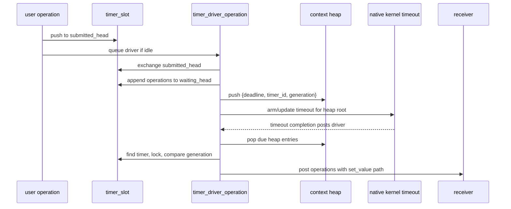
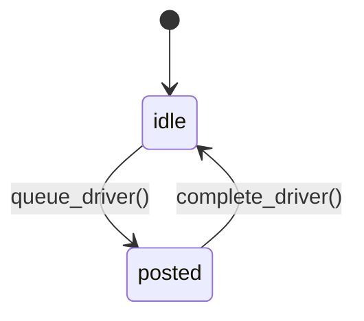
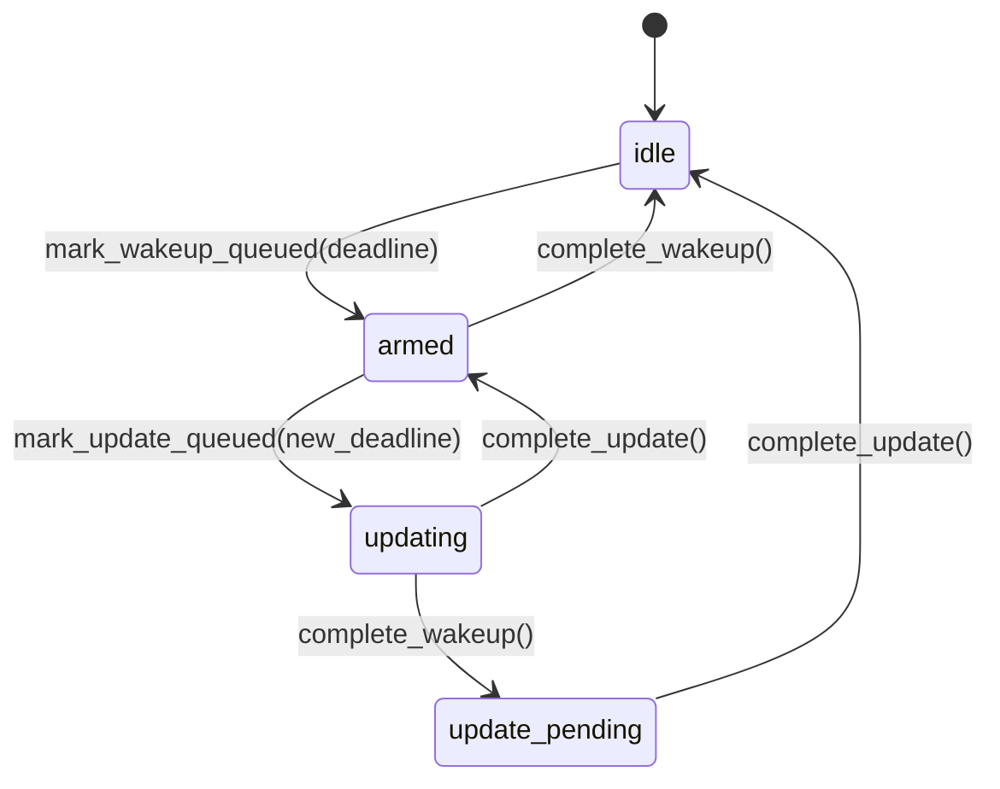

# Timer Design

This document describes the `io_context` timer subsystem. The design is built
around one rule: timer operations are ordinary operations; the important logic
is when they are moved between queues and posted.

Timer implementation types live in the matching
`include/bupp/{linux,bsd}/detail/` directory:

- `io_context_timer_types.h` contains `timer_slot`, `timer_heap_item`,
  `timer_operation_base`, the reusable timer operations, and
  `timer_state_data`.
- `io_context_native_io/timer_wait.h` contains the templated user wait sender
  and operation.
- `steady_timer.h` contains the public `steady_timer` owner.

`io_context` itself only composes these pieces: it owns one
`detail::timer_state_data` and the reusable timer operation members. Queued I/O
does not participate in this subsystem; worker pre-sleep draining guarantees
its progress without a timer.

## Goals

- Provide `steady_timer` as an `io_context`-bound timer object.
- Avoid per-wait heap allocation inside the timer scheduler.
- Use one timer heap owned by `io_context`.
- Make cancellation and expiry changes cheap: bump a generation and post the
  affected operations as stopped.
- Reuse internal operations instead of allocating a new operation for every
  driver or kernel timeout action.

## Main Objects

### `steady_timer`

`steady_timer` owns one `detail::timer_slot`.

The slot contains:

| Field | Role |
|-------|------|
| `context` | Non-null means the timer is registered and valid. |
| `id` | Stable id used by heap entries and the context timer map. |
| `expiry` | Current expiry time for newly submitted waits. |
| `generation` | Version used to reject stale heap entries. |
| `submitted_head` | Lock-free stack of newly started waits. |
| `waiting_head` | Context-owned list of waits already moved into the heap. |

The timer does not store one heap node per outstanding wait. Instead, waits are
batched by timer and generation. A heap entry says "this timer generation has
work due at this deadline".

### `timer_heap_item`

The context heap stores values, not allocated nodes:

```cpp
struct timer_heap_item {
  async_io::time_point deadline;
  std::uint64_t timer_id;
  std::uint64_t generation;
};
```

The heap item deliberately does not contain an operation pointer. Operations
live in the timer slot lists. The heap only selects which timer slot should be
inspected.

### `timer_operation_base`

Timer waits derive from `timer_operation_base`, which is also the selected
native context's CPU-operation base. It is posted to the native context when
completion is known.

The base stores:

| Field | Role |
|-------|------|
| `timer_context_` | Context used for posting completion. |
| `timer_next_` | Intrusive list link used by timer queues. |
| `timer_completion_` | `value` or `stopped`, read by `execute()`. |

Most timer operations contain no scheduling logic. A user wait operation only
turns `value` into `set_value()` and `stopped` into `set_stopped()`.

### `timer_state_data`

`detail::timer_state_data` is the context-owned timer aggregate. It groups the
timer map, heap, reusable driver state, and timeout state.

The aggregate keeps timer state in one place:

| Field | Role |
|-------|------|
| `mutex` | Context-level timer lock. |
| `timers` | Map from timer id to live `timer_slot`. |
| `heap` | Min-heap of `timer_heap_item` values. |
| `next_timer_id` | Monotonic id source for registered timers. |
| `driver` | Posted-state guard for `timer_driver_operation_`. |
| `timeout` | Kernel timeout state machine. |
| `armed_deadline` | Deadline currently represented by the active timeout request. |

## Locking

There are two lock levels:

1. `io_context::timers_.mutex`
2. `timer_slot::mutex`

When both are needed, the order is always context first, then timer. Map lookups
use `find()` and the returned pointer is checked before use. This avoids
accidental insertion into the `unordered_map` and keeps stale heap entries safe.

`submitted_head` is a lock-free stack because starting a wait only needs to
publish an operation pointer. Draining the stack, changing expiry, cancelling,
or unregistering a timer takes the locks because those operations must move the
stack and the waiting list as one logical batch.

## Normal Wait Flow



The key point is that `start()` does not touch the heap. It only pushes onto the
timer's submitted stack and queues the reusable driver operation. The driver is
the only code that drains timer submissions into `waiting_head` and pushes heap
items.

## Heap Entries And Staleness

The heap may contain stale entries. This is intentional.

Expiry changes and cancellations do not search the heap. They increment the
timer generation and move all currently known operations out of the timer slot.
Later, when the driver pops an old heap item, it validates:

1. The timer id exists in the context map.
2. The mapped timer pointer is non-null.
3. The timer still belongs to this context.
4. The heap item's generation equals the timer slot generation.

If any check fails, the heap item is ignored.

This keeps cancellation and expiry update costs proportional to the affected
operation batch, not to the heap size.

## Cancellation

`steady_timer::cancel()` does this under context-then-timer lock:

1. Check `timer.context == this`.
2. Increment `timer.generation`.
3. Exchange `submitted_head` with null.
4. Take `waiting_head`.
5. Release locks.
6. Post all taken operations with `timer_completion_kind::stopped`.

No cancellation callback is needed. The operation already has an `execute()`
function. Cancellation only chooses the stopped channel before posting it.

Changing expiry uses the same mechanism. `expires_at()` changes `expiry`, bumps
the generation, takes existing waits, and posts them stopped. New waits started
after the expiry change use the new generation and deadline.

## Move And Unregister

Moving a timer unregisters the old slot and registers a new slot in the same
context. The old slot is invalidated by setting `context` to null and bumping
the generation. Any operations still attached to the old slot are posted
stopped.

The heap is not cleaned during move. Stale heap entries are filtered by the same
id/generation/context checks used for expiry changes and cancellation.

## Reused Operations

The timer subsystem reuses several internal operation objects:

| Operation | Purpose | Reuse Rule |
|-----------|---------|------------|
| `timer_driver_operation_` | Drains submitted waits, completes due waits, schedules kernel timeout. | Only posted when driver state is idle. |
| `timer_wakeup_operation_` | The active native timeout request (io_uring timeout or `EVFILT_TIMER`). | Queued on the primary run loop only when timeout state is idle. |
| `timer_update_operation_` | Retargets the active native timeout. | Queued on the primary run loop only when timeout state is armed and the root deadline changed. |

These objects must not be posted or queued twice while already in flight.
The state machines below exist to protect that reuse, not to protect ordinary
memory access.

## Posted Operation State

`timer_state_data::queued_operation_state` is used for reusable operations that
are posted onto the native context task queue.



The `driver` state protects `timer_driver_operation_`.

If work arrives while the driver is already posted, no second driver operation
is posted. The already posted driver drains all timer submissions when it runs.
This is the main repeated-posting rule.

## Kernel Timeout State

`timer_state_data::timeout_state` describes the single reusable native timeout
request owned by the context.



The states mean:

| State | Meaning |
|-------|---------|
| `idle` | No kernel timeout is currently active. |
| `armed` | A wakeup timeout is queued or active for `armed_deadline`. |
| `updating` | A timeout update is queued or active for the wakeup. |
| `update_pending` | The old wakeup completed while the update SQE was still in flight. |

The `update_pending` state handles completion reordering. A backend can report
the old timeout completion before the timeout update completion. In that case
there is no active wakeup left after the update CQE arrives, so the state moves
to `idle`.

## Scheduling The Kernel Timeout

After the driver drains submissions or completes due heap entries, it calls
`schedule_timer_wakeup_locked()`.

The function looks only at the heap root:

1. If the heap is empty, there is nothing to schedule.
2. If timeout state is `idle`, queue `timer_wakeup_operation_` on the primary
   run loop's local I/O list.
3. If timeout state is `armed` and the heap root deadline changed, queue
   `timer_update_operation_`.
4. Otherwise do nothing.

Queuing a wakeup or update stores the new `armed_deadline`. The next run-loop
pass prepares it together with other passive I/O; timer code never reserves an
SQE, calls `kevent()`, or submits native work directly.

## Invariants

- `timer.context != nullptr` is the timer validity marker.
- `io_context::timers_.mutex` is always taken before `timer_slot::mutex`.
- `unordered_map` timer lookup uses `find()` and checks null pointers.
- Heap items are values and may be stale.
- Stale heap entries are ignored by id, pointer, context, and generation checks.
- Reusable posted operations are protected by `queued_operation_state`.
- Reusable kernel timeout operations are protected by `timeout_state`.
- Timer cancellation and expiry changes post stopped operations through the
  context rather than calling receivers inline.
