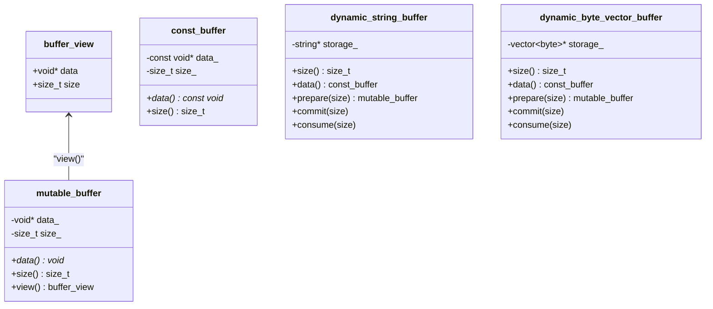
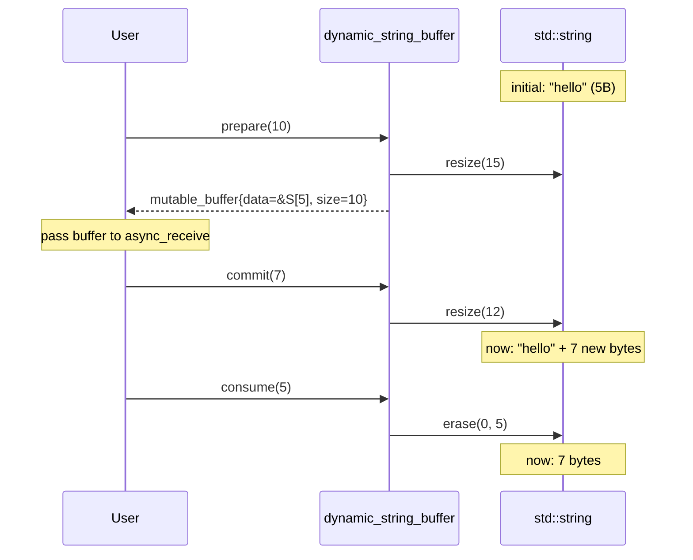
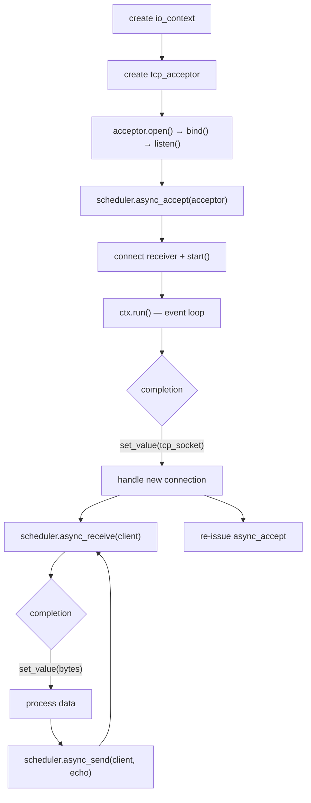
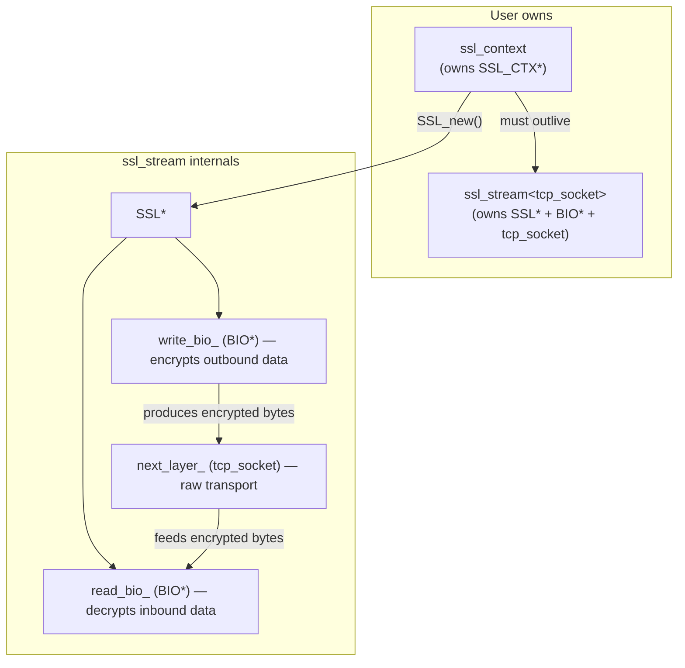
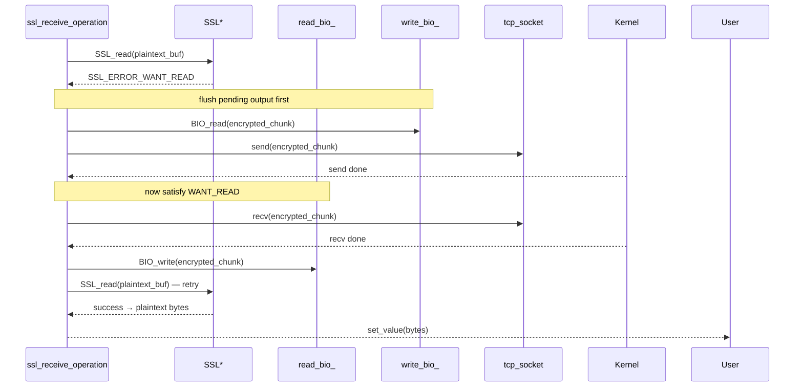
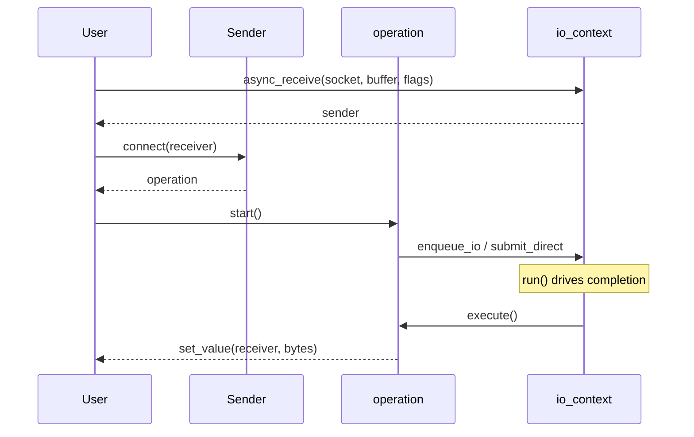

# Usage Guide

Examples and patterns for building applications with bupp. For architecture
background see [`design/architecture.md`](design/architecture.md). For lifecycle
rules see [`design/lifecycle.md`](design/lifecycle.md).

## Table of Contents

- [Buffer System](#buffer-system)
- [TCP Programming](#tcp-programming)
- [SSL/TLS Programming](#ssltls-programming)
- [Sender/Receiver Pattern](#senderreceiver-pattern)
- [Examples](#examples)

---

## Buffer System

### Buffer Type Overview



### Factory Function `bupp::buffer()`

A set of overloaded free functions converts various types to buffer views.
These are non-owning: the caller must keep the underlying storage alive.

```cpp
auto b1 = bupp::buffer(ptr, 1024);               // void*, size_t
auto b2 = bupp::buffer(std::span(data));          // std::span<T>
auto b3 = bupp::buffer(arr);                      // std::array<T,N>&
auto b4 = bupp::buffer(vec);                      // std::vector<T>&
auto b5 = bupp::buffer(str);                      // std::string&
auto b6 = bupp::buffer(sv);                       // std::string_view
auto b7 = bupp::buffer(raw_view);                 // async_io::buffer_view
```

### Dynamic Buffer Protocol

Dynamic buffers adapt growable storage for async I/O. The pattern is:

```
prepare → use in I/O → commit → consume → repeat
```



```cpp
std::string storage;
bupp::dynamic_string_buffer dyn(storage);

// Prepare writable region
auto region = dyn.prepare(4096);

// Use region in async_receive ...
// After I/O completes:

dyn.commit(actual_bytes);   // shrink to actual received size
dyn.consume(sent_bytes);    // remove processed data from front
```

Two adapters are provided:

| Adapter | Backing Store |
|---------|--------------|
| `dynamic_string_buffer` | `std::string&` |
| `dynamic_byte_vector_buffer<A>` | `std::vector<std::byte, A>&` |

Create them with `bupp::dynamic_buffer(storage)`.

---

## TCP Programming

### `tcp_socket` — RAII Stream Socket

Move-only. Closes the fd on destruction.

```cpp
bupp::tcp_socket socket;

// Open
std::error_code ec = socket.open(bupp::ip::tcp::v4());

// Configure
socket.set_reuse_address(true);

// Get non-owning view for async I/O
bupp::async_io::stream_socket_view view = socket.view();

// Move ownership
bupp::tcp_socket other = std::move(socket);
// socket.is_open() == false; other owns the fd
```

Key methods:

| Method | Description |
|--------|-------------|
| `open(family)` / `open(protocol)` | Create socket |
| `close()` | Close socket (also called by destructor) |
| `release()` | Relinquish ownership, return raw fd |
| `assign(fd)` | Take over an existing fd |
| `view()` | Return `async_io::stream_socket_view` |
| `is_open()` | Whether a valid fd is held |
| `shutdown(how)` | Shut down send and/or receive |
| `set_reuse_address(bool)` | Set `SO_REUSEADDR` |
| `native_handle()` | Raw fd value |

### `tcp_acceptor` — RAII Listening Socket

Move-only. Closes the fd on destruction.

```cpp
bupp::tcp_acceptor acceptor;

acceptor.open(bupp::ip::tcp::v4());
acceptor.set_reuse_address(true);

bupp::ip::endpoint ep(bupp::ip::make_v4_address("0.0.0.0"), 8080);
acceptor.bind(ep);
acceptor.listen(128);

// Get non-owning view
bupp::async_io::listening_socket_view view = acceptor.view();
```

Key methods:

| Method | Description |
|--------|-------------|
| `open(family)` / `open(protocol)` | Create socket |
| `bind(endpoint)` | Bind to local address |
| `listen(backlog)` | Mark as listening |
| `close()` / `release()` / `assign(fd)` | fd management |
| `view()` | Return `async_io::listening_socket_view` |
| `is_open()` / `shutdown(how)` / `set_reuse_address(bool)` | status/config |

### IP Address & Endpoint

```cpp
auto addr4 = bupp::ip::make_v4_address("127.0.0.1");
auto addr6 = bupp::ip::make_v6_address("::1");

bupp::ip::endpoint ep(addr4, 8080);

// Protocol tags
auto v4 = bupp::ip::tcp::v4();
auto v6 = bupp::ip::tcp::v6();
```

### Server Flow



---

## SSL/TLS Programming

### SSL Type Hierarchy



### `ssl_context` — RAII SSL_CTX Owner

Move-only. Frees `SSL_CTX*` on destruction.

```cpp
enum class ssl_context_method { tls, tls_client, tls_server };

bupp::ssl_context ssl_ctx(bupp::ssl_context_method::tls);

ssl_ctx.use_certificate_chain_file("cert.pem");
ssl_ctx.use_private_key_file("key.pem");
ssl_ctx.check_private_key();
// ssl_ctx.set_verify_mode(SSL_VERIFY_PEER);
```

### `ssl_stream<NextLayer>` — RAII SSL Stream

Move-only, templated on the transport layer (default `tcp_socket`). Takes
ownership of the transport via move.

```cpp
template <class NextLayer = tcp_socket>
class ssl_stream {
public:
    ssl_stream(NextLayer next_layer, ssl_context& context) noexcept;
    ~ssl_stream() noexcept;              // frees SSL* and BIOs

    ssl_stream(const ssl_stream&) = delete;
    ssl_stream& operator=(const ssl_stream&) = delete;
    ssl_stream(ssl_stream&& other) noexcept;
    ssl_stream& operator=(ssl_stream&& other) noexcept;

    [[nodiscard]] NextLayer& next_layer() noexcept;
    [[nodiscard]] const NextLayer& next_layer() const noexcept;
    [[nodiscard]] NextLayer& lowest_layer() noexcept;

    [[nodiscard]] SSL* native_handle() const noexcept;
    [[nodiscard]] bool valid() const noexcept;
};
```

### SSL I/O Internals

SSL operations multiplex between the SSL state machine and raw TCP I/O
internally. A single `SSL_read()` may trigger multiple TCP sends and receives
as BIO buffers are drained and refilled:



Two 16 KB internal buffers (`input_`, `output_`) serve as staging areas
between the BIO and the TCP socket.

### SSL Usage Pattern

```cpp
// 1. Create and configure SSL context (must outlive stream)
bupp::ssl_context ssl_ctx(bupp::ssl_context_method::tls);
ssl_ctx.use_certificate_chain_file("cert.pem");
ssl_ctx.use_private_key_file("key.pem");
ssl_ctx.check_private_key();

// 2. Create TCP socket and connect/accept
bupp::tcp_socket sock;
sock.open(bupp::ip::tcp::v4());
// ... connect or accept ...

// 3. Wrap in ssl_stream (stream takes ownership of sock)
bupp::ssl_stream<bupp::tcp_socket> stream(std::move(sock), ssl_ctx);

auto scheduler = ctx.get_post_scheduler();

// 4. Handshake
auto hs = scheduler.async_handshake(stream, bupp::ssl_handshake_type::client);
// ... connect receiver + start ...

// 5. After handshake completes, send/receive over SSL
auto recv = scheduler.async_receive(stream, recv_buf, 0);
auto send = scheduler.async_send(stream, send_buf, 0);

// 6. Shutdown when done
auto sd = scheduler.async_shutdown(stream);
```

### Handshake Types

```cpp
enum class ssl_handshake_type {
    client,  // SSL_set_connect_state
    server,  // SSL_set_accept_state
};
```

---

## Sender/Receiver Pattern

Each async factory returns a sender. The protocol is:

```
sender → connect(receiver) → operation → start() → run loop → completion
```



### Completion Signatures

Every sender declares its completion channels:

| Sender | `set_value` | `set_error` | `set_stopped` |
|--------|------------|-------------|---------------|
| `async_receive` | `size_t` bytes | `std::error_code` | `()` |
| `async_send` | `size_t` bytes | `std::error_code` | `()` |
| `async_accept` | `tcp_socket` | `std::error_code` | `()` |
| `async_connect` | `()` | `std::error_code` | `()` |
| `async_poll` | `unsigned` ready-event mask | `std::error_code` | `()` |
| `async_handshake` | `()` | `std::error_code` | `()` |
| `async_shutdown` | `()` | `std::error_code` | `()` |

### Minimal Receiver

```cpp
struct my_receiver {
    void set_value(std::size_t n) {
        // I/O succeeded, n bytes transferred
    }
    void set_error(std::error_code ec) {
        // I/O failed
    }
    void set_stopped() {
        // operation was cancelled
    }
};
```

### Submission Mode: queued vs direct

| Mode | API | When to Use |
|------|-----|-------------|
| **queued** | `async_receive()`, `async_send()`, etc. | High throughput; leverages io_uring batching |
| **direct** | `async_receive_direct()`, `async_send_direct()`, etc. | Low latency; submits immediately |

---

## Examples

For runnable commands and the optional benchmark setup, see
[`examples.md`](examples.md).

### Base Layer — NOP Request

Minimal ring → SQE → submit → CQE cycle:

```cpp
#include <bupp/base.h>

int main() {
    bupp::base::ring ring;
    if (ring.queue_init(8) < 0) return 1;

    bupp::base::submission_queue_entry sqe = ring.get_sqe();
    if (sqe.raw() == nullptr) return 1;

    sqe.prep_nop();
    sqe.set_data64(42);

    if (ring.submit() < 0) return 1;

    bupp::base::completion_queue_entry cqe;
    if (ring.wait_cqe(cqe) < 0) return 1;

    int result = cqe.res();
    ring.cqe_seen(cqe);
    return result;
}
```

### io_context Layer — Async Receive

```cpp
#include <bupp/bupp.h>
#include <iostream>
#include <array>

struct print_receiver {
    void set_value(std::size_t n) {
        std::cout << "received " << n << " bytes\n";
    }
    void set_error(std::error_code ec) {
        std::cerr << "error: " << ec.message() << '\n';
    }
    void set_stopped() {
        std::cout << "stopped\n";
    }
};

int main() {
    bupp::io_context ctx;
    auto scheduler = ctx.get_post_scheduler();

    bupp::tcp_socket sock;
    sock.open(bupp::ip::tcp::v4());

    auto ep = bupp::ip::endpoint(
        bupp::ip::make_v4_address("127.0.0.1"), 7000);
    sock.view().connect(ep);

    std::array<char, 4096> buf{};
    auto sender = scheduler.async_receive(sock, bupp::buffer(buf), 0);
    auto op = std::move(sender).connect(print_receiver{});
    op.start();

    ctx.run();
    return 0;
}
```

### Base Layer — Echo Server

Full echo server at the base layer, demonstrating the raw ring/SQE/CQE
dispatch pattern with manual accept → recv → echo send loops:

[`examples/base/linux/echo_server.cpp`](../examples/base/linux/echo_server.cpp)

### io_context Layer — Raw Echo Server

Raw TCP echo server at the `io_context` layer, demonstrating repeated
`async_accept`, per-connection `async_receive`/`async_write`, detached operation
lifetime through a local holder, and `ctx.run()` as the server event loop:

[`examples/raw_echo`](../examples/raw_echo)

### Choosing the Right Layer

| Use Case | Recommended Layer |
|----------|------------------|
| Full control over io_uring | `base` |
| Need platform-neutral vocabulary types | `async_io` |
| Building application network services | `io_context` |
| Integrating with sender/receiver frameworks | `io_context` + CPOs |

## Error Handling

```cpp
// Base layer: ≥ 0 on success, negative errno on failure
int r = ring.submit();
if (r < 0) {
    // r is -errno (e.g. -EINVAL, -ENOMEM)
}

// io_context layer: std::error_code via set_error completion
// Senders deliver errors through set_error(receiver, std::error_code)
```

Base-layer tests treat `-ENOSYS`, `-EPERM`, and `-EACCES` as covered error
paths for environments where io_uring is unavailable.

## Common Pitfalls

1. **Using CQE fields after `cqe_seen()`** — always read `res()`, `get_data64()`, etc. before calling `cqe_seen()`.

2. **Forgetting `cqe_seen()`** — the CQ ring fills up and no new completions arrive.

3. **Not calling `ctx.run()`** — operations are submitted but the event loop never runs, so completions are never delivered.

4. **Stack buffer passed to async operation** — the buffer must outlive the operation. Use `shared_ptr` or ensure the buffer is in an outer scope.

5. **`ssl_context` destroyed before `ssl_stream`** — the stream's `SSL*` is derived from the context's `SSL_CTX*`.

6. **Copying move-only types** — `ring`, `tcp_socket`, `tcp_acceptor`, `ssl_context`, `ssl_stream`, `io_context` are all move-only.
