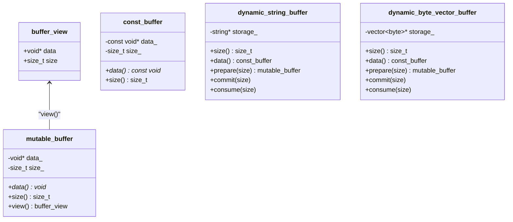
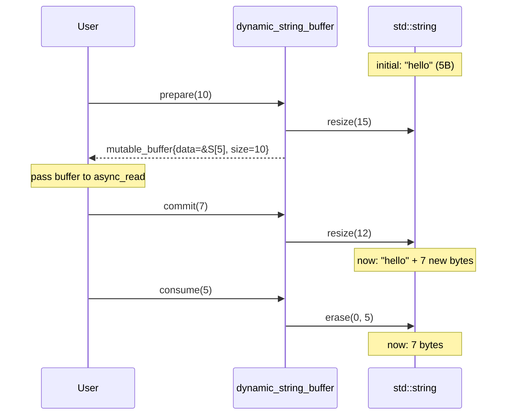

# Buffer System

### Buffer Type Overview



### Factory Function `bupp::buffer()`

A set of overloaded free functions converts various types to buffer views.
These are non-owning: the caller must keep the underlying storage alive.

```cpp
auto b1 = bupp::buffer(ptr, 1024);               // void*, size_t
auto b2 = bupp::buffer(std::span(data));          // std::span<T>
auto b3 = bupp::buffer(arr);                      // std::array<T,N>&
auto b4 = bupp::buffer(vec);                      // std::vector<T>&
auto b5 = bupp::buffer(str);                      // std::string&
auto b6 = bupp::buffer(sv);                       // std::string_view
auto b7 = bupp::buffer(raw_view);                 // async_io::buffer_view
```

### Dynamic Buffer Protocol

Dynamic buffers adapt growable storage for async I/O. The pattern is:

```
prepare → use in I/O → commit → consume → repeat
```



```cpp
std::string storage;
bupp::dynamic_string_buffer dyn(storage);

// Prepare writable region
auto region = dyn.prepare(4096);

// Use region in async_read ...
// After I/O completes:

dyn.commit(actual_bytes);   // shrink to actual received size
dyn.consume(sent_bytes);    // remove processed data from front
```

Two adapters are provided:

| Adapter | Backing Store |
|---------|--------------|
| `dynamic_string_buffer` | `std::string&` |
| `dynamic_byte_vector_buffer<A>` | `std::vector<std::byte, A>&` |

Create them with `bupp::dynamic_buffer(storage)`.

---
