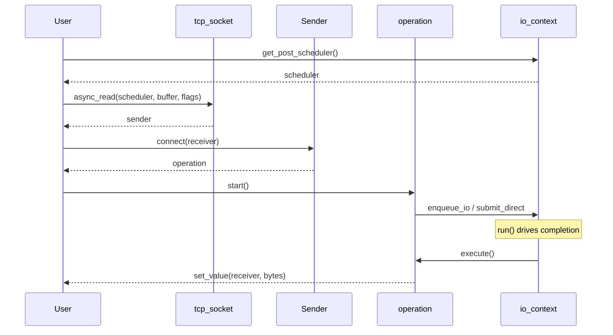

# Sender/Receiver Pattern

Each async factory returns a sender. The protocol is:

```
sender → connect(receiver) → operation → start() → run loop → completion
```



### Read/Write Semantics

`async_read()` is a read-some operation. It submits one bounded receive/read
request and completes when that request completes. The returned byte count can
be smaller than the buffer size, including `0` for EOF on plain descriptors or
TCP sockets. Use it for protocol parsing, streaming responses, and event loops
that naturally process chunks.

`async_read_some()` is the explicit spelling for the same one-read behavior.
Use it when the distinction matters in generic code or when pairing it with
`async_write_some()`.

`async_write()` is a write-all operation. It keeps a small state object with the
current offset and repeatedly calls `async_write_some()` through
`bexec::repeat_until` until the full buffer has been transferred, or until an
error/stopped completion occurs. On success, `set_value(n)` reports the full
buffer size.

`async_write_some()` performs exactly one bounded write attempt and reports that
attempt's byte count. It exists for callers that need manual framing,
backpressure accounting, custom retry policy, or direct access to the native
short-write behavior.

All `*_some` operations cap each native io_uring request to the kernel-facing
length type. Large buffers are safe: write-all APIs split them internally, while
`*_some` returns after the first bounded attempt.

#### Choosing by target

| Target | Read API | Write API | Notes |
|--------|----------|-----------|-------|
| `tcp_socket` / `stream_socket_view` | `async_read()` or `async_read_some()` for one received chunk | `async_write()` for whole frames/messages; `async_write_some()` for manual retry | TCP is a byte stream; reads are not message-delimited. |
| `ssl_stream` | `async_read()` or `async_read_some()` for one plaintext chunk | `async_write()` for the whole plaintext buffer; `async_write_some()` for one SSL write step | TLS may need multiple encrypted transport reads/writes for one plaintext operation. |
| `descriptor_view` | `async_read()` or `async_read_some()` from an offset | `async_write()` for the whole buffer at an offset; `async_write_some()` for one write | Full descriptor writes advance the internal offset by bytes already written. |

The `_direct` suffix is independent of read/write semantics. For example,
`async_write_direct()` is still write-all; it only submits each lower-level I/O
immediately instead of using the queued I/O batch.

### Completion Signatures

Every sender declares its completion channels:

| Sender | `set_value` | `set_error` | `set_stopped` |
|--------|------------|-------------|---------------|
| `async_read(...)` / `async_read_some(...)` | `size_t` bytes read by one operation | `std::error_code` | `()` |
| `async_write(...)` | `size_t` total bytes written | `std::error_code` | `()` |
| `async_write_some(...)` | `size_t` bytes written by one operation | `std::error_code` | `()` |
| `async_accept` | `tcp_socket` | `std::error_code` | `()` |
| `async_connect` | `()` | `std::error_code` | `()` |
| `async_poll` | `unsigned` ready-event mask | `std::error_code` | `()` |
| `async_handshake` | `()` | `std::error_code` | `()` |
| `async_shutdown` | `()` | `std::error_code` | `()` |

### Minimal Receiver

```cpp
struct my_receiver {
    void set_value(std::size_t n) {
        // I/O succeeded, n bytes transferred
    }
    void set_error(std::error_code ec) {
        // I/O failed
    }
    void set_stopped() {
        // operation was cancelled
    }
};
```

### Submission Mode: queued vs direct

| Mode | API | When to Use |
|------|-----|-------------|
| **queued** | `async_read()`, `async_write()`, `async_read_some()`, `async_write_some()`, etc. | High throughput; leverages io_uring batching |
| **direct-submission** | `async_read_direct()`, `async_write_direct()`, `async_read_some_direct()`, `async_write_some_direct()`, etc. | Low latency; bypasses the queued I/O batch and submits immediately |

The `_direct` suffix is only a submission-mode suffix. It does not mean a
different read/write semantic. Stream types only expose `_direct` operations
when they can actually change how the lowest-layer I/O is submitted.

---
