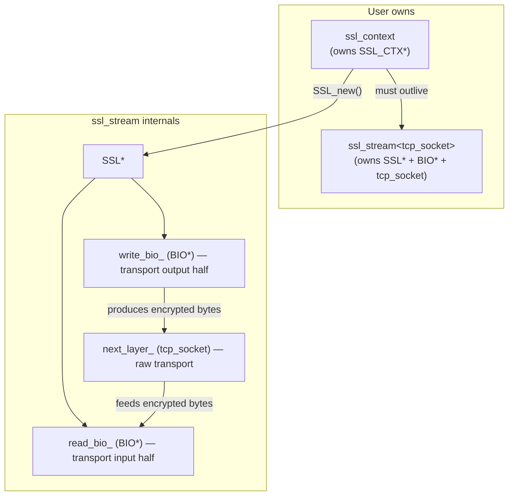
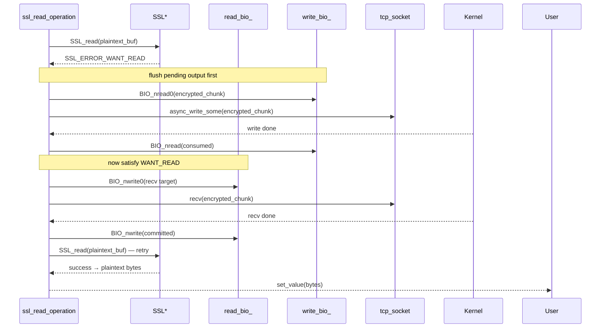

# SSL/TLS Programming

### SSL Type Hierarchy



### `ssl_context` — RAII SSL_CTX Owner

Move-only. Frees `SSL_CTX*` on destruction.

```cpp
enum class ssl_context_method { tls, tls_client, tls_server };

bupp::ssl_context ssl_ctx(bupp::ssl_context_method::tls);

ssl_ctx.use_certificate_chain_file("cert.pem");
ssl_ctx.use_private_key_file("key.pem");
ssl_ctx.check_private_key();
// ssl_ctx.set_verify_mode(SSL_VERIFY_PEER);
```

### `ssl_stream<NextLayer>` — RAII SSL Stream

Move-only, templated on the transport layer (default `tcp_socket`). Takes
ownership of the transport via move.

```cpp
template <class NextLayer = tcp_socket>
class ssl_stream {
public:
    ssl_stream(NextLayer next_layer, ssl_context& context) noexcept;
    ~ssl_stream() noexcept;              // frees SSL* and BIOs

    ssl_stream(const ssl_stream&) = delete;
    ssl_stream& operator=(const ssl_stream&) = delete;
    ssl_stream(ssl_stream&& other) noexcept;
    ssl_stream& operator=(ssl_stream&& other) noexcept;

    [[nodiscard]] NextLayer& next_layer() noexcept;
    [[nodiscard]] const NextLayer& next_layer() const noexcept;
    [[nodiscard]] NextLayer& lowest_layer() noexcept;

    [[nodiscard]] SSL* native_handle() const noexcept;
    [[nodiscard]] bool valid() const noexcept;
};
```

### SSL I/O Internals

SSL operations multiplex between the SSL state machine and raw TCP I/O
internally. A single `SSL_read()` may trigger multiple TCP sends and receives
as BIO buffers are drained and refilled:



SSL transport I/O uses BIO pair non-copying access so the lower layer reads
from or writes to BIO-owned memory directly.

### SSL Usage Pattern

```cpp
// 1. Create and configure SSL context (must outlive stream)
bupp::ssl_context ssl_ctx(bupp::ssl_context_method::tls);
ssl_ctx.use_certificate_chain_file("cert.pem");
ssl_ctx.use_private_key_file("key.pem");
ssl_ctx.check_private_key();

// 2. Create TCP socket and connect/accept
bupp::tcp_socket sock;
sock.open(bupp::ip::tcp::v4());
// ... connect or accept ...

// 3. Wrap in ssl_stream (stream takes ownership of sock)
bupp::ssl_stream<bupp::tcp_socket> stream(std::move(sock), ssl_ctx);

auto scheduler = ctx.get_post_scheduler();

// 4. Handshake
auto hs = stream.async_handshake(scheduler, bupp::ssl_handshake_type::client);
// ... connect receiver + start ...

// 5. After handshake completes, read/write over SSL
auto read_op = stream.async_read(scheduler, read_buf, 0);
auto write_op = stream.async_write(scheduler, write_buf, 0);
// Use async_write_some(...) only when you want to handle partial writes
// yourself.

// 6. Shutdown when done
auto sd = stream.async_shutdown(scheduler);
```

### Handshake Types

```cpp
enum class ssl_handshake_type {
    client,  // SSL_set_connect_state
    server,  // SSL_set_accept_state
};
```

---
