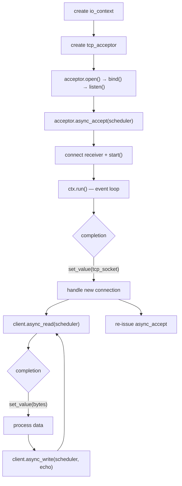

# TCP Programming

### `tcp_socket` — RAII Stream Socket

Move-only. Closes the fd on destruction.

```cpp
bupp::tcp_socket socket;

// Open
std::error_code ec = socket.open(bupp::ip::tcp::v4());

// Configure
socket.set_reuse_address(true);

// Get non-owning view for async I/O
bupp::async_io::stream_socket_view view = socket.view();

// Move ownership
bupp::tcp_socket other = std::move(socket);
// socket.is_open() == false; other owns the fd
```

Key methods:

| Method | Description |
|--------|-------------|
| `open(family)` / `open(protocol)` | Create socket |
| `close()` | Close socket (also called by destructor) |
| `release()` | Relinquish ownership, return raw fd |
| `assign(fd)` | Take over an existing fd |
| `view()` | Return `async_io::stream_socket_view` |
| `is_open()` | Whether a valid fd is held |
| `shutdown(how)` | Shut down send and/or receive |
| `set_reuse_address(bool)` | Set `SO_REUSEADDR` |
| `native_handle()` | Raw fd value |

### `tcp_acceptor` — RAII Listening Socket

Move-only. Closes the fd on destruction.

```cpp
bupp::tcp_acceptor acceptor;

acceptor.open(bupp::ip::tcp::v4());
acceptor.set_reuse_address(true);

bupp::ip::endpoint ep(bupp::ip::make_v4_address("0.0.0.0"), 8080);
acceptor.bind(ep);
acceptor.listen(128);

// Get non-owning view
bupp::async_io::listening_socket_view view = acceptor.view();
```

Key methods:

| Method | Description |
|--------|-------------|
| `open(family)` / `open(protocol)` | Create socket |
| `bind(endpoint)` | Bind to local address |
| `listen(backlog)` | Mark as listening |
| `close()` / `release()` / `assign(fd)` | fd management |
| `view()` | Return `async_io::listening_socket_view` |
| `is_open()` / `shutdown(how)` / `set_reuse_address(bool)` | status/config |

### IP Address & Endpoint

```cpp
auto addr4 = bupp::ip::make_v4_address("127.0.0.1");
auto addr6 = bupp::ip::make_v6_address("::1");

bupp::ip::endpoint ep(addr4, 8080);

// Protocol tags
auto v4 = bupp::ip::tcp::v4();
auto v6 = bupp::ip::tcp::v6();
```

### Server Flow



---
